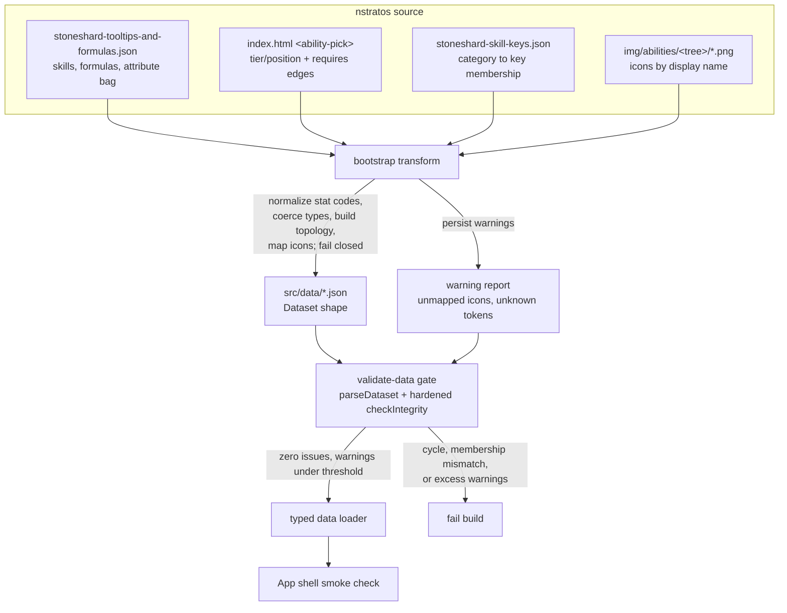
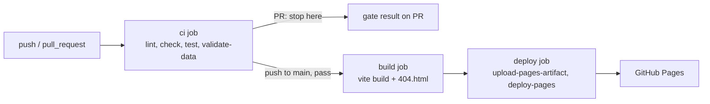

# feat: Phase 0 — data foundation (bootstrap, validation, UMT skeleton, CI/Pages)

## Summary

Finish Phase 0 of the Stoneshard Build Calculator: bring the repo under version control, correct the licensing/attribution posture, transform nstratos's extracted game data into our normalized `src/data/` JSON, harden the integrity checks the data depends on, gate it with `validate-data`, stand up a UMT exporter skeleton for our own long-term extraction, and ship CI + a GitHub Pages deploy. The outcome is a validated, app-loadable dataset and a green deploy pipeline — the foundation Phase 1 (formula engine + skill-tree UI) builds on. The transform asserts its own invariants and fails closed, because the schema's loose fields mean a silently-wrong dataset (inverted prerequisites, empty trees, dead icon paths) can otherwise pass validation.

---

## Problem Frame

Tasks 1–2 of Phase 0 are done: the Svelte 5 + TS + Vite scaffold is green, and `src/lib/types.ts` / `src/lib/validate.ts` define a normalized, Zod-validated schema with explicit tree topology (`tier` / `position` / `requires`) and referential-integrity checks. What's missing is data: `src/data/` is empty, the `bootstrap` and `validate-data` npm scripts point at files that don't exist yet, there's no extraction tooling, no CI, and no deploy. The app shell renders a placeholder.

This plan executes the next bounded, unblocking increment — the data foundation. It deliberately stops short of Phase 1 (formula engine, skill-tree UI, ledger, share codes), because Phase 1's details sharpen once the real bootstrapped data exists. Two findings from research shape the work:

1. **Licensing was mis-stated.** The roadmap and README imply we bootstrap from nstratos's "MIT-licensed data." Their *code* is MIT (© 2025 Stratos Neiros), but their *extracted JSON and icon PNGs are Ink Stains Games IP*, reused under an assumed non-commercial fair-use posture — MIT can't relicense them. We inherit the same fair-use footing, not a clean data license.
2. **Tree topology isn't in their JSON.** `tooltips/stoneshard-tooltips-and-formulas.json` carries skills, formulas, and a stringly-typed attribute bag, but tier/position and prerequisite edges live only in their `index.html` as `<ability-pick>` elements. Our schema *requires* topology, so the transform must parse the HTML, not just the JSON.

Project context: this is not yet a git repository, and none of the build-out directories (`scripts/`, `tools/`, `src/data/`, `.github/`) exist.

---

## Requirements

### Version control and licensing

- R1. The project is a git repository with a clean baseline commit before any generated data files land, and `.gitignore` excludes `node_modules/` and `dist/`.
- R2. The README and an in-repo attribution note state the correct posture: nstratos *code* is MIT (attributed); the *game data and icons* are Ink Stains Games IP used under non-commercial fair use, with the existing "unofficial fan tool" disclaimer preserved.

### Dataset bootstrap and validation

- R3. A repeatable bootstrap script transforms nstratos's source data into our `Dataset` shape and writes committed JSON under `src/data/`.
- R4. The transform populates every schema-required field, including tree topology (`tier`, `position`, `requires`) derived from their `index.html`, with stat codes normalized to our canonical `STR/AGI/PER/VIT/WIL` vocabulary.
- R5. The committed dataset passes `parseDataset` (shape) and `checkIntegrity` (referential integrity) with zero issues; `npm run validate-data` is the gate and exits non-zero on any failure.
- R6. The app can load the validated dataset through a typed loader, proven by a smoke check that surfaces dataset counts in the running shell.

### Extraction pipeline

- R7. A UMT exporter skeleton under `tools/umt-exporter/` plus `tools/README.md` documents our own extraction approach (extending nstratos's `.csx` + skill-keys), explicitly noting it needs Windows + the `modbranch` beta and is not run in CI.

### CI and deployment

- R8. CI runs lint, type-check (svelte-check), tests, and `validate-data` on push and pull request, and fails the run on any gate failure.
- R9. The app deploys to GitHub Pages via the artifact-based Actions workflow, gated on CI passing, with the correct Vite `base` and an SPA `404.html` fallback.

---

## Key Technical Decisions

- **Licensing posture: code MIT, data/icons fair-use.** Treat any borrowed nstratos *code* as MIT (preserve their notice, attribute Stratos Neiros). Treat the *data and icons* as Ink Stains Games IP under the same non-commercial fair-use assumption they document — not as MIT-licensed assets. This corrects the README and keeps attribution honest. Verified against their `LICENSE` (MIT) and README Disclaimer (assets carved out as Ink Stains IP).

- **Topology comes from `index.html`, not the JSON.** The skills JSON has no tier/position/edges; they're encoded on `<ability-pick>` elements (`parents=` / `children=` for prerequisite edges, `style="top:…;left:…"` pixel coords for layout, node ids like `swords-1`). The bootstrap parses the HTML, maps node-id ↔ skill `key`, and converts pixel rows into integer `tier`/`position`. This is the highest-effort part of the transform.

- **Normalize the stat-code drift on import.** nstratos formulas use `AGL`/`PRC` while their `unlock_requirements` use `AGI`/`PER`; our schema's canonical enum is `STR/AGI/PER/VIT/WIL`. The transform maps `AGL→AGI`, `PRC→PER` (and any other variants) to a single vocabulary so downstream formula evaluation and unlock gating share one stat namespace.

- **Coerce the stringly-typed attribute bag.** Their `attributes` values are strings (`cooldown:"14"`, `is_movement:"1"`, `stance:""`). The transform coerces numerics to numbers, `"0"`/`"1"` flags to booleans where the field is boolean, and treats empty string as absent. Unknown keys pass through into our loosely-typed `PropertyBag` so future patches don't break validation.

- **Icons map by display name, not key.** Their PNG filenames are the English display name (`Cleaving_Strike.png` for key `Cleave`), per-tree under `img/abilities/<tree>/`. The transform builds an explicit `key → name.english → filename` map rather than assuming `key.png`.

- **`meta.gameVersion` is a declared target, not an observed version.** nstratos's data tracks an unpinned `modbranch` beta with no version field, so the true game build is unknown. We set `meta.gameVersion` to our declared target (`0.9.4.x`, matching `src/lib/version.ts`) — read it as an assertion, not an observed fact — and record `meta.source` as the pinned nstratos commit SHA, which is the one provenance anchor that is factual. The data may lag the stamped patch.

- **Bootstrap is a one-time idempotent generator; `src/data/` is committed.** The script fetches nstratos source at a pinned commit SHA and regenerates deterministically, and the validated JSON is committed so the app build and CI don't depend on network access. Determinism is enforced: no wall-clock `generatedAt` (provenance is the pinned SHA in `meta.source`), and all emitted arrays and object keys are sorted by a stable key. A second run on the same source produces byte-identical output, so regenerating never churns the diff. Committing the data and icons buys network-independent builds; the trade is that a future legal-driven purge means rewriting history — which argues for vendoring the icons behind a reference where practical. Our own UMT exports supersede the bootstrap incrementally later.

- **The fetched nstratos source is integrity-checked, not just schema-validated.** Schema validation can't stop a well-formed-but-malicious payload from a compromised upstream or a repointed tag. Pin to a full commit SHA, verify each fetched artifact against a committed checksum manifest (fail closed on mismatch), and prefer vendoring a snapshot into the repo over a live fetch. This turns the pin into a real integrity boundary rather than a silent commit.

- **`parents` is authoritative for prerequisites; the transform fails closed.** The nstratos `index.html` encodes prerequisite edges twice (`parents`/`children` are inverse), and the two sources (JSON export vs. patched HTML) can drift. The transform treats `parents` as the source of `requires`, cross-validates against `children`, and hard-fails on disagreement, a skill key with no topology node, or a node id with no skill key — never fabricating a `tier` or emitting a half-written `src/data/`. This prevents the worst case: an inverted or partially-empty tree that passes the existing integrity checks. Writes are atomic (temp then promote) so a failed run leaves the prior dataset intact.

- **The integrity checks are hardened before the data is trusted.** The existing `checkIntegrity` (8 issue kinds) treats silently-wrong data as valid: it has no cycle detection, no `treeId`-vs-`tree.skills[]` membership check, and the schema's loose `formulas`/`icon`/`properties` fields validate anything. Add `requires-cycle` and `tree-membership-mismatch` as P0 invariants (Phase 1's topological resolution needs a DAG); defer reachability, duplicate-position, and orphan-icon checks to Phase 1 where the unlock model makes them meaningful.

- **The gate catches transform warnings, not just schema and integrity.** "Reported but not failed" items (unmapped icons, unknown formula tokens, unmatched node ids, empty trees) currently live only in bootstrap stdout and vanish from the committed artifact. The bootstrap persists a structured warning report and `validate-data` fails on any warning not individually allowlisted with a justification — the default threshold is zero, not a tunable per-category budget. A gap must be explicitly named to ship, so a dataset with unacknowledged gaps cannot ship and a flood of new gaps can't hide under a slack count.

- **Stat-code normalization is token-wise, with a derived-stat allowlist.** Normalize `AGL→AGI` / `PRC→PER` only on standalone identifier tokens (word boundaries), never substring replacement that would corrupt `PRC_bonus`. Classify each non-attribute formula token against an allowlist of known derived stats and functions (`Vitality`, `math_round`, …) so a genuine typo is distinguishable from a legitimate reference rather than buried in noise.

- **Deploy via the artifact workflow — least-privilege and SHA-pinned.** Use `actions/upload-pages-artifact` + `actions/deploy-pages` (OIDC) rather than a `gh-pages` branch, pinned to full commit SHAs (not mutable major tags) so a repointed upstream action can't run code in a job holding `pages: write` + `id-token: write`. A `ci` job runs the full gate (incl. `validate-data`) on push + PR; a `build` job `needs: ci`; the `deploy` job `needs: build` and runs only on push to the default branch — so `main` can't deploy with invalid data. Elevated permissions (`pages: write`, `id-token: write`) sit on the `deploy` job only; the top-level default is `contents: read`.

---

## High-Level Technical Design

### Bootstrap data flow

Three nstratos sources reconcile into one normalized, validated dataset that the app loads:



### CI and deploy job topology



---

## Output Structure

New files and directories this plan creates (per-unit `Files:` remain authoritative):

```
scripts/
  bootstrap-from-nstratos.ts      # U3 — transform nstratos source → src/data
  validate-data.ts                # U4 — the validate-data gate
src/
  data/
    skills.json                   # U3 — generated, committed
    trees.json                    # U3
    attributes.json               # U3
    constants.json                # U3
    meta.json                     # U3 (or a single dataset.json bundle)
    bootstrap-report.json         # U3 — persisted transform warnings
  lib/
    validate.ts                   # U9 — extend with requires-cycle + tree-membership checks
    data/
      load.ts                     # U5 — typed loader
      load.test.ts                # U5
    bootstrap/
      transform.ts                # U3 — pure transform fns (testable)
      transform.test.ts           # U3
      topology.ts                 # U3 — index.html topology parser
      topology.test.ts            # U3
tools/
  umt-exporter/                   # U6 — extraction skeleton (.csx, skill-keys)
  README.md                       # U6
.github/
  workflows/
    deploy.yml                    # U8 — ci + build + deploy
NOTICE.md or src/data/CREDITS.md  # U2 — attribution
```

The single-bundle-vs-split-files choice for `src/data/` is an open question (see Open Questions); the tree above shows the split shape as the default.

---

## Implementation Units

### U1. Bring the project under version control

- **Goal:** Establish a git repository with a clean baseline before any generated artifacts land, so the bootstrap's committed JSON has reviewable history.
- **Requirements:** R1
- **Dependencies:** none
- **Files:** `.gitignore` (verify it covers `node_modules/`, `dist/`, and editor cruft), repo root
- **Approach:** Initialize the repository and make an initial commit of the current scaffold state (Tasks 1–2). Confirm `dist/` and `node_modules/` are ignored so the baseline is source-only. No code changes.
- **Test scenarios:** Test expectation: none — version-control setup, no behavior change. Verify `git status` is clean after the baseline commit and that `node_modules/` / `dist/` are untracked.
- **Verification:** Repository exists with one baseline commit; ignored paths are absent from tracked files.

### U2. Correct licensing and attribution

- **Goal:** State the accurate posture — nstratos code is MIT, their data/icons are Ink Stains Games IP under non-commercial fair use — and preserve the required notices. Gates the bootstrap (U3).
- **Requirements:** R2
- **Dependencies:** U1
- **Files:** `README.md` (fix the "MIT data" implication in Credits + Game data sections), `NOTICE.md` or `src/data/CREDITS.md` (new — attribution + preserved nstratos MIT notice for any borrowed code, plus the fair-use disclaimer for data/icons), `LICENSE` (unchanged — our own code stays MIT)
- **Approach:** Rewrite the README Credits/Game-data wording so it no longer claims the bootstrapped data is MIT-licensed. Add an attribution note: link nstratos, reproduce their MIT notice where we reuse code, and reproduce the "assets belong to Ink Stains Games, used under fair use, non-commercial" disclaimer for data and icons. Keep the existing in-app "unofficial fan tool" footer.
- **Patterns to follow:** The disclaimer wording already in `src/App.svelte`'s footer and the existing README Credits section.
- **Test scenarios:** Test expectation: none — documentation only.
- **Verification:** README no longer asserts MIT licensing over game data; attribution note reproduces both notices; in-app disclaimer remains.

### U9. Harden referential-integrity checks

(Sequenced here — before U3 — because the transform and gate both rely on these checks. U-ID is U9 because it was added during plan deepening; execution order follows the dependency graph, not the ID number.)

- **Goal:** Add the integrity invariants that the existing 8-kind `checkIntegrity` misses, so a structurally-wrong dataset can't pass validation. P0 invariants only; P1 invariants are recorded as Open Questions.
- **Requirements:** R5
- **Dependencies:** U1
- **Files:** `src/lib/validate.ts` (extend `IntegrityIssue` + `checkIntegrity`), `src/lib/validate.test.ts` (extend)
- **Approach:** Add three new `IntegrityIssue` kinds and checks: `requires-cycle` (detect any cycle in the `requires` graph via DFS / topological sort — Phase 1's stat and unlock resolution assumes a DAG); `tree-membership-mismatch` (for every `tree.skills[]` entry, assert the referenced skill's `treeId` equals that tree's `id`); and `non-monotonic-tier` (a skill's `tier` must exceed the maximum `tier` of its `requires` prerequisites). The tier check is an independent cross-check: a pixel-bucketing error that disagrees with the prerequisite-edge structure fails closed here instead of passing as a plausible-but-wrong tier. Keep the existing checks unchanged; reuse the `IntegrityIssue` shape and reporting style.
- **Patterns to follow:** The existing check structure in `src/lib/validate.ts` — push `IntegrityIssue` objects with a `kind` + human-readable `message`; mirror the existing test style in `validate.test.ts`.
- **Test scenarios:**
  - A two-node cycle (`a` requires `b`, `b` requires `a`) yields a `requires-cycle` issue; an acyclic graph yields none.
  - A longer cycle (`a→b→c→a`) is detected; a deep but acyclic chain is not flagged.
  - A skill listed in tree B's `skills[]` but carrying `treeId: "A"` yields `tree-membership-mismatch`; a correctly cross-referenced skill yields none.
  - A skill at `tier` 1 that `requires` a `tier` 2 skill yields `non-monotonic-tier`; a child whose tier exceeds all its prerequisites' tiers yields none.
  - Existing checks (dangling-prerequisite, orphan-skill, tree-missing-tier-1, duplicates) still behave as before (regression).
- **Verification:** New issue kinds are detected on crafted fixtures; all existing tests still pass; a cyclic, mismatched, or tier-inverted dataset fails the `validate-data` gate (U4).

### U3. Bootstrap transform: nstratos source → `src/data/`

- **Goal:** Transform nstratos's JSON + `index.html` + skill-keys + icons into our normalized `Dataset`, asserting transform-time invariants and failing closed, and write committed JSON (plus a warning report) to `src/data/`.
- **Requirements:** R3, R4
- **Dependencies:** U1, U2, U9
- **Files:** `scripts/bootstrap-from-nstratos.ts` (orchestrator: fetch/read source, call transforms, atomic write of `src/data/*.json` + `bootstrap-report.json`), `src/lib/bootstrap/transform.ts` + `transform.test.ts` (pure skill/tree/attribute transforms), `src/lib/bootstrap/topology.ts` + `topology.test.ts` (parse `<ability-pick>` topology from `index.html`), generated `src/data/*.json`, `src/data/bootstrap-report.json`
- **Approach:** Read the three source artifacts at a pinned nstratos commit SHA, verifying each fetched (or vendored) artifact against a committed checksum manifest and failing closed on mismatch. Build skills from the tooltips JSON: carry `key`, `name.english`, `tooltip.english` (verbatim, markup tokens kept for Phase 1 to render), `formulas`, `isPassive`. Coerce the `attributes` bag from explicit field sets — known numeric fields (`energy`, `cooldown`) to numbers (keeping a real `"0"`), a known boolean-field set on `"0"`/`"1"`, empty string to absent — and pass any unrecognized key through to `properties` as the original string (never guess its type). Parse `index.html` for topology: map node id ↔ skill key, take `requires` from `parents` and cross-validate against `children`, and bucket pixel `top` into integer `tier` (cluster near-equal `top` values with a tolerance into contiguous rows) with `position` assigned by sorted `left` within a tier. Assemble `trees` from `stoneshard-skill-keys.json` membership. Normalize stat codes token-wise (`\bAGL\b→AGI`, `\bPRC\b→PER`), classifying each non-attribute token against a known derived-stat/function allowlist. Map `unlock_requirements` → `UnlockRequirements`. Build the `key → name.english → filename` icon map, confirm the file exists under `img/abilities/<tree>/`, and set `Skill.icon` only on a hit (otherwise leave absent and warn). Stamp `meta` (gameVersion `0.9.4.x` as a declared target, source = pinned SHA). Emit deterministically (sorted keys/arrays, no wall-clock timestamp). **Fail closed:** any hard-fail invariant (parents/children drift, a skill key with no topology node, a node id with no skill key) throws and writes nothing; soft issues accumulate into `bootstrap-report.json`.
- **Patterns to follow:** `src/lib/types.ts` schema as the exact output contract; keep transforms pure and free of Node APIs so they're unit-testable (the orchestrator owns fetch/read/atomic-write).
- **Test scenarios:**
  - Stat-code normalization (token-wise): standalone `AGL` → `AGI`, `PRC` → `PER`; a token containing the substring (`PRC_bonus`) is left untouched; an already-canonical code passes through.
  - Unknown-token classification: `Vitality` and `math_round` classify as known (not flagged); a genuine typo (`AGY`) classifies as `UNKNOWN` and is reported.
  - Attribute-bag coercion: `cooldown:"14"` → `14`; `cooldown:"0"` → `0` (present, not dropped); a boolean-set field `is_movement:"1"` → `true`; `stance:""` → absent; an unrecognized key stays a string in `properties`.
  - Topology — direction: a `children`-only edge lands `requires` on the child, not the parent; a tier-1 node has empty `requires`.
  - Topology — drift: `parents`/`children` that disagree is a hard fail; a skill key with no `<ability-pick>` node throws (no fabricated tier-1 default); an extra node id with no skill key is reported.
  - Topology — bucketing: two near-equal `top` coords bucket to the same tier; two far-apart coords bucket to adjacent tiers; same-tier ordering by `left` yields distinct `position`s.
  - Icon mapping: `Cleave` resolves to an existing `Cleaving_Strike.png`; an apostrophe name (`Fencer's_Stance.png`) round-trips; a mapping whose file is absent yields `icon` absent (not a dead path) plus a report entry.
  - Tree assembly: every key in `stoneshard-skill-keys.json` produces a `SkillTree.skills` entry and a matching `Skill.treeId` back-reference.
  - Determinism: running the transform twice on the same fixture yields byte-identical output.
  - Integrity: a fetched artifact whose checksum doesn't match the committed manifest is a hard fail (writes nothing).
  - Full transform on a small fixture produces an object that `parseDataset` accepts and the hardened `checkIntegrity` (incl. tier monotonicity) reports clean.
- **Verification:** `npm run bootstrap` writes `src/data/*.json` + `bootstrap-report.json` atomically; the output parses against the schema and passes the hardened `checkIntegrity`; a forced hard-fail leaves any prior `src/data/` untouched; unit tests cover the scenarios above.

### U4. The `validate-data` gate

- **Goal:** Provide the `npm run validate-data` command that loads `src/data/` and fails loudly on shape, integrity, or unacknowledged-warning problems, ready to run in CI.
- **Requirements:** R5
- **Dependencies:** U3 (real data + warning report), U9 (hardened checks)
- **Files:** `scripts/validate-data.ts`
- **Approach:** Load the committed `src/data/` JSON, run `validateDataset` (which calls `parseDataset` then the hardened `checkIntegrity` from `src/lib/validate.ts`), and also read `bootstrap-report.json` and assert its warning counts are within an explicit, committed allowlist threshold. Print a readable report including per-tree skill counts (so an empty tree is visible at a glance). Exit non-zero on a `ZodError`, any `IntegrityIssue`, or warning counts over threshold; zero issues → exit 0 with a one-line count summary.
- **Patterns to follow:** `validateDataset` / `IntegrityIssue` in `src/lib/validate.ts` — reuse, do not reimplement the checks.
- **Test scenarios:**
  - Valid dataset, warnings under threshold → exits 0, prints per-tree counts.
  - Dataset with a dangling prerequisite → exits non-zero, prints the `dangling-prerequisite` message.
  - Dataset with a `requires` cycle → exits non-zero with the `requires-cycle` message (exercises the U9 check end-to-end).
  - Malformed shape (a skill missing `tier`) → surfaces the `ZodError` and exits non-zero.
  - A tree with no tier-1 skill → exits non-zero with the `tree-missing-tier-1` message.
  - A `bootstrap-report.json` with warning counts above threshold (e.g., unmapped icons) → exits non-zero, even when schema + integrity are clean.
- **Verification:** `npm run validate-data` passes on the real bootstrapped dataset and fails on deliberately corrupted fixtures covering shape, integrity (incl. cycle), and excess-warning cases.

### U5. Typed data loader + shell smoke check

- **Goal:** Make the validated dataset reachable from the app through a typed loader, proven by surfacing counts in the running shell. Minimal — real UI consumption is Phase 1.
- **Requirements:** R6
- **Dependencies:** U3 (data), U4 (validation contract)
- **Files:** `src/lib/data/load.ts` + `load.test.ts`, `src/App.svelte` (replace placeholder with a count line)
- **Approach:** Import the committed `src/data/` JSON and expose a typed `Dataset`. With the split layout (the default), compose the per-file JSON (`skills`, `trees`, `attributes`, `constants`, `meta`) into one `Dataset` object before `parseDataset`, since the schema validates the whole bundle, not individual files; a single `dataset.json` bundle would be one import instead. In dev, run it through `parseDataset` so malformed data fails fast; in production trust the CI-validated build (avoid shipping Zod parse cost on every load). Render a small smoke line in the shell — e.g. "N skills across M trees loaded" — replacing the "under construction" placeholder text.
- **Patterns to follow:** `parseDataset` from `src/lib/types.ts`; the existing `APP_VERSION` / `TARGET_GAME_VERSION` import pattern in `src/App.svelte`.
- **Test scenarios:**
  - Loader returns a `Dataset` whose `skills` / `trees` counts match the committed data.
  - Loaded data satisfies `parseDataset` (no throw).
  - A representative skill round-trips its `tier` / `requires` / `icon` fields through the loader unchanged.
- **Verification:** `npm run dev` shows real dataset counts in the shell; loader tests pass.

### U6. UMT exporter skeleton

- **Goal:** Document and scaffold our own extraction pipeline so the project isn't permanently coupled to nstratos's data, without requiring it to run in CI.
- **Requirements:** R7
- **Dependencies:** U1
- **Files:** `tools/umt-exporter/` (skeleton `.csx` extending nstratos's `ExtractStoneshardTooltipsAndFormulas.csx` approach to also target items/enchantments/attribute→stat formulas; a `stoneshard-skill-keys.json` placeholder or reference), `tools/README.md`
- **Approach:** Lay out the extractor skeleton and a README documenting the setup: Windows + UndertaleModTool, the `modbranch` Steam beta branch, where scripts go, and what we extend beyond nstratos (items, enchantments, legendary modifiers, stat formulas/constants). Mark clearly that this is not wired into CI or the build and is run manually per patch. No runnable extraction this phase.
- **Patterns to follow:** nstratos's `umt-exporter/` layout and README extraction instructions as the reference shape.
- **Test scenarios:** Test expectation: none — scaffolding and documentation, not executable in CI.
- **Verification:** `tools/README.md` describes the full setup and scope; the skeleton compiles-as-documented intent (no CI execution expected).

### U7. Vite Pages base path + SPA fallback

- **Goal:** Confirm the build serves correctly from a GitHub Pages project subpath, and add a deep-link fallback for the client routing Phase 1 will introduce.
- **Requirements:** R9 (build-config portion)
- **Dependencies:** U1
- **Files:** `package.json` (build script copies the built `404.html`), `vite.config.ts` (keep the existing relative `base`)
- **Approach:** Keep the existing `base: './'` already set in `vite.config.ts` — relative base serves correctly under `https://<user>.github.io/<repo>/` without hardcoding the repo name, which is preferable to a `/<repo>/`-prefixed absolute base that breaks on rename. (This corrects the earlier draft, which proposed switching to an absolute base.) Add a `404.html` that duplicates the *built* `dist/index.html` (copy after `vite build`, so injected hashed-asset tags are preserved) for deep-link/refresh fallback once a client router lands in Phase 1. `.nojekyll` is not needed with the artifact workflow.
- **Patterns to follow:** The existing `vite.config.ts` relative-base comment; current Vite static-deploy guidance.
- **Test scenarios:** Test expectation: none — build configuration. Verify via `npm run build && npm run preview`: assets resolve under a subpath and `dist/404.html` exists and equals the built `dist/index.html`.
- **Verification:** Local preview serves correctly under a subpath; `dist/404.html` is present and mirrors the built index.

### U8. CI + GitHub Pages deploy workflow

- **Goal:** Run the full quality gate on push and PR, and deploy to Pages on push to the default branch only when the gate passes.
- **Requirements:** R8, R9 (workflow portion)
- **Dependencies:** U4 (validate-data gate), U7 (build config)
- **Files:** `.github/workflows/deploy.yml`
- **Approach:** One workflow, three jobs. `ci`: on push + pull_request — `npm ci`, then lint, `check` (svelte-check), `test`, `validate-data`, ordered cheap-to-expensive, fail-fast. `build`: `needs: ci`, push to default branch only — `vite build` (+ the `404.html` step) and `upload-pages-artifact` pointed at `dist`. `deploy`: `needs: build`, `environment: github-pages`, `deploy-pages`. Least-privilege permissions: top-level `contents: read`, with `pages: write` + `id-token: write` declared on the `deploy` job only (not workflow-wide), so the `ci`/`build` jobs running `npm ci` + `tsx` can't mint the deploy token. Pin every action (`configure-pages` / `upload-pages-artifact` / `deploy-pages` / `checkout` / `setup-node`) to a full commit SHA, with the human-readable version in a trailing comment. Set `concurrency` group `pages` and `setup-node` on Node 20/22 with npm cache so `tsx` runs cleanly. Document the one-time manual step: set Pages source to "GitHub Actions" in repo settings.
- **Patterns to follow:** Current artifact-based Pages workflow (`configure-pages` / `upload-pages-artifact` / `deploy-pages`, SHA-pinned to their current majors); CI ordering from the deploy research.
- **Test scenarios:** Test expectation: none — CI/CD configuration. Validate the workflow with a linter (e.g. actionlint) if available; confirm the gate ordering and the `needs` chain.
- **Verification:** A push triggers CI; on the default branch a passing CI run deploys and the `page_url` resolves; a deliberately failing gate (e.g. broken data) blocks deploy.

---

## Scope Boundaries

In scope: the data foundation listed in Requirements — version control, attribution, bootstrap + validation, a minimal loader/smoke check, the UMT skeleton, and CI/Pages.

### Deferred to follow-up work

- **Phase 1 and beyond** — formula engine (safe expression evaluator + topological stat resolution), skill-tree UI, attribute allocation, ledger/character recompute, share codes. Planned separately once real data exists.
- **Tooltip markup rendering** — parsing `~lg~`/`~w~`/`##`/`/*Formula*/` tokens into display output is Phase 1; the bootstrap carries tooltip text verbatim. Inherited requirement for Phase 1: treat this committed third-party text as untrusted and escape/sanitize on render (no raw-HTML interpolation) so it can't become a stored-XSS vector.
- **A runnable UMT extraction** — U6 is skeleton + docs only; actually running extraction (Windows + `modbranch`) and making our exports canonical is a later, focused effort.
- **Items / enchantments / legendaries data** — the schema reserves shapes; populating them is Phase 3/4.

---

## Risks & Dependencies

- **Licensing (fair use, not a clean grant).** We reuse Ink Stains Games data/icons under the same non-commercial fair-use assumption nstratos documents — fine for an unofficial fan tool, but it forecloses commercial use and carries their legal risk. The premise is inherited, not independently validated: nstratos being unchallenged is not legal validation of our use, and fair use is fact-specific to the user. Trigger to re-derive or purge: an Ink Stains takedown of any comparable fan tool. Mitigation: accurate attribution (U2), non-commercial framing, vendoring icons behind a reference where practical, and re-deriving via our own UMT pipeline over time.
- **Topology transform is the fragile part.** Pixel-coordinate → tier/position conversion and id↔key mapping from `index.html` are brittle and the likeliest source of corruption. Mitigation: the transform fails closed on drift and unmatched keys/nodes (U3); the hardened `checkIntegrity` adds cycle and tree-membership detection so an inverted or cyclic tree can't pass (U9); per-tree counts and the warning report surface gaps; topology parsing is unit-tested on fixtures.
- **Two upstream sources can drift.** nstratos's JSON (export) and `index.html` (patched downstream) can disagree; `compare-tooltips.js` exists in their repo precisely because of this. Mitigation: pin a nstratos SHA; treat the JSON as authoritative for formulas/attributes and the HTML only for topology. The "JSON wins on formulas" rule is unverified against which source is fresher — surface any formula-text divergence between the two to the warning report rather than silently preferring JSON (Open Question).
- **No game-version pin upstream.** Their data tracks an unpinned `modbranch` beta. Mitigation: `meta.gameVersion` is recorded as a declared target (not an observed fact) and `meta.source` carries the pinned SHA; our UMT pipeline becomes the version-controlled source later.
- **Supply chain / action churn.** Official sources disagree on Pages action majors (v4 vs v5), and mutable major tags can be repointed by their owners. Mitigation: pin every action to a full commit SHA (resolving to current majors per the Vite guide), scope the OIDC `id-token: write` to the deploy job, and integrity-check the fetched nstratos source against a committed checksum manifest.
- **Coverage holes across trees.** Magic/survival/warfare trees in the skill-keys file may lack full entries or icons in the sampled data. An entirely empty tree passes the current checks silently. Mitigation: the bootstrap records unmapped keys/icons in the warning report; `validate-data` fails on orphans and on warning counts over threshold, and prints per-tree counts so an empty tree is visible.

---

## Sources / Research

- **Strategic roadmap** (origin): the approved 6-phase plan at `~/.claude/plans/mighty-inventing-hammock.md` (outside the repo) — this plan executes its Phase 0.
- **nstratos/stoneshard-talent-calculator** — `LICENSE` (MIT, © 2025 Stratos Neiros); README Disclaimer (assets = Ink Stains Games IP, fair use); `tooltips/stoneshard-tooltips-and-formulas.json` (skills/formulas/attribute bag); `index.html` (`<ability-pick>` topology); `umt-exporter/ExtractStoneshardTooltipsAndFormulas.csx` + `stoneshard-skill-keys.json`; `img/abilities/<tree>/*.png` (icons by display name).
- **Schema contract** — `src/lib/types.ts` (`Dataset`, `Skill`, `SkillTree`, `UnlockRequirements`, `parseDataset`) and `src/lib/validate.ts` (`checkIntegrity`, `IntegrityIssue`, `validateDataset`).
- **Deployment** — Vite static-deploy guide (`base`, `BASE_URL`, artifact workflow); GitHub Pages custom-workflow docs (`permissions`, `environment`, build→deploy jobs); `actions/upload-pages-artifact` + `actions/deploy-pages` (current majors); SPA `404.html` fallback; `tsx` Node 20+ requirement.

---

## Open Questions

- **Dataset file layout:** split (`skills.json`, `trees.json`, `attributes.json`, `constants.json`, `meta.json`) vs. a single `dataset.json` bundle. The schema validates either; split aids diffs, a bundle simplifies the loader. Resolve at U3 — default is split per the roadmap's enumerated files.
- **Bootstrap fetch vs. vendored source:** leaning toward vendoring a pinned-SHA snapshot with a checksum manifest (network-independent + an integrity boundary), vs. fetching at the pinned SHA each run. Confirm at U3.
- **Unknown formula tokens — fail or warn?** A non-attribute formula token that isn't on the derived-stat/function allowlist could be a typo or a genuinely new reference. Default is warn-and-count in Phase 0 (the formula engine doesn't exist yet); revisit when the engine lands in Phase 1.
- **Formula-source freshness:** the transform takes formulas from the JSON unconditionally — but if the HTML is the more frequently patched artifact, JSON formulas may be staler. Surface formula-text divergence between the two sources to the warning report; decide JSON-vs-HTML precedence for formulas at U3.
- **Warning-report contents:** what counts persist in `bootstrap-report.json`. The gate's threshold is settled (default zero, per-item allowlist — see Key Technical Decisions), so the open part is only which warning categories the report tracks. Resolve at U4.
- **Reachability and layout checks (deferred to Phase 1):** unreachable-from-a-tier-1-root and duplicate-position-within-a-tier are real integrity concerns but depend on the unlock model and UI layout that Phase 1 defines. Add them to `checkIntegrity` then, not now.
