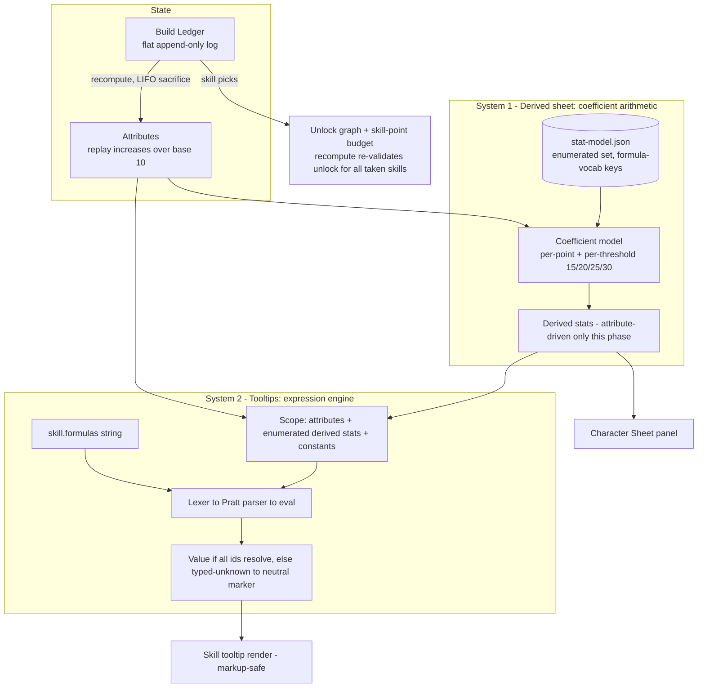
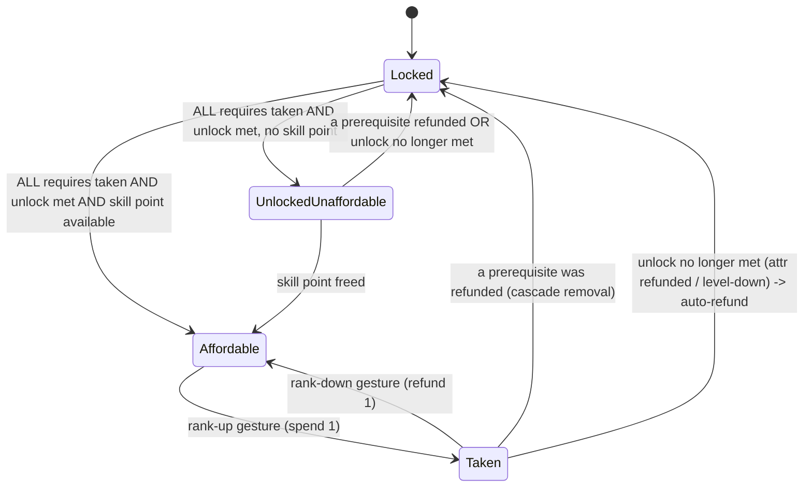
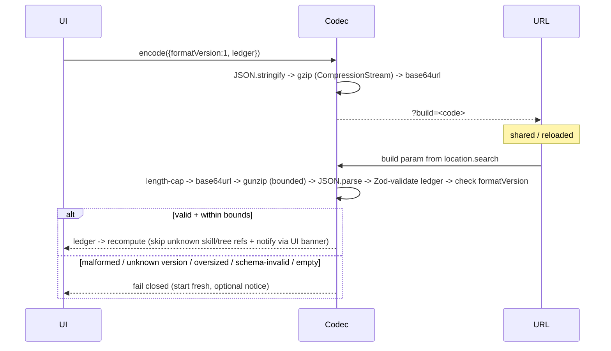

# feat: Phase 1 — Interactive build planner + formula engine + share codes (toward nstratos parity)

## Summary

Phase 1 turns the validated Phase 0 dataset into a **usable, shareable build planner**: allocate attributes and skill points within the level/point economy, see an attribute-driven derived stat sheet update live, read skill tooltips, and share a build via URL. It is built on a **deterministic ledger** (an ordered decision log the character is fully recomputed from) so refunds cascade correctly and level order is reproducible.

**Milestone framing (corrected after review).** The earlier "parity with nstratos" framing oversold this slice. Research overturned the master plan's premise that we'd mirror a reference *engine*: **nstratos has no symbolic formula engine** — its derived stats come from a hardcoded coefficient table, and only skill-effect *tooltip* strings are arbitrary expressions. More importantly, a **substantial share of skill tooltips resolve to a neutral marker ("—") in Phase 1, not only sorcery** — non-sorcery weaponry/shield skills reference armor/shield/weapon-efficiency stats (`Body_DEF`, `Legs_DEF`, `Block_Chance`, `Mainhand_Efficiency`) and skill-flag identifiers that are gear/passive-driven and aren't modeled until Phases 2–3. So **full numeric parity is a Phase-3 outcome**, not a Phase-1 one. Phase 1's milestone is: an interactive planner (trees + attributes + attribute-driven sheet + sharing) that is independently useful, with the engine, ledger, and versioned share format sized to grow into gear/enchants/DPS.

Phase 1 splits "formula" work into two independent systems — a **coefficient-table derived sheet** (attributes → stats) and a **safe expression engine** (skill-effect strings → tooltip numbers, where the scope supports them). Which tooltips resolve is decided by the explicitly-enumerated Phase-1 stat set (KTD14); the engine substitutes a number only when every identifier a formula references is in that scope, and a neutral marker otherwise.

Equipment, enchantments, DPS, build comparison, and the exhaustive stat sheet (incl. skill passives) stay out — those are Phases 2–5.

---

## Problem Frame

Phase 0 landed a typed, validated dataset (228 skills, 21 trees) but no behavior: `src/App.svelte` is a smoke shell, the economy constants in `src/data/constants.json` are all zero placeholders, `statFormulas` is empty, the attribute→stat coefficient data isn't present, and skill `icon` paths point to PNGs that exist nowhere in the repo. A player cannot yet plan a build *in this tool*.

The reference tool (nstratos) defines the target experience: allocate points across a skill tree and attributes, see a derived sheet and skill tooltips, share the result. Phase 1 delivers an independently useful subset of that on our own stack and data. **Positioning (resolved — KTD16):** because nstratos already works and shows more computed values than Phase 1 will, Phase 1 is framed as **foundation** — a usable, shareable planner judged on architecture and correctness, not adoption. The real differentiation (gear, enchants, DPS, comparison) arrives Phases 3–5.

**Actors / flows:** a single actor — a Stoneshard player planning a build. Primary flow: pick level → allocate attributes → invest skill points across trees (respecting unlocks/prereqs) → read live sheet + tooltips → copy a share URL → reopen it later or elsewhere.

---

## Requirements

| ID | Requirement |
|----|-------------|
| R1 | Render all 21 trees / 228 skills with tier/position layout and prerequisite connection lines; provide navigation among the 21 trees; each node shows a distinct **locked / unlocked-unaffordable / affordable / taken** state; rank up and down via a committed, discoverable gesture. |
| R2 | Allocate the five attributes (STR/AGI/PER/VIT/WIL) from a base value of 10, bounded by the per-level attribute-point budget. |
| R3 | Model the level + point economy: **+1 attribute point and +1 skill point per level**, **max level 30**, starting points 0 (attributes) / 2 (skills); never allow overspend. |
| R4 | Maintain a deterministic **build ledger** (ordered log of level-ups, attribute increases, skill picks) from which the full character is recomputed; level-down and refunds cascade deterministically (LIFO); taken skills are re-validated against unlock on every recompute; level order is reproducible. |
| R5 | Provide a **safe expression engine** (tokenizer → Pratt parser → eval over a typed scope; **no `eval()`**) that evaluates skill-effect formula strings, supports the known identifier + function set, fails closed on malformed input, and returns a typed "unknown" for unresolved scope variables. |
| R6 | Compute a **partial derived stat sheet** from attributes via the coefficient model (per-point above 10 + per-threshold at [15, 20, 25, 30]) over an **explicitly enumerated** Phase-1 stat set; it updates live as the build changes. |
| R7 | Render skill tooltips: parse the game markup (`~color~`, `##`, `/*Formula*/`) to **safe** output (no raw-HTML injection); substitute a live value for a placeholder only when every identifier its formula references is in the Phase-1 scope, otherwise a neutral marker; specify the tooltip trigger/placement/dismissal. |
| R8 | Encode/decode shareable build URLs (`?build=<code>`) via a **versioned** gzip→base64url round-trip with **bounded decompression** and **schema validation** of the decoded ledger; load from `location.search` on mount; fail closed on malformed/old/oversized codes; tolerate dataset drift gracefully (skip-and-notify). |
| R9 | Vendor skill icons under the fair-use NOTICE posture with a fallback for missing assets; resolve correctly under the GitHub Pages base path. |
| R10 | Keep all CI gates green (`lint`, `check`, `test`, `validate-data`); new data passes schema + integrity with **zero un-allowlisted warnings**. |

---

## Key Technical Decisions

- **KTD1 — Two independent computation systems.** Derived stat sheet = coefficient-table arithmetic; skill tooltips = expression engine. *Rationale:* nstratos has no symbolic evaluator; only skill-effect strings (110 of 228 skills) are arbitrary expressions. Conflating them would force threshold-counting math through a parser it doesn't need.
- **KTD2 — Vendor the reference JS first, then derive the numbers from the pinned source.** Vendor nstratos's `calculator/*.js` (checksummed, matching the existing `vendor/nstratos/` manifest posture) **before** authoring data, then transcribe coefficients from `stat-bonuses.js` / `build-ledger.js` / `ability-unlock-requirements.js`, cross-checked against the official wiki. **The vendored JS is provenance-only — referenced, not imported or executed.** *Rationale:* every load-bearing number currently rests on transient research; pinning the source makes it re-derivable and verifiable in-repo when patches land (resolves Call-out A, lowers parity risk).
- **KTD3 — Derived sheet is a coefficient table, not formula strings.** *Rationale:* the model is "per-point above 10 + once per crossed threshold in [15,20,25,30]"; threshold-counting (`count(t ≤ stat)`) doesn't express cleanly as a linear formula. `statFormulas` stays reserved/empty.
- **KTD4 — Ledger = ordered decision log + full recompute** (mirror the reference's proven algorithm). The log is a **flat, append-only** stream; level number = count of `levelUp` entries; `levelDown` removes the last `levelUp`; allocations are budget-checked globally on recompute. When the budget is exceeded, recompute **sacrifices LIFO** (walk the log backward, removing the most recent offending allocations and their dependents until within budget). *Rationale:* deterministic refunds, reproducible level order, one well-defined cascade rule; the nstratos `build-ledger.js` LIFO/refund logic is the correctness reference to mirror.
- **KTD5 — Expression engine fails closed; unresolved variables are typed "unknown."** A placeholder substitutes a number only if **all** its identifiers resolve; any `unknown-var`/`error` → neutral marker, never a silent `0`. *Rationale:* the Phase-1 scope is genuinely partial; the engine must degrade visibly and never throw to the UI.
- **KTD6 — Our own versioned share format (`formatVersion: 1`), not byte-compatible with nstratos.** Same technique (JSON → gzip via `CompressionStream` → base64url → `?build=`), but **bounded and schema-validated on decode** (KTD12/U8). *Rationale:* our build model is a superset (gear/enchants later); a version field gives forward compat. The unknown-version branch is cheap insurance for Phase 2+.
- **KTD7 — Svelte 5 runes; ledger as a `.svelte.ts` rune module.** *Rationale:* runes-mode project (`mount()` in `src/main.ts`); ESLint already configures a parser for `*.svelte.ts`.
- **KTD8 — Tooltip markup parsed to safe escaped segments, never raw HTML.** Every path — resolved value, neutral marker, and the malformed-markup "degrade to plain text" fallback — routes through the same escaped renderer; color-span CSS values are not attacker-influenced. *Rationale:* game text is untrusted third-party content (stored-XSS vector).
- **KTD9 — Partial sheet = attributes only; skill-passive and gear contributions deferred (Phase 2/3).** *Consequence (made explicit):* because school Powers **and** armor/shield/weapon-efficiency stats are gear/passive-driven, a substantial share of tooltips — non-sorcery as well as sorcery — resolve to the neutral marker in Phase 1. The exact resolving fraction follows from KTD14's enumerated set. *Rationale:* the master plan places passives in Phase 2; our skill data has no structured "passive grants +X stat" field.
- **KTD10 — Update both data loaders in lockstep.** `src/lib/data/load.ts` and `scripts/validate-data.ts` read the split JSON files independently; any new data file must be added to both.
- **KTD11 — `unlock.attributePoints` = total invested points across the listed attributes, in one isolated predicate.** Measured as `Σ max(attr − baseAttributeValue, 0)` over `unlock.attributes`; a skill is unlocked when `level ≥ unlock.level` **OR** that sum `≥ unlock.attributePoints`, **and** all `requires` are taken. *Rationale:* decides the locked/affordable state of 154/228 skills; isolating it in `economy.ts` as one named predicate makes a correction (if the in-game reading differs — see Open Questions) a one-line change. Verified by a spot-check against the game before U5 builds on it.
- **KTD12 — Component tests at the pure-logic seam; components stay thin.** No Svelte component-mount harness (`@testing-library/svelte`) exists or is added in Phase 1. Behavior (node-state derivation, sheet values, tooltip rendering, hydration) is tested as pure functions; `.svelte` files carry near-zero logic and are exercised in manual verification.
- **KTD13 — Build the algorithmic core fresh (don't port nstratos's JS), but mirror it for correctness.** The reference is MIT and could be ported, but Phase 1 reimplements the ledger, LIFO refund, unlock predicate, codec, and economy on Svelte/TS. *Rationale:* the no-`eval()` posture, runes reactivity, type safety, and the superset build model favor a clean implementation; the vendored JS (KTD2) is the behavioral reference to mirror, which is why LIFO/relock/codec each carry explicit value tests. **Build-vs-port for the expression engine was reviewed and resolved in favor of building (2026-06-23):** nstratos has no generic evaluator to port — it hardcodes each tooltip — so our string-based data model needs an evaluator regardless; the grammar is small, the engine's full payoff lands in Phases 2–5, and correctness is controlled test-first against known values.
- **KTD14 — Enumerate the Phase-1 in-scope derived-stat set; classify boundary identifiers.** `stat-model.json` commits an explicit list of derived stats it produces, keyed in the **formula-identifier vocabulary** so the engine scope is a direct merge. Each boundary identifier (`Vitality`, `Block_Chance`, `Body_DEF`, `Legs_DEF`, `EVS`, `Miracle_Chance`) is classified in-scope (attribute-derived) or deferred. *Rationale:* this set — not the engine's sophistication — decides which tooltips render numbers vs "—"; leaving it implicit makes the tooltip experience emergent and untestable.
- **KTD15 — One shared identifier registry, with functions split from stat identifiers.** `KNOWN_IDENTIFIERS` is currently module-private in `transform.ts`; promote it to a shared export (e.g. `src/lib/formula/identifiers.ts`) consumed by both the bootstrap and the engine, and split function names (`math_round, max, min, floor, ceil, round, abs`) from stat identifiers so the engine's function table and scope-variable set don't conflate. *Rationale:* U2's "reuse, don't re-derive" instruction is otherwise un-actionable (the constant isn't importable).
- **KTD16 — Phase 1 is positioned as foundation, not measured by adoption** (resolved 2026-06-23). The real differentiation (gear, enchantments, DPS, build comparison) arrives Phases 3–5; during Phases 1–3 nstratos stays the more numerically complete tool. Phase 1 is framed and judged as a usable, shareable planner and a clean foundation, not as an nstratos competitor. *Day-one hook:* once KTD14's in-scope set is enumerated, identify the build archetype whose tooltips fully resolve (likely an attribute-driven melee/HP path) and message Phase 1 around it. *Rationale:* avoids measuring Phase 1 against an adoption bar it isn't meant to clear, and keeps investment on the foundation later phases lean on.

---

## High-Level Technical Design

### Recompute pipeline + the two computation systems



### Skill-node state machine (drives R1 + refund cascade)



### Share-code round-trip (R8)



---

## Output Structure

New files Phase 1 introduces (per-unit `**Files:**` remain authoritative):

```text
src/
  lib/
    formula/
      identifiers.ts    identifiers.test.ts    # shared registry (promoted from transform.ts), funcs split from stats
      lexer.ts          lexer.test.ts
      parser.ts         parser.test.ts
      eval.ts           eval.test.ts
      scope.ts          scope.test.ts
    build/
      ledger.svelte.ts  ledger.test.ts
      economy.ts        economy.test.ts        # isolated unlock predicate (KTD11)
      character.ts      character.test.ts      # recompute + LIFO sacrifice + relock + patch-drift
      stats.ts          stats.test.ts
      node-state.ts     node-state.test.ts     # pure node-state derivation (KTD12)
    tooltip/
      markup.ts         markup.test.ts
      render.ts         render.test.ts
    share/
      codec.ts          codec.test.ts          # versioned, bounded, schema-validated
    data/
      load.ts           # extended: import stat-model.json
  components/
    SkillTree.svelte    TreeSelector.svelte    AbilityNode.svelte    ConnectionLines.svelte
    Icon.svelte
    AttributePanel.svelte    LevelControls.svelte
    CharacterSheet.svelte    Tooltip.svelte    ShareBar.svelte    Notice.svelte
  data/
    constants.json      # populated (economy)
    stat-model.json     # NEW: enumerated coefficient table + derived-stat metadata (formula-vocab keys)
vendor/nstratos/
  calculator/*.js       # NEW: vendored reference source, checksum-pinned, provenance-only (KTD2)
scripts/
  validate-data.ts      # extended: load stat-model.json (lockstep with load.ts)
```

---

## Implementation Units

Grouped: **Core logic** (U1–U4) → **UI** (U5, U6, U7) → **Assets & integration** (U8 codec, U9 icons, U10 shell). U-IDs are stable; U5 and U8 were narrowed and U9/U10 added during deepening (gaps/ordering intentional).

### U1. Phase-1 data foundation: vendored source + economy + enumerated coefficient model + loader wiring

**Goal:** Pin the reference source, then land the curated data Phase 1 needs and flow it through both loaders and the gate.
**Requirements:** R2, R3, R6, R10.
**Dependencies:** none.
**Files:**
- `vendor/nstratos/calculator/*.js` (vendor FIRST) + checksum entries in the vendor manifest
- `src/data/constants.json` (populate economy), `src/data/stat-model.json` (new)
- `src/lib/types.ts` (extend Zod: `Constants` fields + new `StatModel` / `AttributeBonus` / `DerivedStatDef`; add `statModel` to `Dataset`)
- `src/lib/formula/identifiers.ts` (+ test) — promote `KNOWN_IDENTIFIERS` to a shared export, split functions from stat identifiers (KTD15); update `transform.ts` to import it
- `src/lib/data/load.ts` and `scripts/validate-data.ts` (import the new file — lockstep, KTD10)
- `src/lib/data/load.test.ts` (extend)

**Approach:** **Vendor + checksum the nstratos `calculator/*.js` first** (KTD2, provenance-only), then transcribe numbers from the pinned files. Populate `constants.json`: `attributePointsPerLevel: 1`, `skillPointsPerLevel: 1`, `startingAttributePoints: 0`, `startingSkillPoints: 2`, `startingLevel: 1`, `maxLevel: 30`, `baseAttributeValue: 10`. New `stat-model.json` carries `mainStatThresholds: [15,20,25,30]`, the `attributeBonuses` coefficient table (STR/AGI/PER/VIT/WIL `perPoint` + `perThreshold`), and an **explicitly enumerated `derivedStats` list** (KTD14) keyed in the formula-identifier vocabulary (`Magic_Power`, `Block_Chance`, `max_hp`, …), each boundary identifier classified in- or out-of-scope. Promote `KNOWN_IDENTIFIERS` to `identifiers.ts`, splitting the function set from stat identifiers (KTD15). Keep `statFormulas` empty/reserved. Curated data must not introduce bootstrap warnings.
**Patterns to follow:** `types.ts` schema+inferred-type pairing; the split-file `loadComposed()` shape in both loaders; vendor-manifest checksum posture.
**Test scenarios:**
- `parseDataset` accepts the populated constants + new `stat-model.json`; rejects a stat-model missing `attributeBonuses` or with an unkeyed derived stat (typed ZodError).
- Economy values correct (1/1 per level, max 30, base 10, starting 0/2).
- `identifiers.ts` exports the registry; functions and stat identifiers are separable sets.
- `load.ts` and `validate-data.ts` compose an **identical** dataset object (guards dual-loader drift, KTD10).
- `validate-data` stays green on the 228/21 dataset with zero un-allowlisted warnings. *Covers R10.*

### U2. Safe expression engine (lexer → Pratt parser → evaluator + typed scope)

**Goal:** Evaluate skill-effect formula strings to numbers over a typed scope, with no `eval()`.
**Requirements:** R5.
**Dependencies:** U1 (shared `identifiers.ts`); `scope.ts` consumes U3's derived-stat output shape.
**Files:** `src/lib/formula/{lexer,parser,eval,scope}.ts` + colocated `*.test.ts`.
**Approach:** Tokenizer for numbers, identifiers, `+ - * /`, parentheses, commas, function calls. Pratt parser with correct precedence (`* /` over `+ -`, unary minus, groups). Evaluator over a `Scope` (`Record<string, number>`) with the function table from `identifiers.ts` (`math_round, max, min, floor, ceil, round, abs`) — kept distinct from scope variables (KTD15). Return a **discriminated result** (`{ kind: 'value', value } | { kind: 'unknown-var', name } | { kind: 'error', message }`); never throw. `scope.ts` merges attributes + enumerated derived stats (U3, formula-vocab keys) + constants; a referenced identifier absent from the merge → `unknown-var`.
**Execution note:** Test-first — known-value cases first; highest-correctness-risk component.
**Patterns to follow:** discriminated-result + assert-on-`.kind`; in-file builders; `node` env.
**Test scenarios:**
- Tokenize numbers, identifiers, operators, function calls, parentheses.
- Precedence: `2 + 3 * 4` → 14; `(2 + 3) * 4` → 20; unary `-5 + 1` → -4.
- Functions: `floor(3.7)` → 3, `max(1, 9)` → 9, `math_round(2.5)` → 3; a function name is never treated as a scope variable.
- A formula fully in scope evaluates exactly (e.g. one referencing only `Magic_Power`).
- Unresolved variable → `{kind:'unknown-var'}`; malformed input (`'2 +'`, `'foo('`, `'1 ** 2'`) → `{kind:'error'}` — both without throwing. *Covers R5.*

### U3. Derived stat sheet computation (enumerated coefficient model)

**Goal:** Compute the partial derived sheet from attributes over the enumerated Phase-1 stat set.
**Requirements:** R6.
**Dependencies:** U1.
**Files:** `src/lib/build/stats.ts` + `stats.test.ts`.
**Approach:** `computeDerivedStats(attributes, statModel)` → for each enumerated derived stat, `base + Σ perPoint·max(attr − baseAttributeValue, 0) + Σ perThreshold·count(t ≤ attr)`. Pure function; output keyed in the formula vocabulary (direct merge into the engine scope). Only the KTD14-enumerated, attribute-driven stats are produced; deferred stats are intentionally absent (→ `unknown-var` in tooltips).
**Execution note:** Test-first against the recovered coefficient table.
**Test scenarios:**
- All attributes at base 10 → every enumerated derived stat equals its `base`.
- Per-point: WIL 11 → `cooldownsDuration` −1.5; VIT 11 → `max_energy` +4.
- Per-threshold: WIL 15 → `Magic_Power` +7.5; WIL 30 → +30 (4 thresholds × 7.5) atop per-point.
- Combined STR/AGI/PER/VIT/WIL build matches the hand-computed sheet.
- **Numeric-parity spot check against the live game at patch 0.9.4.x** (not only nstratos) for 2–3 reference builds. *Covers R6.*

### U4. Build ledger + point economy + deterministic character recompute

**Goal:** The ordered-log state core: enforce the economy, recompute, cascade refunds, stay legal.
**Requirements:** R3, R4.
**Dependencies:** U1, U3.
**Files:** `src/lib/build/ledger.svelte.ts`, `economy.ts`, `character.ts` + colocated `*.test.ts`.
**Approach:** `ledger.svelte.ts` holds the rune-based **flat append-only** log (`levelUp`/`levelDown`, `addAttribute`/`removeAttribute`, `addSkill`/`removeSkill`); level = count of `levelUp`, `levelDown` removes the last (KTD4). `economy.ts` derives available vs spent points and **owns the single `isUnlocked` predicate** (KTD11). `character.ts#recompute(ledger, dataset)` resets to base, replays attribute increases → attributes → `computeDerivedStats` (U3) → resolves the taken-skill set, enforcing in one place:
- **Re-validate unlock for every taken skill** against post-replay level + attributes (both paths), auto-refunding (with cascade) any now-illegal skill.
- **Refund cascade:** removing a skill BFS-removes dependents over `requires`; a node needs **all** `requires` taken (diamond dependencies).
- **LIFO sacrifice:** a level-down over budget removes the most recent offending allocations (and dependents) until within budget.
- **Patch-drift:** a ledger entry referencing a skill/tree key absent from the current dataset is skipped (with dependents) and surfaced via the UI notice (U10); recompute never throws and never discards the whole build.
Model rank as **binary (taken / not-taken)** — all current data is `maxRank: 1`; leave a one-line note that the ledger entry can carry a rank field when multi-rank data arrives (no speculative rank logic now). Mirror the vendored `build-ledger.js` LIFO/refund behavior for correctness (KTD13).
**Execution note:** Test-first — determinism, relock, and LIFO cascade are correctness-critical.
**Patterns to follow:** `.svelte.ts` rune module (KTD7); discriminated outcomes; determinism test like `transform.test.ts`; reuse `validate.ts` vocabulary (`unknown-skill-ref`, `dangling-prerequisite`) for drift.
**Test scenarios:**
- `levelUp` grants +1/+1, capped at 30; `levelDown` removes the last level-up.
- Spend attribute point → available decreases; overspend rejected (`no-points`).
- Skill pick requires available skill point + unlock satisfied + all prereqs; rejects `duplicate`, `locked`, `no-points`.
- Unlock predicate (KTD11): level path unlocks; total-invested path unlocks (`Σ max(attr−10,0) ≥ attributePoints`, summed across the listed attributes); neither → locked.
- **Relock:** a skill unlocked only via the attribute path auto-refunds when an attribute refund/level-down drops the invested sum below threshold; same for the level path.
- **Diamond dependency:** `requires:[A,B]` — refunding A removes the dependent though B remains.
- **LIFO sacrifice:** level 30 with 29 attribute points spent, dropped toward level 1 → most-recent allocations refunded first, deterministically.
- **Patch-drift:** a ledger with one unknown skill key recomputes the rest and flags the stale entry.
- Determinism: same ledger → identical character; level order preserved. *Covers R3, R4.*

### U5. Skill-tree UI (navigation, nodes, connection lines, states, interaction)

**Goal:** Render and navigate the interactive trees and wire clicks to the ledger.
**Requirements:** R1.
**Dependencies:** U4 (and U9 for real icons; renders fallback glyphs without it).
**Files:** `src/components/{SkillTree,TreeSelector,AbilityNode,ConnectionLines}.svelte`; `src/lib/build/node-state.ts` + `node-state.test.ts`.
**Approach:** **Tree navigation:** `TreeSelector` presents the 21 trees (tabbed/sidebar list) and shows one tree's grid at a time, with a default tree on first load and per-tree invested-point counts surfaced in the selector. Extract node-state into a **pure function** `nodeState(skill, character, economy)` → `locked | unlocked-unaffordable | affordable | taken` (the tested seam, KTD12). SVG tree: nodes by `tier` (row) × `position` (column); `ConnectionLines` from each skill to its `requires` targets. `AbilityNode` consumes `Icon` (U9). **Rank gestures (committed):** left-click ranks up; rank-down via a **visible refund affordance** (a small minus/refund control on the hovered/taken node) rather than a pointer-only right-click — so the action is discoverable and leaves a keyboard path open for Phase-6 a11y. Components stay thin.
**Patterns to follow:** Svelte 5 runes; CSS vars from `src/app.css`; pure-logic seam tested, components manual-verified.
**Test scenarios:**
- `nodeState` returns each of the four states for crafted character + economy fixtures (locked w/ unmet prereq; locked w/ unmet unlock; unlocked-unaffordable at 0 points; affordable; taken).
- Diamond topology: a node with `requires:[A,B]` is `locked` until both are taken.
- Layout helper places nodes by tier/position and yields a connection entry per `requires` edge (pure).
- Tree-selection logic: switching the active tree changes the rendered set; default tree on first load. *Covers R1.*
- *Component rendering (SVG, lines, selector, refund affordance) verified in manual verification per KTD12.*

### U6. Attribute panel, level controls, and live character sheet

**Goal:** Allocate attributes/level and display the live partial sheet.
**Requirements:** R2, R3, R6.
**Dependencies:** U4, U3.
**Files:** `src/components/{AttributePanel,LevelControls,CharacterSheet}.svelte`.
**Approach:** `AttributePanel` shows the five attributes with +/− bound to ledger ops and the available-points budget; `LevelControls` adjusts level (1–30) and surfaces remaining attribute/skill points and a "level order" view (the flat log interleaves allocations between level-ups). `CharacterSheet` renders `computeDerivedStats` output grouped by category. Displayed numbers come from already-tested pure functions (U3/U4); components stay thin (KTD12).
**Patterns to follow:** runes; CSS vars; derived state over the ledger store.
**Test scenarios:**
- *(Covered at the logic seam in U3/U4: budget enforcement, level clamp [1,30], threshold-crossing bumps.)*
- Manual: +/− respects the budget (disabled at 0 available); level up/down updates points; sheet updates on attribute change and a threshold crossing (WIL 14→15) bumps the affected stat. *Covers R2, R3, R6.*

### U7. Tooltip rendering (markup parser + scope-aware substitution + trigger)

**Goal:** Safe, readable tooltips with live values where the scope supports them.
**Requirements:** R7.
**Dependencies:** U2 (engine), U3 (scope), hosted by U5/U6.
**Files:** `src/lib/tooltip/{markup,render}.ts` + tests; `src/components/Tooltip.svelte`.
**Approach:** `markup.ts` tokenizes color spans (`~r~…~/~`, `~w~`, `~p~`), paragraph breaks (`##`), and `/*Formula_Name*/` placeholders. `render.ts` resolves each placeholder via U2 over the current scope; `value` → number, `unknown-var`/`error` → neutral marker (never a wrong number or raw markup). Output is structured escaped segments; `Tooltip.svelte` renders them — **no `{@html}`** (KTD8). **Trigger/placement (committed):** tooltip shows on hover/focus of a node, positioned to avoid the click target, dismissed on blur/leave — it does not consume the rank-up/rank-down gesture.
**Patterns to follow:** discriminated segments; reuse U2 results; CSS vars for color spans; pure-logic seam tested (KTD12).
**Test scenarios:**
- Markup parse: color spans, `##` breaks, `/*X*/` placeholders tokenize; malformed/unclosed markup degrades to plain text (via the escaped renderer, no crash).
- **Fully-in-scope formula** (only KTD14-enumerated stats, e.g. over `Magic_Power`) substitutes the number.
- **Out-of-scope sorcery formula** (Wormhole's `Arcane_Damage` via `Arcanistic_Power`) → neutral marker.
- **Out-of-scope non-sorcery formula** (e.g. a weaponry/shield skill via `Body_DEF`) → neutral marker — proving the deferral is broader than sorcery.
- Security: tooltip text containing `` renders escaped, never live HTML. *Covers R7.*

### U8. Share codec (versioned, bounded, schema-validated, fail-closed)

**Goal:** Safe versioned encode/decode of the build, independent of any UI.
**Requirements:** R8 (codec half).
**Dependencies:** U4 (the ledger's serializable shape).
**Files:** `src/lib/share/codec.ts` + `codec.test.ts`.
**Approach:** `encode({formatVersion: 1, ledger})` → `JSON.stringify` → gzip via `CompressionStream` → base64url. `decode` (treating the input as **untrusted**): reject overlong codes before decompression (input length cap); stream `DecompressionStream` output with a hard byte ceiling (sized to the largest legitimate max-level build), aborting + failing closed if exceeded (zip-bomb guard); `JSON.parse`; **validate the decoded object against a Zod ledger schema** (op kinds, field types, and an entry-count ceiling); validate `formatVersion`. Any failure → `null`/typed error. "Structurally valid" is defined as schema-valid. Patch-drift (valid code, stale refs) is `recompute`'s job (U4). Assert the meaningful invariant on the **recomputed character**, not log bytes; document whether cancelled ops are compacted before encoding.
**Execution note:** Test-first for the round-trip and the bounds.
**Patterns to follow:** discriminated result; `node` test env (`CompressionStream` is available in the runtime); reuse the U1 Zod posture for the ledger schema.
**Test scenarios:**
- Round-trip: `decode(encode(ledger))` recomputes to an **equivalent character**.
- `formatVersion` embedded; unknown/old version → fail-closed (no throw).
- Malformed base64 / non-gzip / empty string → fail closed.
- **Zip-bomb:** a small payload that decompresses past the byte ceiling → fail closed, not OOM.
- **Schema:** valid `formatVersion` + malformed/over-typed `ledger`, or an over-length ledger → fail closed.
- A heavily-edited ledger round-trips to the same recomputed character. *Covers R8 (codec).*

### U9. Skill icons: vendoring + Icon component + fallback

**Goal:** Bring in the icon assets under fair use, with a robust fallback.
**Requirements:** R9.
**Dependencies:** none (parallelizable; unblocks U5's real icons but U5 works on fallback without it).
**Files:** vendored `public/img/abilities/<tree>/<Name>.png`; `src/components/Icon.svelte`; `NOTICE.md` update.
**Approach:** Vendor nstratos's icon set into `public/img/abilities/` (fair-use posture; update `NOTICE.md`). `Icon.svelte` resolves `${import.meta.env.BASE_URL}img/abilities/...` (never absolute `/img/...`, per `base: './'`) with an `onerror` fallback to a placeholder glyph. No gate verifies icon-file existence, so the fallback is the safety net.
**Patterns to follow:** `import.meta.env.BASE_URL`; CSS vars; thin component (KTD12).
**Test scenarios:**
- `Icon` resolves the asset path under `BASE_URL`; a missing asset triggers the fallback glyph (tested as path-resolution + fallback logic; otherwise manual).
- *Vendoring itself: `Test expectation: none — static assets, covered indirectly by the Icon fallback path.* *Covers R9.*

### U10. App shell + ShareBar + on-mount build load + user-facing states

**Goal:** Assemble the app, wire share-link hydration end to end, and specify the user-facing states.
**Requirements:** R8 (hydration half), end-to-end assembly of R1–R7.
**Dependencies:** U4, U5, U6, U7, U8, U9.
**Files:** `src/components/{ShareBar,Notice}.svelte`; `src/App.svelte` (replace the smoke shell + on-mount load); `src/main.ts` (unchanged unless needed).
**Approach:** `App.svelte` reads `location.search` on mount, decodes any `?build=` via the codec (U8), rebuilds the ledger → recompute (U4, which handles patch-drift); absent/empty/invalid → fresh build. **First-run/empty state:** default tree shown, starting points (2 skill / 0 attribute) surfaced so the user knows they can act immediately, with a one-line orientation on an untouched build. **`Notice.svelte`:** a dismissible banner that, on a patch-drift load, states how many (and which) skills/trees were skipped — making the "never silently break" guarantee visible. **`ShareBar.svelte`:** a copy-URL control with a transient "Copied!" confirmation, and a **paste-import flow** — a field to paste a code/URL, a decode trigger, and two outcomes (valid → replace the build with confirmation; invalid → reject with an error message via U8's fail-closed result). Layout hosts `TreeSelector`+`SkillTree`, `AttributePanel`, `LevelControls`, `CharacterSheet`, `ShareBar`, `Notice`, with the fair-use disclaimer footer preserved; query-param routing only (SPA 404 fallback, `base: './'`).
**Patterns to follow:** `import.meta.env.DEV` gating if validation is expensive; CSS vars; thin components (KTD12).
**Test scenarios:**
- On-mount hydration helper: a `?build=` reconstructs the build; absent / empty / invalid → fresh build (pure helper tested).
- Manual: invest → copy URL (see "Copied!") → reopen → same character; paste a valid code → build replaced; paste an invalid code → error message; a `?build=` referencing removed content → `Notice` banner naming the skipped count, build otherwise intact; first-run shows the default tree + starting-points orientation; icons load (missing one falls back) under a Pages-style base path. *Covers R8 (hydration), end-to-end R1–R7.*

---

## Scope Boundaries

**In scope:** R1–R10 — navigable interactive trees, attributes, economy, ledger, expression engine, enumerated coefficient sheet, safe tooltips, versioned/bounded/validated share URLs, vendored icons, green CI.

### Deferred for later (Phases 2–6, per master plan)
- **Phase 2:** exhaustive derived stat sheet **including skill-passive contributions** (KTD9) — this is what lights up the deferred tooltips (school Powers, armor/shield/weapon-efficiency stats); class starting sheets / class selection (Open Questions).
- **Phase 3:** equipment/gear and their stat contributions (the other deferred-tooltip source).
- **Phase 4:** enchantments & legendaries (*Ancient Echoes*).
- **Phase 5:** DPS / effective-HP and two-build comparison.
- **Phase 6:** polish — mobile/responsive, a11y (the visible refund affordance + hover/focus tooltips keep a keyboard path open), formula-rendering refinements.

### Deferred to follow-up work (Phase-1-adjacent, out of this slice)
- Extending the UMT exporter to pull items/enchants (the long-term source-of-truth pipeline).
- Treatise-acquisition gating (Phase 1 models only level + invested-attribute gating).
- A Svelte component-mount test harness (`@testing-library/svelte`) — Phase 1 tests at the pure-logic seam (KTD12).
- A `scripts/warning-allowlist.json` — only if a genuine, signed-off data gap must ship.

### Non-goals
- **Byte-compatibility** with nstratos share codes (our build model is a superset — KTD6).
- **Pixel-perfect** replication of nstratos's CSS; we match tree *topology* and *numbers*, with our own visual design.

---

## Risks & Dependencies

| Risk | Impact | Mitigation |
|------|--------|------------|
| Coefficient numbers unverified until vendored | Calculator confidently shows wrong stats; no gate catches game-incorrectness | Vendor + checksum the reference JS first (KTD2/U1); spot-check 2–3 builds against the **game** at 0.9.4.x (U3). |
| Expression-engine correctness (high) | Wrong tooltip numbers undermine trust | Test-first with known-value cases; fail-closed on uncertainty (KTD5). |
| Tooltip deferral broader than sorcery | "Computed values" reads as broken if unframed | Reframe milestone (Summary, KTD9); enumerate the in-scope set (KTD14); U7 tests a non-sorcery "—" case. |
| Ledger relock / LIFO cascade correctness | Illegal builds or non-deterministic refunds | Recompute re-validates unlock for all taken skills + deterministic LIFO (KTD4, U4); relock + diamond + LIFO tests; mirror the reference (KTD13). |
| Share-code zip-bomb / DoS | One-click victim tab OOM/hang from a shared link | Input length cap + bounded `DecompressionStream` output, fail closed (U8). |
| Decoded ledger trusted before validation | Adversarial payload reaches the recompute core | Zod-validate the decoded ledger + entry-count ceiling before recompute (U8). |
| Share-code patch-drift | Shared links silently break / discard whole builds | Skip-and-notify on unknown refs (U4) surfaced via the `Notice` banner (U10), never throw/discard (R8). |
| Dual-loader drift | App and gate diverge silently | Update both in lockstep (KTD10) + "identical compose" test (U1). |
| Base-path / share-link breakage on Pages | Icons 404, share links fail | Relative/`BASE_URL` assets + query-param routing; Icon fallback + hydration tests. |
| No component-mount harness | Component behavior untested by default | Pure-logic seam tests, thin components (KTD12); rendering in manual verification. |
| Untrusted tooltip text (XSS) | Stored-XSS via game data | Escaped segments through one renderer, never `{@html}` (KTD8); security test (U7). |

**External dependency:** none new at runtime (gzip via native `CompressionStream`/`DecompressionStream`, confirmed in Node 22/24 for `node` codec tests). Build/CI unchanged (Node 22, SHA-pinned actions).

---

## Open Questions

> **Resolved during review (2026-06-23):** Phase-1 positioning → **foundation, not adoption-measured** (KTD16); engine **build-vs-port → build** (KTD13). Remaining items below.

- **In-scope derived-stat classification.** KTD14 requires enumerating which derived stats `stat-model.json` produces and classifying boundary identifiers (`Vitality`, `Block_Chance`, `Body_DEF`, `Legs_DEF`, `EVS`, `Miracle_Chance`). This is settled in U1 against the vendored source; the exact resolving-vs-"—" fraction follows from it.
- **`unlock.attributePoints` reading (pinned default, verify before relying on it).** Implemented as total invested across the listed attributes (KTD11), isolated in `economy.ts`. Spot-check a couple of reference builds against the game; with a 29-point lifetime budget a threshold of 20 is reachable by spreading points across the listed attributes — it does not require any single attribute at 30. If the in-game reading is "current attribute value," it's a one-line predicate change.
- **Class selection / starting sheets.** Derived-stat bases are nstratos defaults; the wiki lists them per class. Phase 1 uses a single neutral base. *Default: defer class selection to Phase 2.*
- **Starting skill points = 2.** An nstratos convention, not wiki-confirmed; adopted for parity; revisit if in-game differs.

---

## Sources & Research

- **Master plan:** `~/.claude/plans/mighty-inventing-hammock.md` (Phase 1 definition).
- **Repo grounding:** `src/lib/types.ts` (schema), `src/lib/data/load.ts` + `scripts/validate-data.ts` (dual loaders), `src/lib/validate.ts` (11 integrity kinds + `unknown-skill-ref`/`dangling-prerequisite` vocabulary), `src/lib/bootstrap/transform.ts` (`KNOWN_IDENTIFIERS` — currently module-private; promote per KTD15), `vite.config.ts` (`base: './'`), `.github/workflows/deploy.yml` (CI: lint→check→test→validate-data), `package.json` (no Svelte component-test harness; `CompressionStream` available in Node 22/24). Confirmed gaps: empty `statFormulas`, zeroed `constants.json`, all 228 `icon` paths missing, `vendor/nstratos/` holds data only (no calculator JS — vendored in U1).
- **External (load-bearing, to be pinned in U1):** `nstratos/stoneshard-talent-calculator` source — `build-ledger.js` (economy +1/+1, start 0/2, ordered ledger + LIFO refunds), `stat-bonuses.js` (coefficient table + thresholds `[15,20,25,30]`), `character.js` (derived-stat list + bases), `ability-tooltip-values.js` (**no symbolic engine** — KTD1), `ability-unlock-requirements.js` (gating model — KTD11), `talent-calculator.js` (share format, gzip→base64url, soft cap 30). Official wiki (`stoneshard.com/wiki/Level`, `/Attributes_&_Stats`, `/Willpower`) confirmed economy + WIL coefficients (patch 0.9.4.6). *These currently rest on web research; KTD2/U1 vendor + pin the source so they're verifiable in-repo.*
- **Deepening + 7-persona doc review (2026-06-23):** drove the LIFO/relock/level-order/patch-drift specs (U4); the partial-scope tooltip reality and milestone reframe (Summary/KTD9/KTD14/U7); the U5→U5/U9 and U8→U8/U10 splits; reference-JS-first vendoring (KTD2/U1); the `KNOWN_IDENTIFIERS` export (KTD15); tree navigation, UI feedback/first-run/notice states, and the committed rank-down/tooltip gestures (U5/U7/U10); share-code bounded-decompression + ledger schema validation (U8); dropping speculative `maxRank` logic (U4); and the standalone-value / build-vs-port Open Questions.

---

## Verification

- **Unit (Vitest):** engine known-value cases; coefficient sheet vs hand-computed; ledger recompute determinism + relock + LIFO + diamond + patch-drift; node-state derivation; codec round-trip + zip-bomb + schema-rejection; tooltip markup safety + in-scope/out-of-scope (sorcery **and** non-sorcery) substitution. Pure logic in `node`.
- **Data gate:** `validate-data` green on the 228/21 dataset incl. `stat-model.json`; zero un-allowlisted warnings; both loaders compose identically.
- **CI:** `lint → check → test → validate-data` all green.
- **Manual (the component layer, per KTD12):** `npm run dev`; build 2–3 reference characters, compare the sheet + a fully-in-scope tooltip's numbers against the game at 0.9.4.x (and confirm out-of-scope tooltips show "—"); navigate trees; exercise refund cascades + a level-down; copy/paste-import a `?build=` URL; load a `?build=` referencing removed content (expect the `Notice` banner); confirm icons load and a missing one falls back via `npm run build && npm run preview`.
