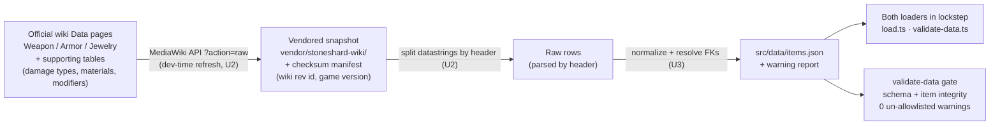

# feat: Item-data extraction pipeline + validated item dataset (M2)

## Summary

Stand up the **item data foundation** for the build calculator: a first-class item schema (weapons, armor, accessories), an extraction pipeline that ingests Stoneshard item data from the **official wiki's parser-generated dumps** into a vendored, patch-stamped snapshot, and a normalized `src/data/items.json` wired through both data loaders and the `validate-data` gate with item-aware referential-integrity checks. This is **data only** — no equipment UI, no equipping, no damage math. M2 is the critical path that gates the gear, damage, and combat milestones (M3–M5): nothing downstream produces real numbers until items exist.

---

## Problem Frame

Phase 1 shipped a talent planner with an attribute-only derived sheet; there is no gear and no `items.json`. The `Item`/`EquipmentSlot` Zod schemas in `src/lib/types.ts` are forward-looking stubs with empty data, `src/data/constants.json` has an empty `damageTypes` list, and the UMT exporter under `tools/` has a stubbed `ExtractItems()` pass. The brainstorm's gating question — **where item data comes from** (UMT vs wiki) — is now resolved: the official Stoneshard wiki publishes parser-generated, machine-readable item dumps refreshed each patch, giving game-file fidelity without running UndertaleModTool (see Key Technical Decisions). M2 turns that source into a validated dataset under the existing Phase-0/1 data posture (vendored + checksum-pinned source, dual loaders, `validate-data` gate with zero un-allowlisted warnings).

---

## Key Technical Decisions

- **KTD1 — Source: the official wiki's parser dumps, not UMT, not Fandom.** `stoneshard.com/wiki` publishes `Weapon data` (70 columns) and `Armor data` (93 columns) plus jewelry/consumable/supporting tables as semicolon-delimited "Datastrings" with header rows, generated by the wiki admin's parser from the game files and bulk-refreshed each patch. This yields UMT-grade fidelity that is **agent/CI-runnable** (MediaWiki API, no Windows/game/UMT dependency and no GML reverse-engineering of an unknown internal layout). The Fandom mirror is disqualified (stale at 0.6.1.10 vs the live 0.9.4.x). Fits the project: Phase-1 numbers were already cross-checked against this same official wiki, and `NOTICE.md`'s fair-use posture covers game-fact data. (Advances R4; see Alternatives Considered.)
- **KTD2 — Keep a UMT / ModShardLauncher fallback warm.** The wiki is bulk-updated by one maintainer and can lag a patch. The plan keeps a verification path documented (ModShardLauncher auto-exports all items to CSV on loading a `.win`; the existing `ExtractStoneshardData.csx` skeleton can be extended to the item GlobalScripts) so a lagging or suspect wiki column can be diffed against the game files. No UMT code is implemented in M2 — it is the documented tiebreaker, not a build dependency.
- **KTD3 — Vendored, checksum-pinned, patch-stamped snapshot.** Mirror the Phase-1 `vendor/nstratos/` posture: the dev-time fetch vendors the raw datastrings under `vendor/stoneshard-wiki/` with a `manifest.json` (checksums + wiki revision id + `retrievedAt` + targeted game version). Builds and CI run off the committed snapshot and `items.json`, never the live network — reproducible and offline-safe.
- **KTD4 — Typed core fields + a `properties` bag for the long tail.** Model the fields the gear/damage/sheet model needs as typed schema (slot, category, weapon damage range/type, armor/resistances, stat modifiers, tier/rarity/material), and carry the rest of the 70/93 columns verbatim in a loose `PropertyBag`, exactly as `Skill` does today. New patch columns then widen the data without breaking validation.
- **KTD5 — Parse by header name and fail loudly on drift.** Both the wiki datastrings and the game's internal tables can add or reorder columns per patch. Map columns by header label (never by blind position), and fail the parse on header/column-count mismatch rather than silently misaligning fields. Stamp each ingest with the wiki revision id so provenance is exact even though the wiki labels schema by named patch.
- **KTD6 — Reuse the existing gate, don't invent a parallel one.** Items flow through the same `validateDataset` (Zod shape + `checkIntegrity` referential integrity) and the same zero-un-allowlisted-warnings policy as skills, added to **both** loaders in lockstep (R15). A malformed item dataset must fail CI the same way a malformed skill dataset does.

---

## Requirements

This milestone directly advances:

- R3. Weapons are a first-class item category carrying at least a damage range, damage type, and weapon-specific modifiers that feed the damage model. *(origin R3)*
- R4. Item data is extracted from an authoritative source into a versioned dataset that passes the schema + referential-integrity gate with zero un-allowlisted warnings. *(origin R4)*
- R15. New datasets (items) flow through both data loaders in lockstep and the `validate-data` gate, matching the Phase-0/1 data posture. *(origin R15)*

Groundwork only (the requirement itself lands in M3): R1 (slot set — the `EquipmentSlot` enum already matches the in-game slots), R5 (the item stat fields the finished sheet will consume). Equipping items, gear→sheet wiring, the share-codec expansion (R16), and damage/combat (R7–R12) are out of M2 — see Scope Boundaries.

---

## High-Level Technical Design

The item pipeline mirrors the Phase-1 vendored-source posture: a network fetch happens once at dev/refresh time and is pinned into a vendored snapshot; everything downstream (transform, gate, app) runs off committed artifacts.

The dashed boundary in practice: **U2's fetch is a manual/dev refresh step** (like `npm run bootstrap` today); the vendored snapshot, `items.json`, transform (U3), and gate (U4) are the parts that run in CI and the app build.

---

## Implementation Units

### U1. Item schema — weapons, armor, accessories as first-class

**Goal:** Extend the forward-looking `Item` schema into a typed model the gear/damage/sheet work can consume, and populate the damage-type vocabulary. Source-agnostic foundation.
**Requirements:** R3; groundwork for R1, R5 *(origin R3)*.
**Dependencies:** none.
**Files:**

- `src/lib/types.ts` — extend `Item`; add an item-category discriminator (e.g. `weapon` / `armor` / `accessory`) and weapon fields (damage min/max range, damage type, weapon-specific modifiers), armor/resistance fields, and identity fields (tier, rarity, material) actually present in the source; keep the existing `slot`, `stats` record, `icon`, and `PropertyBag` for the long tail. Add a `superRefine` cross-check (a weapon's damage type must be in `constants.damageTypes`), mirroring `StatModel`.
- `src/data/constants.json` — populate `damageTypes` with the recognized vocabulary (currently `[]`).
- `src/lib/data/load.test.ts` — schema round-trip cases for a representative weapon, armor piece, and accessory.

**Approach:** Follow the `Skill` precedent: a small set of typed, formula-relevant fields plus a `PropertyBag` so unmapped columns survive without breaking validation. Decide single-damage-type vs a damage-type spread during implementation against the real datastrings (see Open Questions); default to the simplest shape R3 needs (a range + a primary type) and carry any spread in `properties`. Do not over-model all 70/93 columns as typed fields.
**Patterns to follow:** the `Skill` schema (typed core + `properties` bag) and the `StatModel.superRefine` cross-check in `src/lib/types.ts`.
**Test scenarios:**

- A representative weapon parses with its damage range and type; an accessory and an armor piece parse with their stat fields. *(Covers R3.)*
- `superRefine` rejects a weapon whose damage type is absent from `constants.damageTypes`.
- Unknown/extra source columns land in `properties` rather than failing validation.
- Optional fields default cleanly when absent (e.g. an accessory with no damage range).

**Verification:** `parseDataset` accepts the sample items; `svelte-check`, lint, and the existing suite stay green.

### U2. Wiki ingestion — fetch, vendor, and parse the datastrings

**Goal:** Stand up the extraction front-end: fetch the official wiki's raw datastrings (weapons, armor, jewelry, and the supporting tables — damage types, materials, modifiers), vendor a checksum-pinned snapshot for reproducible offline builds, and parse the semicolon blocks by header row into raw row objects with exact provenance.
**Requirements:** R4 *(origin R4)*.
**Dependencies:** none (parallelizable with U1).
**Execution note:** Characterization-first — vendor a real snapshot and write the parser test against it before generalizing, since the datastring format is external and only partly known.
**Files:**

- `tools/wiki-extractor/` (new) — the dev-time fetch script (MediaWiki action API `?action=raw` / `action=query&prop=revisions` for each Data page) plus a short README, paralleling `tools/README.md`’s posture.
- `vendor/stoneshard-wiki/` (new) — the vendored raw datastrings + `manifest.json` (per-file `sha256` checksums, source page URLs, wiki revision id, `retrievedAt`, targeted game version), mirroring `vendor/nstratos/manifest.json`.
- a parser module (e.g. `src/lib/data/wiki-datastring.ts`) that splits a datastring block by its header row into typed-by-name raw rows.
- `src/lib/data/wiki-datastring.test.ts` — parser tests against a committed fixture slice of the snapshot.

**Approach:** Fetch wikitext for each Data page; split the datastring blocks on `;`, keying every field by the header label, never by position. Fail loudly on a header/column-count mismatch (KTD5). Vendor the fetched snapshot + checksums so `npm run` builds never touch the network (KTD3). Ingest the supporting tables (damage types, materials, modifiers) in the same pass so U3 can resolve foreign keys. Record the wiki revision id for provenance.
**Patterns to follow:** `vendor/nstratos/manifest.json` (checksum-pinned snapshot + provenance note), `scripts/bootstrap-from-nstratos.ts` (vendored-source-to-data transform), `NOTICE.md` (attribution posture).
**Test scenarios:**

- Parsing a known-good vendored fixture yields the expected row count and field values for a sampled weapon and armor row. *(Covers R4.)*
- A header/column-count mismatch (simulated drift) fails loudly rather than misaligning fields.
- Blank fields and a trailing semicolon are handled without producing phantom columns.
- A missing supporting table (e.g. damage types) is reported, not silently skipped.
- Checksum verification rejects a tampered/mismatched vendored file.

**Verification:** the parser produces raw rows from the vendored snapshot; checksum verification passes; the new tests are green and run in CI (no network).

### U3. Transform & normalize → `src/data/items.json`

**Goal:** Transform the parsed raw rows into normalized `Item[]` (U1 schema) and emit the committed `src/data/items.json`, with a warning report for unmapped columns / missing fields / unresolved foreign keys under the existing zero-un-allowlisted-warnings policy.
**Requirements:** R3, R4 *(origin R3, R4)*.
**Dependencies:** U1, U2.
**Files:**

- a transform step (e.g. `scripts/transform-items.ts`, or an added pass in the existing bootstrap) → writes `src/data/items.json`.
- a warning report for items (extend `src/data/bootstrap-report.json` or add a sibling report consumed by the gate) and `scripts/warning-allowlist.json` for any named, accepted gaps.
- transform unit tests (e.g. `scripts/transform-items.test.ts` or alongside the parser).

**Approach:** Map datastring columns → typed `Item` fields (slot from the source category, weapon damage range/type, armor/resistances, stat modifiers, tier/rarity/material, `icon` reference if present), with everything else in `properties`. Resolve foreign keys (damage type, material) against the supporting tables from U2; populate `constants.damageTypes` from the damage-types table if U1 did not hard-code it. Emit deterministic, key-sorted JSON. Every unmapped column, missing required field, or unresolved FK becomes a warning in the report so the gate (U4) enforces the zero-un-allowlisted policy. Capture `item.icon` as a reference string only — icon image assets are deferred to M3.
**Patterns to follow:** `scripts/bootstrap-from-nstratos.ts` (raw → normalized transform + warning report), the split-JSON layout under `src/data/`.
**Test scenarios:**

- A sample raw weapon row transforms to the expected normalized `Item` (range, type, slot, category). *(Covers R3.)*
- An unresolved damage-type or material foreign key produces a warning, not a crash. *(Covers R4.)*
- Weapon / armor / accessory rows are categorized to the correct `category` and `slot`.
- Output ordering is deterministic across runs (sorted by key).

**Verification:** `src/data/items.json` is produced and `parseDataset` accepts it; report warnings are either zero or named in the allowlist; transform tests green.

### U4. Gate, dual-loader, and item referential integrity

**Goal:** Wire items into **both** loaders in lockstep and extend the gate with item-aware integrity checks + counts, so a malformed item dataset fails CI (R15) and a clean dataset passes with zero un-allowlisted warnings (R4).
**Requirements:** R4, R15 *(origin R4, R15)*.
**Dependencies:** U1, U3.
**Files:**

- `src/lib/data/load.ts` — replace the hard-coded `items: []` with the real `items.json` import.
- `scripts/validate-data.ts` — `loadComposed()` reads `items.json`; print an item count alongside the per-tree skill counts.
- `src/lib/validate.ts` — extend `checkIntegrity` with item issue kinds (e.g. `duplicate-item-key`, `unknown-damage-type`, `weapon-missing-damage`, `unknown-stat-key`, `slot-category-mismatch`).
- `src/lib/data/gate.ts` — surface an item count in `GateResult`.
- `src/lib/data/gate.test.ts`, `src/lib/data/load.test.ts` — item integrity cases + the loader-lockstep equivalence check.

**Approach:** Add `items.json` to both composition points identically (the lockstep guarantee — the app loader and the gate loader must compose the same dataset; the existing `composedLikeGate` test in `load.test.ts` is the pattern). Extend `checkIntegrity` to cross-check items the way it cross-checks skills: duplicate keys, a weapon's damage type resolving to `constants.damageTypes`, weapon-category items actually carrying a damage range, `item.stats` keys resolving to the known stat vocabulary, and slot/category consistency (a weapon belongs in a hand slot). Report the item count so a thin or empty dataset is obvious at a glance. Keep the zero-un-allowlisted-warnings policy unchanged.
**Patterns to follow:** `checkIntegrity` in `src/lib/validate.ts` (typed `IntegrityIssue` kinds), the `composedLikeGate` lockstep assertion in `src/lib/data/load.test.ts`, the count-reporting tail of `scripts/validate-data.ts`.
**Test scenarios:**

- A duplicate item key is flagged. *(Covers R4.)*
- A weapon with a damage type absent from `constants.damageTypes` is flagged. *(Covers R4.)*
- A weapon-category item with no damage range is flagged.
- An `item.stats` entry referencing an unknown stat key is flagged.
- Both loaders compose an identical dataset including items (lockstep equivalence). *(Covers R15.)*
- A clean dataset passes the gate and reports the item count with zero blocking warnings. *(Covers R4, R15.)*

**Verification:** `npm run validate-data` passes and prints item counts; the app loader and gate loader produce identical datasets; the full suite, `svelte-check`, lint, prettier, and the production build all stay green.

---

## Alternatives Considered

| Source approach | Why not primary |
| --- | --- |
| **UMT-primary** (extend `ExtractItems()` against `data.win`) | Authoritative but requires a manual Windows + Steam `modbranch` + UndertaleModTool run that is **not agent/CI-runnable**, plus reverse-engineering an unknown internal item-table layout (the skeleton "avoids committing to exact GameObject names until run against a real `data.win`"). Heaviest path; kept as the documented verification fallback (KTD2). |
| **ModShardLauncher CSV export** | Lower-effort UMT-family path (auto-exports items to CSV on loading a `.win`) and a good fallback generator, but still needs a manual Windows + game + tool run, so it cannot be the agent/CI-maintained primary. Folded into the KTD2 fallback. |
| **Fandom mirror scrape** (`stoneshard.fandom.com`) | Badly stale (surfaced as ~0.6.1.10 vs live 0.9.4.x) and CC-BY-SA, adding a third licensing regime. Disqualified. |
| **Community CSV dumps** (e.g. `patrick323/stoneshard`) | Translation-oriented, small, undocumented as to source/patch — useful only as a cross-reference sanity dataset, not authoritative. |

The chosen path (official-wiki-primary, KTD1) is the only one that is simultaneously authoritative, machine-readable, and runnable without a Windows/game dependency.

---

## Scope Boundaries

**In scope:** the item **data foundation** — schema, wiki ingestion + vendored snapshot, normalized `items.json`, and gate/dual-loader integration for **base equippable gear** (weapons, armor, jewelry).

### Deferred to Follow-Up Work

- **Item icon image assets.** M2 captures `item.icon` as a reference only; vendoring the icon images (mirroring the 228 ability icons) lands in M3 when items are displayed.
- **Equipment UI, equip logic, and gear→derived-sheet wiring (R1, R2, R5, R6).** M3.
- **Share-codec expansion to carry equipped gear (R16).** M3, when builds include gear.
- **A second extraction pass for enemy data (R10–R12).** M5.

### Non-goals

- Enchantments and legendaries (Ancient Echoes), item-quality/affix rolls — the dataset starts with base items (origin Scope Boundaries; the `Enchantment` stub stays untouched in M2).
- Consumables, potions, and medicine — present on the wiki but not equippable gear; not part of the build's gear/damage model.
- Implementing the UMT/ModShardLauncher pipeline — it remains a documented fallback (KTD2), not built in M2.

---

## Risks & Dependencies

| Risk | Impact | Mitigation |
| --- | --- | --- |
| **Column drift across patches** (wiki datastrings or internal tables add/reorder columns) | Silent field misalignment → wrong stats | Parse by header label, never position; fail loudly on header/column-count mismatch (KTD5); fixture test pins a known-good shape (U2). |
| **Patch-version provenance** (wiki labels schema by named patch, not exact build) | Dataset's claimed version is approximate | Stamp each ingest with the wiki **revision id** + targeted game version in the snapshot manifest; treat the named patch as approximate (KTD3, KTD5). |
| **Wiki lag / single-maintainer dependency** (bulk-updated by one admin; can trail a patch) | Dataset trails the live game for days/weeks | Keep the UMT/ModShardLauncher fallback warm to regenerate-and-diff when the wiki is suspect or lagging (KTD2). |
| **No structured query layer** (MediaWiki 1.45 without Cargo/SMW/Scribunto) | Must parse raw text, edge cases (blank fields, trailing `;`) | Header-keyed parser with explicit blank/trailing handling + fixture tests (U2). |
| **Foreign keys** (item rows reference damage types, materials, modifiers) | Dangling references in the dataset | Ingest the supporting tables in the same pass (U2) and resolve + integrity-check FKs (U3, U4). |

**Dependency:** M2 is itself the critical-path dependency for M3–M5 — no gear, damage, or combat milestone produces real numbers until this dataset exists.

---

## Open Questions

**Deferred to implementation:**

- Exact column → typed-field mapping for the 70-column weapon and 93-column armor datastrings (resolved by reading the live snapshot in U2/U3).
- Whether a weapon's damage is modeled as a single primary type + range or a typed spread (default to the simplest R3-sufficient shape; carry any spread in `properties`).
- The precise supporting-table set needed to resolve all foreign keys (damage types and materials are known; modifiers may need their own table).
- Whether to refresh `src/data/meta.json` provenance to record the wiki source alongside nstratos, or keep item provenance solely in the snapshot manifest.

---

## Verification

- **Gates (after each unit):** the existing suite, `svelte-check`, `eslint`, `prettier --check`, and the production build stay green; `npm run validate-data` passes — and, once U4 lands, reports the item count with zero un-allowlisted warnings.
- **Dataset acceptance (R4):** `src/data/items.json` parses through `parseDataset` and passes `checkIntegrity` with no item integrity issues; the vendored snapshot's checksums verify; the dataset is stamped with a wiki revision id + game version.
- **Lockstep (R15):** the app loader (`src/lib/data/load.ts`) and the gate loader (`scripts/validate-data.ts`) compose an identical dataset including items (the `composedLikeGate` equivalence test extended to items).
- **Weapons first-class (R3):** a sampled weapon round-trips through schema → transform → gate carrying its damage range and type.

---

## Sources & Research

- **Origin:** `docs/brainstorms/2026-06-24-complete-build-calculator-requirements.md` — Milestone M2, requirements R3/R4/R15, and the (now-resolved) "item-data source" outstanding question.
- **External research (high value):** the official `stoneshard.com/wiki` `/wiki/Data` hub links parser-generated `Weapon data` (70 cols) and `Armor data` (93 cols) datastrings, bulk-refreshed each patch; MediaWiki 1.45.1 without Cargo/SMW (raw-wikitext parsing via the action API); the Fandom mirror is stale (~0.6.1.10) and CC-BY-SA. Prior art: `nstratos` (UMT `.csx` for tooltips/formulas), `ModShardTeam/ModShardLauncher` (auto CSV item export), `patrick323/stoneshard` (community CSVs). Item GlobalScript tables (e.g. `gml_GlobalScript_table_*`) confirm the UMT fallback is feasible if needed.
- **Codebase (verified):** the `Item`/`EquipmentSlot` stubs and `StatModel.superRefine` in `src/lib/types.ts`; the empty `damageTypes` in `src/data/constants.json`; the dual loaders (`src/lib/data/load.ts` hard-coding `items: []`, `scripts/validate-data.ts` `loadComposed`); the gate (`src/lib/data/gate.ts` → `checkIntegrity` in `src/lib/validate.ts`); the vendored-source posture (`vendor/nstratos/manifest.json`, `scripts/bootstrap-from-nstratos.ts`); the UMT skeleton (`tools/umt-exporter/ExtractStoneshardData.csx`, `tools/README.md`); `NOTICE.md` licensing posture.
