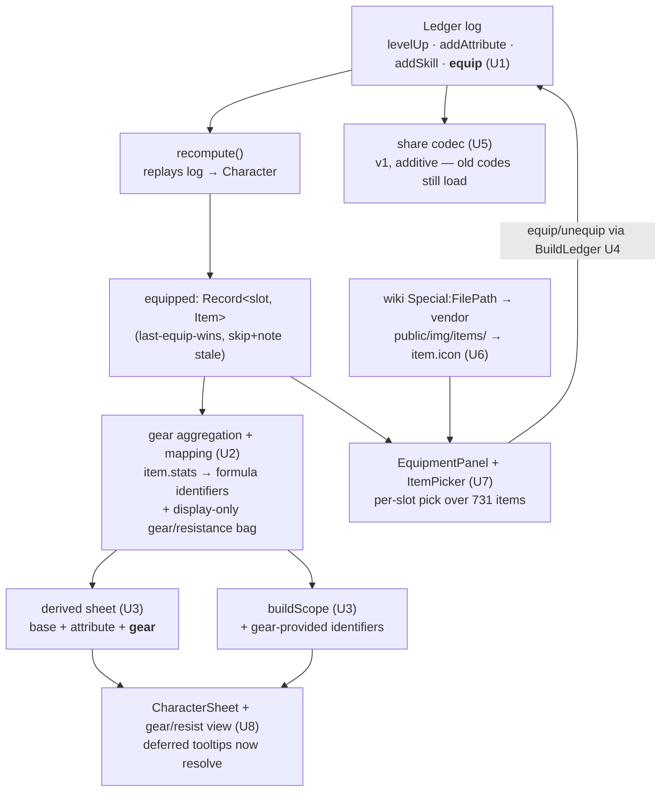

# feat: Gear equipping + gear→derived-sheet integration (M3)

## Summary

Make the **gear** real: let a build equip items from the M2 dataset into the in-game slots, fold each equipped item's stats into the derived character sheet and the formula scope so the Phase-1 tooltips that currently degrade to "—" **light up** when gear supplies their stat, carry equipped gear in the shareable build code (additive — existing codes still load), and surface item art by vendoring item icons from the official wiki. This is the milestone where the calculator stops being attribute-only and starts modeling a full geared character. It is **build modeling, not combat**: no damage output, no effective-HP, no enemies — those are M4/M5.

M3 sits directly on M2's validated `src/data/items.json` (731 items: weapons, armor, accessories — each with `category`, `slot`, a `damageType`, a snake_case `stats` record, and the `constants.itemStatKeys` vocabulary) and on the Phase-1 recompute/scope/codec engine.

---

## Problem Frame

Phase 1 shipped a deterministic build engine — a flat ledger log (`levelUp` / `addAttribute` / `addSkill`) that `recompute` replays into a `Character` whose `derived` sheet is computed by `computeDerivedStats` from attributes alone (KTD14). The engine scope (`buildScope`) deliberately omits gear/passive identifiers, so any skill tooltip referencing `Magic_Power`, the `*_Power` sorcery schools, `Body_DEF`, etc. resolves to `unknown-var` and renders a neutral "—". M2 then produced the item dataset but wired **no** equipping, no gear→sheet math, and no item icons (the `Item.icon` field is currently omitted because the datastrings carry no icon path).

M3 closes that gap: equipping is a new positive decision in the same ledger log; gear stats become a third contribution layer to the derived sheet (alongside base + attribute bonuses) and enter the scope so the deferred tooltips finally resolve; the share codec carries the new ledger op for free; and item icons are vendored from a now-confirmed wiki source. The whole thing stays inside the Phase-0/1 posture: deterministic recompute, a reactive runes store, a versioned/bounded/Zod-validated share codec, vendored+checksummed external assets.

---

## Key Technical Decisions

- **KTD1 — Equipping is a new ledger op, not a separate store.** Add `{ op: 'equip', slot, item }` to the `LedgerEntry` discriminated union. The build stays a single flat log, so `recompute` replays gear the same way it replays skills (last-equip-wins per slot; an equip naming an unknown item key or a stale slot is skip-and-noted, exactly like patch-drift on skills), and the share codec serializes it with **zero codec changes** — which is the whole of R16. Unequip removes the entry (LIFO), mirroring `removeSkill`/`removeAttribute`.
- **KTD2 — Share codec stays `FORMAT_VERSION = 1` (additive).** A new op in the union is backward-compatible for *reading*: every existing v1 code (no equip entries) still decodes. Bumping to v2 would reject all currently-shared builds, which R16 must not do. The single deployed site updates atomically, so a post-M3 code reaching a pre-M3 client is not a real failure mode. `MAX_LEDGER_ENTRIES` (512) already has ample headroom for ~10 gear slots.
- **KTD3 — Gear is a third additive layer on the derived sheet, keyed in the formula vocabulary.** Derived stat = `base + Σ attribute bonuses + Σ gear contributions`. Gear contributions are produced by a **curated mapping** from each item-stat key (snake_case, e.g. `magic_power`, `pyromantic_power`, `block_chance`) to its formula identifier (`Magic_Power`, `Pyromantic_Power`, `Block_Chance`). Only stats with a mapping enter `derived`/scope; the rest (resistances, raw weapon damage, durability/price) are carried in a separate gear-stats bag for display. This is what makes the deferred tooltips light up while keeping combat-only stats out of the Phase-1 sheet math.
- **KTD4 — The item-stat→identifier mapping is curated data, not a pure transform.** A mechanical "capitalize each word" rule covers many cases but is wrong for the long tail (resistances have no Phase-1 identifier; some identifiers like `max_hp` are lowercase; `Body_DEF`/`Legs_DEF` derive from slot+protection, not a single column). So the mapping is an explicit table validated against `constants.itemStatKeys` × the formula vocabulary, with the precise membership resolved during implementation (see Open Questions). Fail loud on a mapping target that isn't a known identifier — the same posture as `StatModel.superRefine`.
- **KTD5 — Gear stats are flat-additive in M3; percentage/mitigation semantics defer to M4.** Stoneshard mixes flat and percentage modifiers and has slot-specific defense math. M3 models the flat-additive contribution (the common case, and all that the *sheet* needs to show gear's effect and light up tooltips). Percentage stacking and the `Body_DEF`/`Legs_DEF` protection→mitigation derivations belong with the damage model (M4), where they actually feed a number.
- **KTD6 — Item icons come from the wiki via `Special:FilePath`, vendored like the ability icons.** Confirmed reachable: `https://stoneshard.com/wiki/Special:FilePath/<Item Name>.png` returns the sprite (name-keyed; `Footman_Sword.png` → 200), and item names are globally unique (the basis for `item.key = slug(name)`). A dev-time fetch vendors them under `public/img/items/` and sets `item.icon`; a 404 (no art) leaves `icon` unset and `Icon.svelte`'s existing fallback renders a placeholder — exactly the ability-icon pattern (KTD from Phase 1 U9). Network/dev-only, never CI.
- **KTD7 — Reuse, don't reinvent, the Phase-1 seams.** Equipping flows through `BuildLedger` (runes store) → `recompute` → `$derived` character, with discriminated `LedgerResult` refusals (`no-item`, `wrong-slot`) so the UI explains why. The equip UI reuses `Icon.svelte` and the established `.panel`/pixel-header treatments from M1. No new state-management or rendering primitives.

---

## Requirements

This milestone directly advances (R-IDs carried from the M2 plan, which carried them from the roadmap brainstorm):

- **R2.** Items can be equipped into and removed from the in-game equipment slots, with illegal placements refused. *(origin R2)*
- **R5.** The item stat fields land in the character model the derived sheet consumes. *(origin R5)*
- **R6.** Equipped gear feeds the derived character sheet — gear stat contributions change the sheet, and skill tooltips referencing gear/passive identifiers resolve once gear supplies them. *(origin R6)*
- **R16.** The share code carries equipped gear, and existing gearless codes still decode. *(origin R16)*

Groundwork already in place (M2): **R1** — the `EquipmentSlot` enum matches the in-game slots (`main_hand`, `off_hand`, `head`, `body`, `gloves`, `boots`, `belt`, `cloak`, `amulet`, `ring`); M3 consumes it.

Also in scope (deferred from M2, no R-ID): **item icon image assets** — vendor item art and populate `Item.icon`.

---

## High-Level Technical Design

The gear contribution joins the existing recompute pipeline as a third layer, then flows into both the displayed sheet and the formula scope.

The dashed boundary in practice: the **icon fetch (U6) is a dev/refresh step** (like `npm run vendor:wiki`); everything else runs in the app and CI off committed artifacts.

---

## Implementation Units

### U1. Equip op in the ledger + recompute

**Goal:** Make equipping a first-class build decision: a new ledger op that `recompute` replays into an `equipped` map on `Character`, with the same fail-soft posture as skills.
**Requirements:** R2, R5 *(origin R2, R5)*.
**Dependencies:** none.
**Execution note:** Test-first — this is the deterministic core; write the recompute cases before extending the union.
**Files:**

- `src/lib/build/character.ts` — add `{ op: 'equip', slot: EquipmentSlot, item: SkillKey-like string }` to `LedgerEntry`; in `recompute`, fold a pass that resolves equipped items into `equipped: Partial<Record<EquipmentSlot, Item>>` (last-equip-wins per slot; an equip whose item key is absent from the dataset, or whose `item.slot`/category doesn't fit the equip slot, is skipped and recorded in `notes` with a new `RecomputeNote` kind). Add `equipped` to the `Character` interface.
- `src/lib/build/character.test.ts` — recompute cases.

**Approach:** Build an item-by-key lookup like `skillByKey`. Reuse the M2 slot/category validity rules (a weapon belongs in a hand slot, etc.) so an illegal equip is dropped, not trusted. Keep `equipped` keyed by slot so the UI and aggregation read it directly. Do not compute gear stats here — that's U2/U3; this unit only resolves *which* item occupies *which* slot.
**Patterns to follow:** the skill-replay block in `recompute` (`character.ts`), its patch-drift `notes` handling, and the M2 slot/category checks in `checkItems` (`src/lib/validate.ts`).
**Test scenarios:**

- An `equip` entry places the item in its slot; `equipped[slot]` is the resolved `Item`. *(Covers R2.)*
- Two equips to the same slot → the later wins.
- An equip naming an item key absent from the dataset → skipped, one `note`, build preserved. *(Covers patch-drift parity.)*
- An equip whose item slot/category doesn't match the target slot → skipped with a note.
- A gearless ledger produces an empty `equipped` map (no regressions to existing recompute).

**Verification:** `recompute` returns the expected `equipped` map across the cases; existing `character.test.ts` stays green.

### U2. Gear stat aggregation + item-stat→identifier mapping

**Goal:** Turn the equipped items into (a) a gear-contribution map keyed in the **formula vocabulary** (for the sheet/scope) and (b) a display-only gear/resistance bag for everything that doesn't map to a Phase-1 identifier.
**Requirements:** R5, R6 *(origin R5, R6)*.
**Dependencies:** U1.
**Execution note:** Test-first — the mapping is the crux of M3; pin its behavior with cases before wiring it into recompute.
**Files:**

- `src/lib/build/gear.ts` (new) — `aggregateGear(equipped): { contributions: Record<string, number>; display: Record<string, number> }`, summing each equipped item's `stats` through the mapping table. Define the `ITEM_STAT_TO_IDENTIFIER` table here (or load from data — see Open Questions), validated so every mapping target is a known formula identifier.
- `src/lib/build/gear.test.ts` (new).

**Approach:** For each equipped item, for each `(statKey, value)` in `item.stats`: if `statKey` maps to a formula identifier, add `value` into `contributions[identifier]`; else add into `display[statKey]` (resistances, raw weapon damage, etc.). The mapping table starts from a mechanical capitalize default and overrides the exceptions; resolve exact membership against the real 83-key `itemStatKeys` × `KNOWN_STAT_IDENTIFIERS` during implementation. Validate at module-load (or via a unit test) that no mapping points at a non-identifier — fail loud, mirroring `StatModel.superRefine`. Aggregation is pure and additive (KTD5).
**Patterns to follow:** `KNOWN_STAT_IDENTIFIERS` / `KNOWN_IDENTIFIERS` in `src/lib/formula/identifiers.ts`; the `superRefine` cross-check in `src/lib/types.ts`; the deferred-identifier list in `src/data/stat-model.json`.
**Test scenarios:**

- A robe with `{ magic_power: 6 }` → `contributions.Magic_Power === 6`; two magic-power items stack additively. *(Covers R6.)*
- A `*_power` school stat (e.g. `pyromantic_power`) maps to its `Pyromantic_Power` identifier.
- A resistance stat (e.g. `fire_resistance`) and a raw weapon stat (e.g. `slashing_damage`) land in `display`, not `contributions`.
- An item-stat key with no mapping is carried in `display` (never dropped).
- The mapping table rejects (test-time) any target not in the known identifier set.

**Verification:** `aggregateGear` returns the expected split for a mixed loadout; the mapping-integrity assertion passes.

### U3. Fold gear into the derived sheet + scope (tooltips light up)

**Goal:** Make equipped gear visibly change the sheet and resolve previously-deferred tooltips: gear contributions add into `Character.derived`, and the formula scope includes gear-provided identifiers.
**Requirements:** R6 *(origin R6)*.
**Dependencies:** U1, U2.
**Execution note:** Test-first — assert a deferred identifier resolves *only* when gear provides it.
**Files:**

- `src/lib/build/character.ts` — after `computeDerivedStats`, merge `aggregateGear(equipped).contributions` into `derived` (additive; gear can introduce an identifier the attribute model never produced, e.g. a `*_Power` school). Expose the gear `display` bag on `Character` (e.g. `gearStats`) for U8.
- `src/lib/formula/scope.ts` — include gear-contributed identifiers in the scope so a tooltip formula referencing them resolves; keep the precedence sane (gear-derived stats sit with the other derived stats).
- `src/lib/build/character.test.ts`, `src/lib/formula/scope.test.ts`.

**Approach:** Gear merges as a post-pass so the attribute-only computation stays untouched and independently tested. A stat present in both the attribute model and gear sums; a stat only gear provides appears fresh. The scope build already iterates `derived` — once gear is merged into `derived`, scope inclusion largely follows; verify a formerly-deferred identifier (`Magic_Power` with gear, a `*_Power` school) now evaluates instead of degrading to "—", and still degrades when no gear provides it.
**Patterns to follow:** `computeDerivedStats` (`src/lib/build/stats.ts`), `buildScope` (`src/lib/formula/scope.ts`), the existing scope/tooltip tests.
**Test scenarios:**

- Equipping a `magic_power` item raises `derived.Magic_Power` by the item's value. *(Covers R6.)*
- A skill tooltip referencing a deferred identifier evaluates to a number when gear supplies it, and still renders the neutral marker when no gear does. *(Covers R6 — the headline behavior.)*
- Gear + attribute contributions to the same stat sum correctly.
- Unequipping (removing the entry) reverts the sheet and re-defers the tooltip.

**Verification:** the sheet reflects gear; a previously-"—" tooltip resolves with gear and degrades without it; `svelte-check`, lint, tests green.

### U4. Equip/unequip operations on the reactive store

**Goal:** Give the UI safe, reason-returning equip/unequip operations on `BuildLedger`.
**Requirements:** R2 *(origin R2)*.
**Dependencies:** U1.
**Files:**

- `src/lib/build/ledger.svelte.ts` — `equip(slot, itemKey)` and `unequip(slot)` returning `LedgerResult`; validate the item exists and fits the slot (reuse U1's rules) before pushing; `unequip` removes the slot's equip entry (LIFO), mirroring `removeSkill`.
- `src/lib/build/ledger.test.ts`.

**Approach:** Add an item-by-key lookup to the store (like `#skillByKey`). New refusal reasons (`no-item`, `wrong-slot`) extend the `Reason` union. Equipping into an occupied slot pushes a new equip entry (recompute's last-wins handles replacement); optionally `unequip` first for a clean log — decide during implementation.
**Patterns to follow:** `addSkill` / `removeSkill` / `removeAttribute` in `ledger.svelte.ts` and their discriminated `LedgerResult`.
**Test scenarios:**

- `equip` a valid item → `{ ok: true }`, `character.equipped[slot]` set. *(Covers R2.)*
- `equip` an item that doesn't fit the slot → `{ ok: false, reason: 'wrong-slot' }`.
- `equip` an unknown key → `{ ok: false, reason: 'no-item' }`.
- `equip` into an occupied slot replaces the occupant.
- `unequip` clears the slot; `unequip` an empty slot → `{ ok: false, reason: 'not-found' }`.

**Verification:** store operations update the derived character; illegal operations are refused with the right reason.

### U5. Share codec carries gear (R16)

**Goal:** Confirm and lock in that equipped gear round-trips through the share code, additively, without breaking existing codes.
**Requirements:** R16 *(origin R16)*.
**Dependencies:** U1.
**Files:**

- `src/lib/share/codec.ts` — verify the `equip` op flows through `Build`/`LedgerEntry` (likely no change beyond U1's union); confirm `MAX_LEDGER_ENTRIES` headroom.
- `src/lib/share/codec.test.ts`, `src/lib/share/hydrate.test.ts` — gear round-trip + backward-compat cases.

**Approach:** Because the codec serializes `LedgerEntry[]`, U1's union extension is the feature. This unit is mostly characterization: prove a geared build encodes and decodes byte-stable, prove a pre-M3 (gearless) code still decodes to a valid ledger, and prove the over-cap / zip-bomb / unknown-version guards are unaffected.
**Patterns to follow:** existing `codec.test.ts` round-trip and fail-closed cases; `hydrate.ts` load path.
**Test scenarios:**

- A build with several equipped items encodes → decodes to the same ledger. *(Covers R16.)*
- A captured pre-M3 (gearless) code still decodes successfully. *(Covers R16 — backward compatibility.)*
- An equip entry with a bad shape is rejected by the schema (`reason: 'schema'`).
- The entry-count ceiling and decompressed-byte ceiling still hold with gear entries present.

**Verification:** gear survives a share round-trip; old codes still load; all fail-closed guards intact.

### U6. Item icons — fetch from the wiki, vendor, populate `Item.icon`

**Goal:** Vendor item art from the wiki and set `Item.icon`, with a graceful placeholder when an item has no image.
**Requirements:** item icons (deferred from M2).
**Dependencies:** none (data/asset unit; parallelizable). Feeds U7.
**Execution note:** Characterization-first — fetch a real slice and confirm the name→image resolution before generalizing (the source is external).
**Files:**

- `tools/wiki-extractor/fetch-icons.ts` (new) — for each item (by display name), fetch `https://stoneshard.com/wiki/Special:FilePath/<Name>.png`; save present images under `public/img/items/<slug>.png`; record a manifest of which items have art (checksums + retrievedAt). 404 → no file. Add an `npm run vendor:item-icons` script + a note in `tools/wiki-extractor/README.md`.
- `src/lib/bootstrap/items.ts` + `scripts/transform-items.ts` — set `item.icon = 'img/items/<slug>.png'` when the vendored file exists (read the icon manifest), else leave unset; regenerate `src/data/items.json`.
- `src/components/Icon.svelte` — reuse as-is (placeholder fallback); confirm it handles an unset/`img/items/` path.
- `public/img/items/` (vendored assets) + manifest under `vendor/stoneshard-wiki/`.

**Approach:** Mirror the Phase-1 ability-icon vendoring and the M2 datastring vendoring posture: a dev-time, network-only fetch that pins a checksummed snapshot; the app and CI read committed assets. `Item.icon` is the base-relative reference (`Icon.svelte` already resolves base-relative paths for Pages). Items with no wiki art simply have no `icon` and render the placeholder.
**Patterns to follow:** the ability-icon vendoring (Phase 1 U9, `public/img/abilities/` + `Icon.svelte` fallback), `tools/wiki-extractor/fetch.ts` (network fetch + manifest), `scripts/transform-items.ts` (icon-path population + deterministic regen).
**Test scenarios:**

- The transform sets `item.icon` for an item whose art was vendored, and leaves it unset for one without. *(Covers the deferred-from-M2 work.)*
- `Icon.svelte` renders the placeholder for an item with no `icon`.
- `items.json` regeneration stays deterministic (key-sorted; icon paths stable).
- *Test expectation for the fetch script itself: none beyond a smoke check — it is dev-only network IO, like `vendor:wiki`.*

**Verification:** `public/img/items/` is populated, `item.icon` is set where art exists, `validate-data` stays green, the picker (U7) shows real art with placeholders for the gaps.

### U7. Equipment panel + per-slot item picker

**Goal:** A UI to see the equipment slots, what's equipped, and pick from the items valid for each slot.
**Requirements:** R2 *(origin R2)*.
**Dependencies:** U4, U6.
**Files:**

- `src/components/EquipmentPanel.svelte` (new) — the slot layout (head/body/.../main_hand/off_hand/amulet/ring/belt), each showing the equipped item (icon + name) and an unequip control.
- `src/components/ItemPicker.svelte` (new) — opens for a slot, lists items whose `slot`/category fit, filterable by name; selecting calls `BuildLedger.equip`.
- `src/App.svelte` — mount the panel; wire it to the shared `BuildLedger`.

**Approach:** Filter the 731 items per slot using the M2 `slot`/`category` rules. The picker is name-searchable (731 items is too many to grid blindly) and uses `Icon.svelte`. Equip/unequip refusals (U4's reasons) surface inline. Reuse the M1 `.panel` / pixel-header / pressable-button treatments — visual-consistency, not new design primitives. Responsive at 375px and 1280px (M1 invariant).
**Patterns to follow:** `TreeSelector.svelte` / `SkillTree.svelte` (list + selection + `Icon`), `AttributePanel.svelte` (+/− controls with refusal feedback), `App.svelte` store wiring, the M1 panel/button CSS.
**Test scenarios:**

- Opening the picker for a slot lists only items that fit it; selecting one equips it and updates the sheet. *(Covers R2.)*
- The name filter narrows the list.
- Unequip from a slot clears it and reverts the sheet.
- An illegal pick surfaces the refusal reason rather than silently no-op'ing.
- Renders without overflow at 375px and 1280px (browser check; code-level review if no browser).

**Verification:** equipping/unequipping through the UI drives the derived sheet; per-slot filtering correct; no layout overflow.

### U8. Sheet view: gear contributions + resistances

**Goal:** Show gear's effect — the now-resolved derived stats plus a resistances / equipped-stats section fed by the gear display bag.
**Requirements:** R5, R6 *(origin R5, R6)*.
**Dependencies:** U3, U7.
**Files:**

- `src/components/CharacterSheet.svelte` — surface gear-affected derived stats and a resistances/equipped-stats section from `Character.gearStats`.
- `src/components/CharacterSheet` test (jsdom).

**Approach:** Extend the existing sheet rather than replacing it: the attribute-derived rows now reflect gear (U3), and a new section lists the display-only gear stats (resistances, etc.). Keep the M1 sheet styling. No new derived math here — pure presentation of U3's output.
**Patterns to follow:** `CharacterSheet.svelte` (existing derived-stat rows), the M1 `.panel`/pixel-header treatment.
**Test scenarios:**

- With gear equipped, the sheet shows the raised derived stat and the resistances section. *(Covers R5, R6.)*
- With no gear, the resistances section is empty/absent and the sheet matches Phase-1 behavior.
- Resistance values reflect the equipped loadout (sum across pieces).

**Verification:** the sheet visibly responds to gear; resistances display; existing sheet tests stay green.

---

## Scope Boundaries

**In scope:** equipping/unequipping items per slot (ledger op + store ops + UI), gear→derived-sheet + scope integration so deferred tooltips light up, a resistances/equipped-stats sheet view, the share codec carrying gear (additive), and item-icon vendoring from the wiki.

### Deferred to Follow-Up Work

- **Damage output and effective-HP ("deal + take").** The combat model — turning gear damage stats and resistances into real numbers — is **M4**. M3 displays those stats but does not compute combat outcomes.
- **Percentage-stat stacking and `Body_DEF`/`Legs_DEF` slot-protection→mitigation math.** Needs the damage model; **M4** (KTD5).
- **Enemy data + enemy-vs-build combat.** A second extraction pipeline + enemy-ability engine; **M5**.

### Non-goals

- **Enchantments, legendaries (Ancient Echoes), and affix/quality rolls.** The dataset is base items (M2 non-goal carried forward); the `Enchantment` stub stays untouched.
- **Consumables / potions / medicine.** Not equippable gear.
- **A second item-data source.** Items remain the M2 wiki datastrings; M3 only adds the icon assets from the same wiki.

---

## Risks & Dependencies

| Risk | Impact | Mitigation |
| --- | --- | --- |
| **Item-stat → identifier mapping is incomplete or wrong** | Gear silently doesn't affect a stat, or a tooltip stays "—" | Curated table validated against `itemStatKeys` × known identifiers, fail-loud on a bad target (KTD4); U2 tests pin the headline mappings; unmapped stats are visibly carried in the display bag, never dropped. |
| **Wiki item images are name-mismatched or missing for some items** | Gaps in icon coverage | `Special:FilePath/<Name>.png` is name-keyed and names are unique (confirmed); 404 → placeholder via `Icon.svelte` (KTD6). Coverage gaps degrade gracefully, not fatally. |
| **Equipping changes the recompute hot path** | Regression to the well-tested Phase-1 engine | Gear is an additive post-pass; attribute-only computation stays untouched and independently tested; new behavior is test-first (U1–U3). |
| **Share-code growth / compatibility** | Bloated or broken codes | Additive op under the existing `MAX_LEDGER_ENTRIES`/byte ceilings; backward-compat asserted on a captured pre-M3 code (U5). |
| **731-item picker is unusable** | Poor UX choosing gear | Per-slot filtering (M2 slot/category rules) + name search collapse the list to the relevant subset (U7). |

**Dependency:** M3 sits on M2's `items.json` + schema and the Phase-1 engine. M3 is in turn the prerequisite for M4 (damage) — no combat numbers exist until gear feeds the model.

---

## Open Questions

**Deferred to implementation:**

- The exact `item-stat → formula-identifier` membership: which of the 83 `itemStatKeys` map to a `KNOWN_STAT_IDENTIFIERS` entry vs. land in the display bag. Resolve by diffing the two vocabularies against the real data in U2. (Default: mechanical capitalize + explicit overrides.)
- Whether the mapping table lives in code (`gear.ts`) or as a committed data file (like `stat-model.json`) read by both loaders. Lean code-level unless it needs to be data-gated.
- Whether `equip` into an occupied slot should auto-`unequip` first (cleaner log) or rely on recompute's last-wins (simpler op). Decide in U4.
- Icon manifest shape and whether `item.icon` should be a path or a presence flag the loader expands — settle against the ability-icon precedent in U6.
- Whether any gear stat is better shown as a delta (base → with-gear) in the sheet; a presentation call for U8.

---

## Verification

- **Gates (after each unit):** the suite, `svelte-check`, `eslint`, `prettier --check`, `npm run validate-data`, and the production build stay green.
- **Equipping (R2):** an item equips into its slot and only its slot; illegal placements are refused; unequipping reverts.
- **Gear→sheet (R5, R6):** equipping a stat-bearing item changes the derived sheet, and a skill tooltip that resolved to "—" in Phase 1 now resolves to a number when gear supplies its identifier (and degrades again without gear).
- **Share (R16):** a geared build round-trips through encode/decode; a pre-M3 gearless code still decodes.
- **Icons:** `public/img/items/` is vendored, `item.icon` is set where art exists, placeholders render for the gaps.
- **Real-app check:** build 1–2 reference geared characters and confirm the sheet + a formerly-deferred tooltip match the game at 0.9.4.x (browser verification at 375px/1280px, per the M1 invariant).

---

## Sources & Research

- **Origin:** Milestone M3 of the roadmap. The brainstorm requirements doc referenced by the M2 plan is **not present on disk**; M3's requirements (R1, R2, R5, R6, R16) and scope are carried from `docs/plans/2026-06-24-002-feat-item-data-extraction-plan.md` (Scope Boundaries → Deferred to Follow-Up Work) and project memory. No external research was needed — the work is internal architecture on a well-understood codebase with strong local patterns.
- **Codebase (verified this session):** the ledger log + `recompute` + `Character` (`src/lib/build/character.ts`); the attribute-only derived computation (`src/lib/build/stats.ts`); the scope builder and its deliberate deferred-identifier omission (`src/lib/formula/scope.ts`); the formula vocabulary (`src/lib/formula/identifiers.ts`); the reactive store (`src/lib/build/ledger.svelte.ts`); the versioned/bounded share codec (`src/lib/share/codec.ts`); the M2 item schema + slot/category rules (`src/lib/types.ts`, `src/lib/validate.ts`); the icon component + ability-icon precedent (`src/components/Icon.svelte`, `public/img/abilities/`).
- **External (verified during planning):** item icons are reachable on the official wiki via `https://stoneshard.com/wiki/Special:FilePath/<Item Name>.png` (name-keyed; `Footman_Sword.png` → HTTP 200, item pages embed `/wiki/images/…`), confirming the KTD6 icon source.
