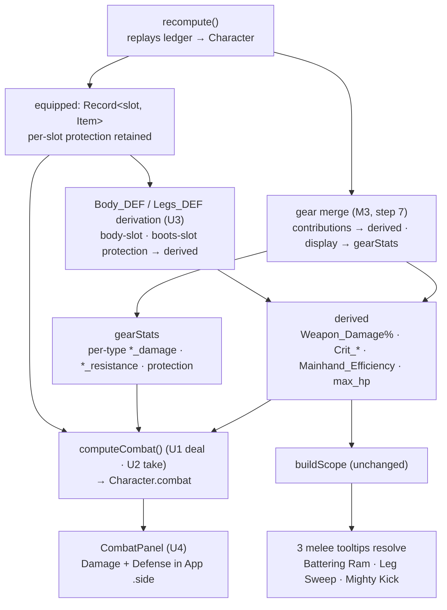

# feat: Combat math — self damage output + mitigation (M4)

## Summary

Turn the damage and resistance stats the sheet currently only *displays* into real numbers. M4 adds a derived **combat layer** with two sides: **"deal"** — the build's self/raw weapon damage output per damage type, with crit folded in — and **"take"** — how much punishment the build absorbs, expressed as per-type resistance, per-bodypart flat protection, and a resistance-based effective-HP. It also resolves the percentage-stat and `Body_DEF`/`Legs_DEF` protection→mitigation semantics M3 deferred, lighting up the three melee skill tooltips that reference them. This is the milestone where the calculator starts modeling **combat**, not just a geared character — but **self only**: no enemy, no enemy-vs-build resolution (that is M5).

M4 sits on M3's `Character` (a `derived` sheet, a `gearStats` display bag of per-type `*_damage` / `*_resistance` / `protection`, and an `equipped` map) and the Phase-1 recompute/scope engine. It is purely derived — no new ledger op, no persisted state, no share-codec change.

---

## Problem Frame

M3 made gear real: equipped items fold into the derived sheet, and stats that map to a Phase-1 formula identifier light up tooltips. But the combat-bearing stats stop at *display*. A weapon's per-type damage (`slashing_damage`, `piercing_damage`, …), per-type resistances, and `protection` all sit in the `gearStats` bag as raw numbers — never combined into a hit, a mitigation, or a durability figure. The offensive *modifiers* (`Weapon_Damage` %, `Crit_Chance`, `Crit_Efficiency`, `Mainhand_Efficiency`, `Armor_Penetration`) live in `derived` but multiply nothing. And `Body_DEF`/`Legs_DEF` — formula identifiers three skill tooltips depend on (`Battering Ram` for `Body_DEF`; `Leg Sweep` and `Mighty Kick` for `Legs_DEF`) — are still in the deferred set, so those tooltips degrade to "—" because no item carries a `body_def` stat: in-game they are derived from the equipped chestpiece's and boots' `protection`.

M4 closes that gap with a pure post-pass over `Character`. A new `combat.ts` module reads across the two stat namespaces (raw `*_damage` from `gearStats`, modifiers from `derived`) to compute the deal and take sides, writing a read-only `combat` field on `Character`. Separately, `Body_DEF`/`Legs_DEF` are derived from per-slot equipped `protection` and written into `derived`, so the scope and the three tooltips resolve for free. The whole layer stays inside the established posture: a pure, dependency-injected module mirroring `stats.ts`/`gear.ts`, an additive recompute step, null-prototype accumulators, and fail-loud validation on any new data constant.

---

## Key Technical Decisions

- **KTD1 — Combat is a pure derived post-pass; no ledger op, no codec change.** The deal/take numbers are a function of state M3 already computes (`derived` + `gearStats` + `equipped`). A new `src/lib/build/combat.ts` (`computeCombat(character, constants) → CombatSheet`) is called from `recompute` as a step after the gear merge, and its result is exposed on a new read-only `Character.combat` field. No `LedgerEntry` variant, no `FORMAT_VERSION` bump — the share codec is untouched because M4 persists nothing new.
- **KTD2 — Per-hit, not DPS.** Stoneshard is turn-based with no published attack-speed/DPS formula; the natural unit is damage *per attack*. The deal side surfaces per-type hit damage and a crit-weighted expected value — never a fabricated DPS number. The expected value is conditional on the hit landing (crit-weighted only); Accuracy and Dodge resolve against an attacker, so hit-chance weighting is M5.
- **KTD3 — "Deal" covers weapon basic-attack damage only.** The melee/physical archetype is the day-one in-scope build (the same classification basis that set the swords default). Spell and per-ability damage — the `*_Power` sorcery schools (14–24 tooltip references each) — need per-ability formulas and are a much larger lift, deferred to a later milestone. `Body_DEF`/`Legs_DEF` derivation is the exception that *is* in scope: it is the M3-deferred protection→mitigation work and lights up three melee tooltips cheaply.
- **KTD4 — Damage math reconciles two stat namespaces.** Raw per-type damage lives in `gearStats` keyed snake_case (`slashing_damage`); the multipliers live in `derived` keyed PascalCase (`Weapon_Damage`, `Crit_Efficiency`). The combat layer reads both, bridged by the existing `toIdentifier` mapping in `gear.ts`. It must distinguish the **13 real damage types** (`constants.damageTypes`) from the modifier-style `_damage` keys (`weapon_damage`, `armor_damage`, `bodypart_damage`), which are not damage types.
- **KTD5 — Mitigation is flat Protection then multiplicative Resistance, per the wiki order of operations.** Protection subtracts flat (1 Protection blocks 1 physical, 2 blocks 1 nature/magic) and is **per-bodypart** across four pools (Head/Chest/Arms/Legs). Resistance is multiplicative (`dmg × (1 − resist)`), applied last, **capped at 75%** (damage-taken floored at 25%) — a type's resistance combines an umbrella-group stat with any per-type value (KTD8). Because flat Protection is hit-size-dependent and M4 has no enemy, durability is surfaced as **two co-equal signals** — a resistance-based effective-HP (`max_hp / (1 − min(resist, 0.75))`) per damage type, and the per-bodypart Protection with a hit-weighted-average summary — not a single headline number, since a high-Protection/low-resistance melee build would otherwise read as fragile.
- **KTD6 — `Body_DEF`/`Legs_DEF` derive from per-slot equipped Protection, into `derived`.** Read `Character.equipped` per slot — `Body_DEF` = body-slot `protection`, `Legs_DEF` = boots-slot `protection` — **not** the pre-summed `gearStats.protection`, which has already lost the slot dimension. Write them into `derived` so `buildScope` and the tooltips pick them up with no `scope.ts` change, and promote them out of `stat-model.json`'s `deferredIdentifiers`. Promotion also removes them from the From-Gear view automatically via the existing enumerated-stat gate.
- **KTD7 — Undocumented and game-sourced constants are named and isolated.** The bodypart hit distribution (Chest 36.7% / Head 16.7% / each Arm 11.7% / each Leg 11.7% — datamined figures that sum to ~100.2%, so the hit-weighted average normalizes by the actual weight sum rather than assuming 1.0), the Protection block rates, the resistance cap (75%) and stat caps (Weapon Damage 200%, Crit Efficiency 150%) are game constants, some datamined rather than officially published. They live as named constants in one place (candidate: `constants.json` under the `superRefine` fail-loud posture, which asserts the weights sum within tolerance), so a patch or a corrected value is a one-line change, and the deal/take values can be honestly labelled "expected" where a formula is approximated. The named-constant guarantee covers magnitude drift only — a patch that changes a formula's *shape* (e.g. the Protection block ratio or how crit composes) still requires a `combat.ts` change.
- **KTD8 — Resistance combines an umbrella-group stat with per-type values.** Most armor carries an aggregate `physical_resistance` (236/731 items), `nature_resistance`, or `magic_resistance`, often alongside a per-type `*_resistance`. A damage type's effective resistance is its umbrella-group value — physical → slashing/piercing/crushing/rending; nature → fire/frost/shock/poison/caustic; magic → arcane/sacred/unholy/psionic — **summed additively** with any co-present per-type `*_resistance`, then clamped to 75%. The damage-type→group mapping is added to `constants.json` under the `superRefine` fail-loud posture (every one of the 13 types maps to exactly one group). Additive-vs-max stacking of the two sources is an Open Question; additive is the default.

---

## Requirements

Plan-local requirements (no on-disk origin doc; carried from the M4 roadmap milestone and M3's deferred scope).

**Damage output ("deal"):**

- R1. The build's weapon basic-attack damage is computed per damage type from the equipped main-hand weapon's per-type damage and the derived offensive modifiers (`Weapon_Damage` %, `Mainhand_Efficiency`).
- R2. Crit is modeled from `Crit_Chance` and `Crit_Efficiency` and surfaced as an expected-with-crit value alongside the non-crit hit, honoring the caps (Weapon Damage 200%, Crit Efficiency 150%).

**Mitigation and durability ("take"):**

- R3. Mitigation is computed as per-type resistance (capped 75%) plus per-bodypart flat Protection (Head/Chest/Arms/Legs from equipped armor), with a hit-location-weighted Protection summary.
- R4. An effective-HP-per-damage-type figure expresses durability from max HP and resistance.

**Tooltip resolution:**

- R5. `Body_DEF` and `Legs_DEF` are derived from the equipped body and boots Protection and enter the derived sheet and formula scope, so the skill tooltips referencing them resolve — and degrade to the neutral marker when that armor is absent.

**Surfacing:**

- R6. A combat panel surfaces the deal and take numbers in the app, reactive to attribute and gear changes.

---

## High-Level Technical Design

The combat computation joins the recompute pipeline as a post-pass after the M3 gear merge, reading across `derived`, `gearStats`, and `equipped`. `Body_DEF`/`Legs_DEF` take a separate path into `derived` so the existing scope→tooltip machinery resolves them unchanged.

The deal/take output (`Character.combat`) is a **read-only view consumed by UI, not by formulas** — it stays out of `Scope`. Only `Body_DEF`/`Legs_DEF` enter `derived`/scope, because they are genuine formula inputs.

---

## Implementation Units

### U1. Combat module + damage output ("deal")

**Goal:** Establish the pure combat module and the recompute seam, computing per-type weapon hit damage with crit folded in.
**Requirements:** R1, R2.
**Dependencies:** none.
**Execution note:** Test-first — this is deterministic pure arithmetic; pin the worked cases before wiring into recompute.
**Files:**

- `src/lib/build/combat.ts` (new) — `computeCombat(character, constants): CombatSheet`; the deal half computes, per damage type, `{ base, modified, expected }`. Percentage-unit derived stats are divided by 100 before use (matching the `Power / 100` convention in `skills.json`): `modified = base × min(Weapon_Damage, 200)/100 × Mainhand_Efficiency/100`. Crit is a **bonus**, not a total multiplier — `Crit_Efficiency` is stored as a `%` bonus (base 25 → a 1.25× hit), so `critMult = 1 + min(Crit_Efficiency, 150)/100` and `expected = (1 − Crit_Chance/100) × modified + (Crit_Chance/100) × modified × critMult`. Read raw per-type damage from `gearStats` (the `*_damage` keys that are real damage types), modifiers from `derived`. Handle the no-weapon (unarmed) and no-`*_damage` cases without throwing.
- `src/lib/build/combat.test.ts` (new).
- `src/lib/build/character.ts` — add the `combat: CombatSheet` field to the `Character` interface; call `computeCombat` as a post-pass after the gear merge.
- `src/lib/types.ts` — `CombatSheet` type (and Zod schema if combat constants are added to `Constants`).

**Approach:** Mirror `stats.ts`/`gear.ts`: pure, dependency-injected, null-prototype accumulators. Distinguish the 13 `constants.damageTypes` from the modifier keys `weapon_damage`/`armor_damage`/`bodypart_damage` (KTD4) — only true types produce a damage row. Main-hand only (off-hand is shields; dual-wield deferred). Keep the variance roll unmodeled (Open Questions) — surface the point/expected value and label it "expected".
**Patterns to follow:** `computeDerivedStats` (`src/lib/build/stats.ts`), `aggregateGear` (`src/lib/build/gear.ts`), the `toIdentifier` bridge, the step-7 gear-merge block and `WeakMap` memo in `src/lib/build/character.ts`.
**Test scenarios:**

- A weapon with `{ slashing_damage: 20 }` at base modifiers → `modified === 20`; raising `Weapon_Damage` to 150 → `modified === 30`. *(Covers R1.)*
- `Weapon_Damage` of 250 is clamped to 200% in `modified`. *(Covers R1 caps.)*
- With `Crit_Chance` 25 and `Crit_Efficiency` 150, `expected === 0.75 × modified + 0.25 × modified × 2.5` (crit-efficiency consumed as the `1 + CE/100` bonus, not a total multiplier); `Crit_Efficiency` 200 clamps to 150. *(Covers R2.)*
- A two-type weapon (e.g. `slashing_damage` + `fire_damage`) yields one row per type, each modified independently.
- `armor_damage` / `bodypart_damage` keys produce no damage-type row.
- No main-hand weapon → an unarmed/empty deal result, no throw.

**Verification:** `computeCombat`'s deal half matches hand-worked values across the cases; `Character.combat` populates; existing `character.test.ts` stays green.

### U2. Mitigation + durability ("take")

**Goal:** Compute the defensive side — per-type resistance, per-bodypart flat Protection, a hit-weighted Protection summary, and resistance-based effective-HP per type.
**Requirements:** R3, R4.
**Dependencies:** U1.
**Execution note:** Test-first — pin the cap/floor and per-bodypart math before presentation.
**Files:**

- `src/lib/build/combat.ts` — extend `CombatSheet` with the take half: per-type `resistance` (umbrella-group stat + per-type `*_resistance`, summed then clamped to 75%, per KTD8), per-bodypart `protection` read from `equipped` per slot (`head`, `body`→Chest, `gloves`→Arms, `boots`→Legs), a hit-weighted average Protection normalized by the actual KTD7 weight sum, and `effectiveHp[type] = max_hp / (1 − min(resistance, 0.75))`.
- `src/lib/build/combat.test.ts` — take cases.
- `src/lib/types.ts` + `src/data/constants.json` — extend `CombatSheet`; add the damage-type→resistance-group mapping (KTD8) and the hit-distribution + cap constants (KTD7) with a `superRefine` cross-check (mapping covers all 13 types; hit weights sum within tolerance).

**Approach:** Read per-slot `protection` directly from `equipped` (KTD6/risk 2) — the summed `gearStats.protection` has lost the slot split. Resolve each type's resistance by fanning the umbrella stat (`physical`/`nature`/`magic`) across its group and summing the per-type value (KTD8). Effective-HP and per-bodypart Protection are surfaced as two co-equal durability signals, not one headline (KTD5). Keep allocation-light on the hot path.
**Patterns to follow:** the null-prototype accumulator and DI style in `stats.ts`/`gear.ts`; the `Constants` schema + `superRefine` in `src/lib/types.ts`.
**Test scenarios:**

- A loadout with `fire_resistance: 50` → `resistance.fire === 0.5` and `effectiveHp.fire === max_hp / 0.5`. *(Covers R3, R4.)*
- `fire_resistance: 90` clamps to 75%; `effectiveHp` uses the 75% floor. *(Covers R3 cap.)*
- Body protection 8 and boots protection 4 → `protection.chest === 8`, `protection.legs === 4`. *(Covers R3 per-bodypart.)*
- An aggregate `physical_resistance: 20` raises resistance for all four physical types; a co-present `slashing_resistance: 10` makes `resistance.slashing === 0.30` (summed) while the other three stay `0.20`. *(Covers R3 — umbrella + per-type, KTD8.)*
- The hit-weighted average Protection divides by the actual weight sum (so the ~100.2% total does not skew it) and matches the four-pool weights.
- No armor → zero protection, resistance 0, `effectiveHp` equals `max_hp` per type.

**Verification:** the take half matches hand-worked values; caps/floors honored; per-bodypart split correct.

### U3. `Body_DEF` / `Legs_DEF` derivation → derived + scope (melee tooltips light up)

**Goal:** Derive `Body_DEF`/`Legs_DEF` from equipped body/boots Protection into `derived`, so the three skill tooltips referencing them resolve.
**Requirements:** R5.
**Dependencies:** none (independent of U1/U2; may share a per-slot-protection helper with U2).
**Execution note:** Test-first — assert each tooltip resolves *only* when the relevant armor is equipped.
**Files:**

- `src/lib/build/character.ts` — in `recompute`, after the gear merge, set `derived.Body_DEF = equipped.body?.stats.protection ?? 0` and `derived.Legs_DEF = equipped.boots?.stats.protection ?? 0` (reuse U2's per-slot reader). Ensure they no longer double-appear in `gearStats`.
- `src/data/stat-model.json` — remove `Body_DEF`, `Legs_DEF` from `deferredIdentifiers`; add them as enumerated `derivedStats` (base 0, category defense) so they are first-class known identifiers.
- `src/lib/build/character.test.ts`, `src/lib/formula/scope.test.ts`, and `src/lib/data/load.test.ts` — the last currently asserts `Body_DEF`/`Legs_DEF` are members of `deferredIdentifiers`; update it to expect them as enumerated `derivedStats`, or the gate goes red.

**Approach:** These are not item stats — no item carries `body_def`. They are computed from the slot's `protection` (confirmed: `Battering Ram`'s tooltip says "The damage depends on the equipped chestpiece's Protection"). Because anything written into `derived` flows into `buildScope`, no `scope.ts` change is needed. Promoting them to enumerated stats removes them from the From-Gear redundancy via the existing `enumerated.has(id)` gate.
**Patterns to follow:** the deferred-identifier list and `derivedStats` shape in `src/data/stat-model.json`; the gear→derived merge and the `enumerated`-gated `gearStats` write in `src/lib/build/character.ts`; the scope/tooltip resolution tests.
**Test scenarios:**

- With a chestpiece of Protection 8 equipped, `derived.Body_DEF === 8` and `Battering Ram`'s `Blunt_Damage = round(0.5*Body_DEF + 0.5*STR)` resolves to a number. *(Covers R5.)*
- With boots of Protection 5, `Leg Sweep`'s `Damage = 4 + 0.2*Legs_DEF + 0.3*STR` resolves (and `Mighty Kick`, the other `Legs_DEF` skill, likewise). *(Covers R5.)*
- With no body/boots armor, `Body_DEF`/`Legs_DEF` are 0 and the tooltips render the neutral marker (degrade gracefully).
- `Body_DEF`/`Legs_DEF` no longer appear in the From-Gear view (no redundant display).
- `validate-data` accepts the promoted stat-model, and `load.test.ts`'s deferred-identifier assertion is updated to expect them as enumerated stats (the `superRefine` cross-check passes; the gate stays green).

**Verification:** the three tooltips resolve with the relevant armor and degrade without it; `validate-data`, `svelte-check`, tests green.

### U4. Combat panel UI

**Goal:** Surface the deal and take numbers in the app, reactive to attribute and gear changes.
**Requirements:** R6.
**Dependencies:** U1, U2.
**Files:**

- `src/components/CombatPanel.svelte` (new) — a Damage section (per-type rows: base → modified → expected-with-crit) and a Defense section (per-type resistance + effective-HP, per-bodypart Protection, the weighted-average summary). Takes `{ character }` (and `dataset.constants.damageTypes` for the type order).
- `src/App.svelte` — mount `CombatPanel` in the `<aside class="side">` stack, wired to the shared `BuildLedger`-derived character.

**Approach:** Reuse the `.panel` / `.groups` helpers and the `fmt`/`humanize` helpers from `CharacterSheet.svelte` (duplicated per-component today — match the existing pattern, do not prematurely share). The two-column `.stat` row carries one value, but the Damage section needs a **three-column row** (Base / Modified / Expected) under one header row — add a small local row variant rather than forcing the `.stat` idiom. The Defense section separates its two axes: a per-type block (resistance + effective-HP paired per type) and a per-bodypart Protection block (the four pools) headed by the hit-weighted average. **Zero state:** with no main-hand weapon the Damage section shows a one-line prompt ("Equip a weapon to see damage") instead of empty/zero rows; with no armor the Defense section shows neutral resistance/EHP rows plus a note that Protection needs equipped armor. Pure presentation of `Character.combat`; no math in the component. Label crit-averaged values "expected (on hit)". Responsive at 375px and 1280px (M1 invariant).
**Patterns to follow:** `CharacterSheet.svelte` (category-grouped rows, the From-Gear section, `fmt`/`humanize`), `EquipmentPanel.svelte` props shape, the `.side` stack wiring and `$derived` character in `src/App.svelte`, the M1 panel/pixel-header CSS.
**Test scenarios:** Components have no unit-test harness in this repo (verified, per M3) — these are browser / `svelte-check`-observable behaviors; the underlying numbers are already unit-tested in U1/U2.

- With a weapon and armor equipped, the Damage section shows a per-type row (base → modified → expected) and the Defense section shows resistance, effective-HP, and per-bodypart Protection. *(Covers R6.)*
- Changing an attribute or swapping gear updates the panel reactively (the `$derived` character flows through).
- A no-weapon build shows the Damage "equip a weapon" prompt; a no-armor build shows neutral resistance/EHP rows and the "Protection needs armor" note — no crash, no `NaN`.
- The panel renders without horizontal overflow at 375px and 1280px (M1 invariant).

**Verification:** the panel renders the deal/take numbers, updates when gear or attributes change, and shows no horizontal overflow at 375px / 1280px (browser check; code-level review otherwise).

### U5. Real-dataset integration + From-Gear dedup + browser verification

**Goal:** Prove the combat layer end-to-end on the committed dataset, confirm no From-Gear redundancy, and verify against the game.
**Requirements:** R1–R6 (integration).
**Dependencies:** U1, U2, U3, U4.
**Files:**

- `src/lib/build/integration.test.ts` — extend with real-data combat assertions: equip a known weapon + armor from `items.json`, assert the deal per-type and take numbers, and assert the `Body_DEF`/`Legs_DEF` tooltips resolve.
- `src/components/CharacterSheet.svelte` — confirm (and adjust if needed) that promoted `Body_DEF`/`Legs_DEF` no longer surface in the From-Gear section.

**Approach:** Mirror the existing `integration.test.ts` that drives ledger→recompute→sheet→tooltip on the real committed dataset. Pick one or two reference loadouts (a melee/physical archetype) with known wiki values to cross-check. The codec is untouched, but assert a geared+combat build still round-trips (characterization — the combat field is derived, never serialized).
**Patterns to follow:** the real-dataset end-to-end style in `src/lib/build/integration.test.ts`; the share round-trip characterization in `src/lib/share/codec.test.ts`.
**Test scenarios:**

- A reference build with a known weapon yields the expected per-type deal numbers against a hand-worked value. *(Covers R1, R2.)*
- The same build's take numbers (resistance, per-bodypart Protection, effective-HP) match the equipped loadout. *(Covers R3, R4.)*
- The `Body_DEF`/`Legs_DEF` tooltips resolve for the reference build and `validate-data` is green. *(Covers R5.)*
- A geared+combat build still encodes/decodes to the same ledger (combat is derived, not persisted).

**Verification:** the integration suite is green on the real dataset; From-Gear shows no `Body_DEF`/`Legs_DEF`; a browser pass at 375px/1280px confirms the combat panel matches the game for 1–2 reference builds at patch 0.9.4.x.

---

## Scope Boundaries

**In scope:** a derived combat layer computing self/raw weapon damage output (per type, with crit-weighted expected value) and the defensive picture (per-type resistance, per-bodypart flat Protection, hit-weighted summary, resistance-based effective-HP); deriving `Body_DEF`/`Legs_DEF` from equipped Protection so three melee tooltips resolve; and a combat UI panel.

### Deferred to Follow-Up Work

- **Spell and per-ability damage.** The `*_Power` sorcery schools (Pyromantic/Geomantic/Electromantic/Arcanistic/Miracle, 14–24 tooltip references each) need per-ability spell formulas keyed on `Magic_Power` and school power — a separate, larger milestone (KTD3).
- **Dual-wield / off-hand weapon damage.** `Offhand_Efficiency` exists, but off-hand is shields-only in the dataset and no off-hand weapon damage source is modeled; deal is main-hand only.
- **Status-effect / damage-over-time output.** Bleed, poison, and caustic ticks, plus Armor Damage's hidden armor-durability axis, are not combat-hit damage and are out of M4.
- **Damage variance roll.** The min/max RNG spread per hit is undocumented; M4 surfaces the expected/point value only.
- **Damage-per-energy / DPS normalization.** No published attack-speed formula exists and `Character` has no per-attack energy-cost field yet; M4 stays strictly per-attack. A damage-per-energy proxy could follow once an energy-cost model is added.

### M5 (enemies)

- **Enemy-vs-build resolution.** A real attacker, target armor/durability, Armor Penetration applied to an enemy, Block Chance resolution, hit/dodge resolution, and the flat-Protection-vs-actual-hit-size mitigation all need an enemy and a second extraction pipeline — that is M5.

### Non-goals

- **Enchantments, legendaries (Ancient Echoes), affix rolls.** The dataset is base items; the `Enchantment` stub stays untouched.
- **Build-vs-build side-by-side comparison.** Not part of the combat model.

---

## Risks & Dependencies

| Risk | Impact | Mitigation |
| --- | --- | --- |
| **Key combat formulas are undocumented** (damage variance, exact Efficiency × Weapon Damage % stacking order) | Numbers diverge from the game | Model the documented expected values; isolate game constants in one place (KTD7); label crit-averaged values "expected"; browser-verify 1–2 reference builds against 0.9.4.x (U5). |
| **Two stat namespaces** — raw `*_damage` (snake_case, `gearStats`) vs modifiers (PascalCase, `derived`) | Damage silently reads the wrong bag or misses a type | Bridge via the existing `toIdentifier`; distinguish the 13 `damageTypes` from modifier `_damage` keys (KTD4); U1 tests pin the headline per-type path. |
| **Umbrella vs per-type resistance** — most armor carries aggregate `physical`/`nature`/`magic_resistance`, not per-type | Take side under-counts mitigation for most real loadouts | Fan umbrella stats across their type group and sum with per-type, clamp 75% (KTD8); a data-defined mapping in `constants.json`; a U2 test pins the combination. |
| **Percentage-stat semantics** — `Weapon_Damage`/`Crit_*` are stored as raw points (`25` = 25%), not fractions | A literal formula computes nonsense (e.g. a negative crit weight) | Normalize every percentage-unit stat by `/100` before use, and consume `Crit_Efficiency` as a `1 + CE/100` bonus, matching the `Power/100` convention in `skills.json` (U1). |
| **Per-slot Protection lost in the `gearStats` sum** | `Body_DEF`/`Legs_DEF` and per-bodypart Protection compute off a flattened number | Read `Character.equipped` per slot, never `gearStats.protection` (KTD6); U2/U3 share the per-slot reader. |
| **Effective-HP is hit-size-dependent** (flat Protection can't fold into a single scalar without an enemy) | A naive single EHP number misleads a high-Protection build | EHP and per-bodypart Protection are shown as two co-equal signals, not folded into one headline (KTD5); the hit-size combination is M5. |
| **Combat runs on the recompute hot path** (every reactive read) | Regression to a well-tested engine | Pure additive post-pass, allocation-light null-prototype accumulators, `WeakMap` memo precedent; attribute-only and gear paths stay untouched. |
| **No component test harness** | UI behavior unverified by unit tests | Combat math is fully unit-tested in `combat.ts`; the panel is verified via `svelte-check` + build + browser (U4, U5), matching M3. |

**Dependency:** M4 sits on M3's `Character` (`derived`, `gearStats`, `equipped`) and the Phase-1 recompute/scope engine. It is the prerequisite for M5 — no enemy-vs-build math exists until the build's own deal/take numbers do.

---

## Open Questions

**Deferred to implementation:**

- **Flat per-type damage bonuses** (if gear adds any) — whether they apply before or after the `Weapon_Damage`/Efficiency multipliers. The wiki doesn't specify; default to post-multiplier and refine against a worked in-game value (U1).
- **Umbrella + per-type resistance stacking** — additive (the default, KTD8) vs max-wins. The wiki order of operations doesn't settle within-build aggregation; pin against a worked in-game value (U2/U5).
- **Durability primary view** — both the per-type resistance EHP and the per-bodypart Protection are computed and shown; which (if either) reads as the panel's primary number is a surfacing choice to settle in U4.
- **Where the KTD7/KTD8 constants live:** `constants.json` (data-gated, `superRefine`-checked) vs a `combat.ts` constant table. Lean data-gated if `validate-data` should guard them; else keep them colocated.
- **Crit Efficiency on magical components** — wiki wording conflicts. Moot for M4 (weapon physical); note it for the spell-damage milestone.

---

## Verification

- **Gates (after each unit):** the suite, `svelte-check`, `eslint`, `prettier --check`, `npm run validate-data`, and the production build stay green.
- **Deal (R1, R2):** a known weapon and attributes produce the expected per-type and expected-with-crit numbers, caps honored, matching a hand-worked value.
- **Take (R3, R4):** per-type resistance (capped 75%) and per-bodypart Protection match the equipped loadout; effective-HP reflects resistance.
- **Tooltips (R5):** the three `Body_DEF`/`Legs_DEF` skills resolve with body/boots armor and degrade to the marker without it.
- **Surfacing (R6):** the combat panel renders the deal/take numbers and reacts to attribute/gear changes.
- **Real-app check:** build 1–2 reference combat builds and confirm the panel matches the game at 0.9.4.x (browser verification at 375px/1280px, per the M1 invariant).

---

## Sources & Research

- **Origin:** Milestone M4 of the roadmap (self/raw damage — "deal + take"). The brainstorm requirements doc is **not present on disk**; M4 scope is carried from `docs/plans/2026-06-24-003-feat-gear-derived-sheet-plan.md` (Scope Boundaries → Deferred to Follow-Up Work, KTD5) and project memory. Requirements R1–R6 are plan-local.
- **Codebase (verified this session):** the recompute orchestrator, `Character` shape, and step-7 gear merge (`src/lib/build/character.ts`); the attribute-only and gear computations (`src/lib/build/stats.ts`, `src/lib/build/gear.ts`); the scope builder and identifier vocabulary (`src/lib/formula/scope.ts`, `src/lib/formula/identifiers.ts`); the deferred-identifier list and `derivedStats` (`src/data/stat-model.json`); the sheet UI and From-Gear section (`src/components/CharacterSheet.svelte`, `src/App.svelte`); the share codec, confirmed untouched (`src/lib/share/codec.ts`). Verified directly: `Body_DEF`/`Legs_DEF` appear in three skill formulas (`Battering Ram` for `Body_DEF`; `Leg Sweep` and `Mighty Kick` for `Legs_DEF`) with tooltip text tying them to chestpiece/boots Protection; `protection` lives only on head/body/gloves/boots items (the four bodypart pools); weapons carry the per-type `*_damage` keys plus the modifier keys `armor_damage`/`bodypart_damage` (no `rending_damage` in the live data); most armor carries an aggregate `physical`/`nature`/`magic_resistance` rather than per-type, and `load.test.ts` asserts `Body_DEF`/`Legs_DEF` are deferred identifiers (U3 must update it).
- **External — Stoneshard combat formulas (official wiki + Veteran's Guide, patch ~0.9.x):** Protection is flat (1 Protection blocks 1 physical, 2 blocks 1 nature/magic), per-bodypart across four pools; bodypart hit distribution Chest 36.7% / Head 16.7% / each Arm 11.7% / each Leg 11.7% (sums to ~100.2%, normalized in use); Resistance is multiplicative, capped 75% (damage-taken floored 25%); order of operations Accuracy → Dodge/Fumble → Block → Protection → Resistance; crit is a separate roll with Crit Efficiency (cap 150%) on a Weapon Damage capped at 200%; Mainhand/Offhand Efficiency default 100% (dual-wield −25%/−50%); turn-based, so per-hit is the natural unit (no published DPS formula). Sources: `stoneshard.com/wiki/Combat_Formulas`, `/Attributes_&_Stats`, `/Damage_Types`, `/Dodge_Chance`, `/Dual_Wielding`; Steam "Veteran's Guide" (#3321560440) for the Armor-Penetration formula. Undocumented and flagged as Open Questions: the damage variance roll and the exact Efficiency × Weapon Damage % stacking order. (The Fandom mirror returned HTTP 403; facts are from the official wiki + Steam guide.)
