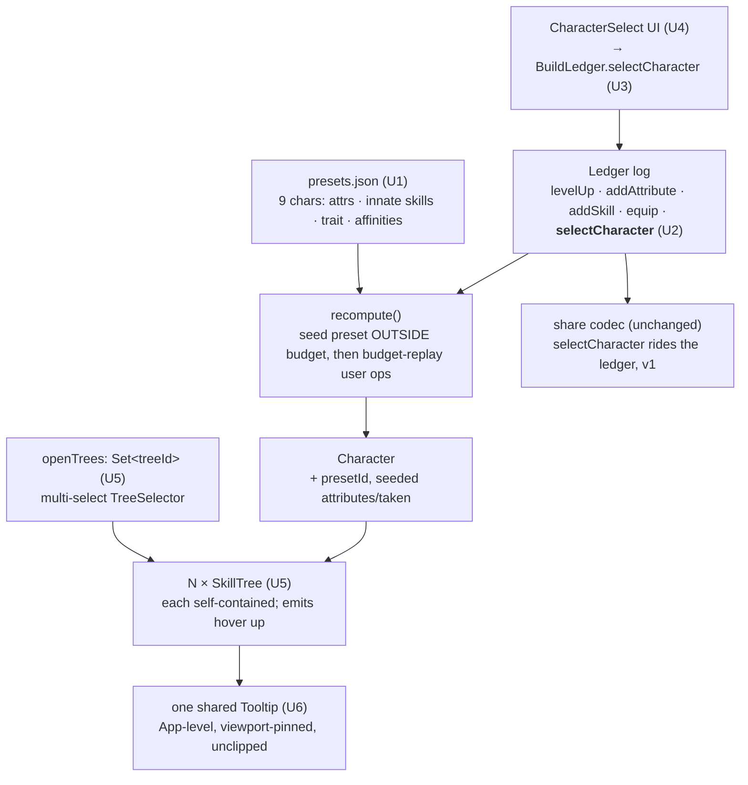

# feat: Character select, multi-tree view, and always-visible tooltips

## Summary

Three connected planner improvements. **Character select** seeds a build from a Stoneshard preset — the character's starting attributes and innate starting abilities — which the user then keeps editing. **Multi-tree view** lets several skill trees stay open at once instead of switching one at a time. And the skill **tooltip is made always fully visible** within that denser layout by hoisting it to a single shared panel. The build stays shareable throughout. This is **planner UX + a small new data section**: no combat/enemy work (that is M5), no new formula or item features.

It sits on the Phase-1 ledger/recompute engine (a flat op log → `Character`, budget-enforced) and the existing tree/tooltip components, which research shows are already per-instance self-contained.

---

## Problem Frame

Today the planner starts every build from a blank slate at base attributes (all 10) and shows **one** skill tree at a time: `App.svelte` tracks a single `activeTreeId`, `TreeSelector` switches it, and one `SkillTree` renders. The skill tooltip is a per-tree pinned panel (the M1 non-clip fix) living inside each `SkillTree`'s area.

Three gaps:
- **No character presets.** Stoneshard's 9 playable characters each start with set attributes (e.g. Velmir at STR/AGI/PER 11) and innate abilities. The calculator can't seed any of that — and crucially, recompute has **no concept of out-of-budget innate allocations**: a level-1 character's three starting attribute points exceed the level-1 attribute budget of 0 and would be silently LIFO-sacrificed if expressed as ordinary ledger entries.
- **One tree at a time.** Comparing or planning across trees (a melee + a magic tree, say) means constant switching.
- **Tooltip crowds a denser layout.** The per-tree pinned panel works for a single tree but, with several narrow tree columns open, each panel crowds or overflows its own column.

This plan adds a curated character-preset data section, seeds presets through recompute outside the budget (carried in the share code as a new ledger op, exactly like M3's `equip`), opens multiple trees at once, and hoists the tooltip to one shared, guaranteed-unclipped panel.

---

## Key Technical Decisions

- **KTD1 — Character presets are a curated data file, not a wiki-extraction pipeline.** The roster is **9 characters** with simple data (five starting attributes, a unique-trait label, affinity trees); per-character innate *abilities* are thinly/inconsistently documented on the wiki. A hand-curated `src/data/presets.json` (values transcribed from the wiki, validated by a Zod schema) is smaller and more reliable than a brittle extraction for 9 records. Verren is the neutral 10/10/10/10/10 preset — identical to today's default. Re-checkable on game patches (EA, ~0.9.x).
- **KTD2 — A preset seeds *outside* the budget, inside `recompute`.** recompute is the only legality authority and has no innate concept. Thread the selected preset through `recompute`: seed its starting attributes and innate skills **before** the budget-replay loops and **exclude them from the budget counters** and from `isUnlocked`/`requires` gating, so a level-1 character's +1 attributes and starting abilities survive (they would otherwise be sacrificed/relocked). The user's own `addAttribute`/`addSkill` entries layer on top against the normal budget. The 2 free starting skill points are already modeled (`startingSkillPoints: 2`) and remain user-spendable.
- **KTD3 — Character selection is a new ledger op (`selectCharacter`), carried in the share code for free.** Add `{ op: 'selectCharacter', id }` to the `LedgerEntry` union — last-wins, like other ops. recompute reads the last one and seeds from the preset. Because the codec serializes the ledger, the selection round-trips with **zero codec changes and full backward compatibility** (old codes have no `selectCharacter` entry → no preset), mirroring exactly how M3's `equip` op stayed `FORMAT_VERSION = 1`. An unknown preset id is skip-and-noted (patch-drift posture).
- **KTD4 — Multi-tree view renders N self-contained `SkillTree` instances; no `SkillTree` refactor.** Research confirms each `SkillTree` already owns its hover state, scroll viewport, and per-instance layout (`computeTreeLayout`/`nodeState` are pure over one `skills[]`). The change is **state + selection + layout**: `activeTreeId: string` → a set of open tree ids; `TreeSelector` becomes a multi-select toggle; `App` renders one `SkillTree` per open tree; each tree's full-height `max-height` is revised for a stacked/multi-column layout.
- **KTD5 — The tooltip is hoisted to a single shared App-level panel.** Lift `hovered` out of each `SkillTree` (it already centralizes hover internally — emit it upward) so **one** tooltip panel renders at `App` level, pinned viewport-relative and guaranteed unclipped no matter how many trees are open. This replaces per-tree panels that crowd narrow columns and is the robust answer to "always fully visible." `scope` is already App-level, so no new plumbing. Preserves the security posture (the `<Tooltip>` body with escaped segments — no `{@html}`).
- **KTD6 — Traits and affinities are display-only this plan.** Seed and show the character's **unique-trait name** and **affinity trees** as labels/metadata; do **not** model trait *effects* (build-defining passives outside the formula model) or affinity unlock-relaxation (the calculator does not strictly enforce treatise/trainer unlocks). Deferred.

---

## Requirements

Plan-local requirements (no on-disk origin doc; derived from the feature request + research).

**Character select:**

- R1. Selecting a character seeds the build with the character's starting attributes (the innate above-base points), applied outside the normal attribute-point budget.
- R2. Selecting a character seeds its innate starting abilities outside the skill-point budget; the 2 free starting skill points remain user-spendable.
- R3. A selected build stays editable (further attribute/skill allocation works normally on top of the seed) and the selection round-trips through the shareable build code.
- R4. The selected character's identity — name and unique-trait label — is surfaced; Verren is the neutral default.

**Multi-tree view:**

- R5. Multiple skill trees can be open in view at once and toggled independently, instead of a single active tree.

**Tooltip:**

- R6. A hovered/focused skill's tooltip is always fully visible (never clipped) regardless of how many trees are open or the viewport width.

**Cross-cutting:**

- R7. The planner remains responsive with no horizontal overflow at 375px and 1280px (the M1 invariant) with several trees open.

---

## High-Level Technical Design

The preset path seeds `recompute` outside the budget; the UI path opens N trees and lifts hover to one shared tooltip.

The two paths meet at `Character`: the seeded build feeds the same `scope` the trees and the shared tooltip read.

---

## Implementation Units

### U1. Character preset data + schema

**Goal:** A curated, validated `presets.json` of the 9 playable characters.
**Requirements:** R1, R2, R4.
**Dependencies:** none.
**Files:**

- `src/data/presets.json` (new) — 9 entries: `id`, display `name`, `attributes` (STR/AGI/PER/VIT/WIL, mapping the wiki's `AGL`→AGI / `PRC`→PER), `startingSkills` (skill keys for innate abilities, e.g. Basic Skills entries + any character-specific learned ability — empty where undocumented), `trait` (label string), `affinities` (tree ids, display-only).
- `src/lib/types.ts` — a `Preset` Zod schema + `presets: z.array(Preset).default([])` on `Dataset`; cross-check (superRefine) that `attributes` keys are valid `AttributeKey`s and `startingSkills`/`affinities` reference real skill/tree ids.
- `src/lib/data/load.ts` + `scripts/validate-data.ts` — wire `presets` into both composed datasets (dual-loader parity, KTD10).

**Approach:** Transcribe attribute values from the wiki (Verren 10/10/10/10/10; the other eight raise three attributes to 11). Keep `startingSkills` conservative — seed only documented innate abilities; treat affinities as metadata. Validate ids against the loaded skills/trees so a typo fails the gate loudly.
**Patterns to follow:** the item-data schema additions in `src/lib/types.ts` (`Item`/`Constants` Zod-first), the `composed` wiring in `src/lib/data/load.ts`, the `superRefine` cross-check on `StatModel`.
**Test scenarios:**

- The dataset loads with 9 presets; Verren is `{ STR:10, AGI:10, PER:10, VIT:10, WIL:10 }`; Velmir raises STR/AGI/PER to 11.
- A preset referencing an unknown skill or tree id fails `validate-data` (typed error).
- `presets` composes identically through both loaders (the `composedLikeGate` parity test extends to presets).

**Verification:** `validate-data` passes with the presets section; both loaders agree; schema rejects malformed presets.

### U2. `selectCharacter` ledger op + out-of-budget seeding in recompute

**Goal:** Make a selected preset seed the character's starting attributes and innate skills outside the budget, deterministically.
**Requirements:** R1, R2, R3.
**Dependencies:** U1.
**Execution note:** Test-first — this is the deterministic core and the riskiest seam (budget interaction); pin the seed/budget cases before wiring UI.
**Files:**

- `src/lib/build/character.ts` — add `{ op: 'selectCharacter', id: string }` to `LedgerEntry`. In `recompute`, resolve the last `selectCharacter` to a preset; seed its attributes (above base) into `attributes` and its `startingSkills` into `taken`/`takenOrder` **before** the attribute/skill replay loops, and skip seeded allocations when counting `attributesSpent`/`skillsSpent` and when applying `requires`/`isUnlocked`. Add `presetId` (and optionally the resolved trait/affinities) to `Character`; an unknown preset id → a `RecomputeNote` (new kind), build preserved.
- `src/lib/build/character.test.ts` — seeding + budget cases.

**Approach:** Seed first, then replay user ops against the normal budget so user edits layer cleanly. Seeded skills bypass prereq/unlock (a starting ability may be innate regardless of tier); seeded attributes do not consume the level-derived budget. Keep the fail-soft posture: unknown preset id is noted, never fatal. Do not let a later `selectCharacter` accumulate — last-wins replaces the seed.
**Patterns to follow:** the equip-replay + patch-drift `notes` blocks in `recompute`; the attribute/skill LIFO + relock loops it seeds before; `RecomputeNote` shape.
**Test scenarios:**

- Selecting Velmir at level 1 seeds STR/AGI/PER to 11 with `attributesSpent` still 0 (seeded points are free). *(Covers R1.)*
- A character with an innate starting skill has it in `taken` at level 1 without consuming the 2-point skill budget; the user can still add 2 more skills. *(Covers R2.)*
- User `addAttribute`/`addSkill` on top of a seed allocate against the normal budget and stack on the seeded values. *(Covers R3.)*
- A seeded skill whose `requires`/`unlock` wouldn't normally hold at level 1 still resolves (innate bypass).
- Two `selectCharacter` entries → the later preset wins (no attribute double-seed).
- An unknown preset id → one note, build otherwise intact; Verren (or no selection) → neutral base, no seed.

**Verification:** recompute seeds attributes/skills outside budget; user edits layer correctly; last-wins + unknown-id fail-soft hold; existing `character.test.ts` stays green.

### U3. `BuildLedger.selectCharacter` + share round-trip

**Goal:** Give the UI a store op to select/clear a character, and confirm it round-trips through the share code.
**Requirements:** R3, R4.
**Dependencies:** U2.
**Files:**

- `src/lib/build/ledger.svelte.ts` — `selectCharacter(id)` (push/replace the `selectCharacter` entry) and a way to clear it (back to Verren/neutral); reuse the existing `LedgerResult` refusal shape for an unknown id.
- `src/lib/build/ledger.test.ts`, `src/lib/share/codec.test.ts` — store op + round-trip.

**Approach:** Mirror `equip`: validate the preset id against the dataset, then mutate `entries`. The codec already serializes `LedgerEntry[]`, so the op is carried with no codec change — this unit characterizes that a character-seeded build encodes/decodes byte-stable and a pre-feature (no-preset) code still decodes.
**Patterns to follow:** `equip`/`unequip` in `ledger.svelte.ts`; the additive-op + backward-compat tests in `codec.test.ts`/`hydrate.test.ts` from M3.
**Test scenarios:**

- `selectCharacter('velmir')` → `{ ok:true }`, `character.presetId === 'velmir'`, seeded attributes present. *(Covers R3, R4.)*
- `selectCharacter('nope')` → `{ ok:false, reason: ... }`.
- Selecting then clearing returns to the neutral base.
- A character-seeded build round-trips through encode/decode to the same character; a pre-feature gearless/presetless code still decodes. *(Covers R3.)*

**Verification:** the store op drives the seeded character; selection survives a share round-trip; old codes still load.

### U4. Character-select UI

**Goal:** A control to pick a character and see its identity.
**Requirements:** R4.
**Dependencies:** U1, U3.
**Files:**

- `src/components/CharacterSelect.svelte` (new) — the 9-character picker (name + trait label + affinity hint), selecting calls `BuildLedger.selectCharacter`; a clear/neutral option.
- `src/App.svelte` — mount near the header / top of the build controls; wire `onSelectCharacter`.

**Approach:** Reuse the M1 `.panel`/pixel-header/pressable-button treatments and the picker idiom from `ItemPicker`/`TreeSelector`. Show the selected character's name + trait prominently; surface a notice if a shared build referenced an unknown preset (from `Character.notes`). Responsive at 375/1280.
**Patterns to follow:** `TreeSelector.svelte`/`ItemPicker.svelte` (list + selection), `AttributePanel.svelte` (control + refusal feedback), the M1 panel/button CSS, the `Notice.svelte` patch-drift surface.
**Test scenarios:** Components have no unit-test harness in this repo (verified, per M3) — browser / `svelte-check`-observable; the seeding/store logic is unit-tested in U2/U3.

- Selecting a character updates the attribute panel + sheet to the seeded values and shows the trait label. *(Covers R4.)*
- Clearing returns to neutral base 10s.
- Renders without overflow at 375px and 1280px (M1 invariant).

**Verification:** picking a character drives the seeded build and shows its identity; no layout overflow.

### U5. Multi-tree view (open several trees at once)

**Goal:** Replace the single active tree with a set of open trees rendered together.
**Requirements:** R5, R7.
**Dependencies:** none (independent of the character work).
**Files:**

- `src/App.svelte` — `activeTreeId: string` → `openTreeIds: Set<string>` (or array); render one `<SkillTree>` per open tree; revise the `.trees`/`.tree-scroll` grid for a multi-tree layout; keep the ancestor `overflow: visible` so the (U6) tooltip isn't clipped.
- `src/components/TreeSelector.svelte` — multi-select toggle (open/close per tree; drop single `aria-current`; show which are open and a count); a "close all"/"open one" affordance.
- `src/components/SkillTree.svelte` — revise the per-instance full-height `max-height` so N stacked/columned trees fit (a shorter per-tree viewport, or a layout that scrolls the page rather than each tree).

**Approach:** Lean on `SkillTree`'s existing self-containment — pass each open tree its `skills`/`character`/`scope` as today; the only structural change is rendering a list and the selection/layout state. Decide the layout (responsive columns at wide widths, stacked/accordion at narrow) so it reflows without horizontal overflow.
**Patterns to follow:** the existing `activeTree`/`activeSkills` `$derived` in `App.svelte` (generalized to a set), `TreeSelector`'s tab row (made multi-select), the `.side`/`main` grid + the `@media (max-width:880px)` single-column fallback.
**Test scenarios:** Components-level — browser / `svelte-check`-observable.

- Toggling two trees open renders both simultaneously; toggling one closed leaves the other. *(Covers R5.)*
- Each open tree's node states/tooltips reflect the shared `character`/`scope`.
- At 1280px multiple trees lay out side-by-side; at 375px they stack with no horizontal overflow. *(Covers R7.)*

**Verification:** several trees stay open and toggle independently; layout reflows cleanly at 375/1280; node selection still drives the ledger.

### U6. Hoisted shared tooltip (always fully visible)

**Goal:** One App-level tooltip panel that is never clipped, regardless of how many trees are open.
**Requirements:** R6, R7.
**Dependencies:** U5.
**Files:**

- `src/components/SkillTree.svelte` — stop rendering its own `.tooltip-panel`; emit hover/focus upward (the skill being hovered) via a callback, keeping the existing `setHover` race-guard.
- `src/App.svelte` — track a single `hovered` skill lifted from whichever tree fired it; render **one** `<Tooltip>` panel pinned viewport-relative (e.g. in/near the `.side` region or a fixed overlay) so it sits outside every tree's scroll/clip container.
- `src/components/Tooltip.svelte` — reuse the presentational body as-is.

**Approach:** Keep `pointer-events: none` so the panel never traps interaction, and the `<Tooltip>` escaped-segment rendering (no `{@html}`). Ensure the panel's pinned position is outside any `overflow: hidden/auto` ancestor — pin at App/viewport level. `scope` is already App-level, so the hoisted panel reads it directly.
**Patterns to follow:** the current `setHover` guard + `<Tooltip bare>` body in `SkillTree.svelte`; the M1 `.tree-scroll { overflow: visible }` non-clip guarantee (now extended to the hoisted panel); the fixed color map / segment escaping (security, do not regress).
**Test scenarios:** Components-level — browser / `svelte-check`-observable.

- Hovering a skill in any open tree shows the tooltip fully on-screen, not clipped, with several trees open. *(Covers R6.)*
- The tooltip resolves the same live values as before the hoist (formula scope unchanged).
- At 375px the tooltip stays fully visible (pinned, scroll-safe), no horizontal overflow. *(Covers R6, R7.)*
- Only one tooltip shows at a time (last hover wins across trees).

**Verification:** the single shared tooltip renders unclipped with multiple trees open at 375/1280; formula values unchanged; no `{@html}` regression.

### U7. Integration + browser verification

**Goal:** Prove the three features end-to-end on the real dataset and in the browser.
**Requirements:** R1–R7 (integration).
**Dependencies:** U2, U3, U5, U6.
**Files:**

- `src/lib/build/integration.test.ts` — real-data: select a character → seeded attributes/skills correct outside budget → edit on top → share round-trip preserves the character.
- (UI) browser pass — multi-tree + hoisted tooltip at 375/1280.

**Approach:** Mirror the existing real-dataset end-to-end style. Pick a couple of reference characters (Verren neutral; one of the +1 characters) and assert the seeded sheet. Browser-verify the multi-tree layout and the always-visible tooltip via CDP at true 375 + 1280 (per the M1 invariant).
**Patterns to follow:** the real-dataset flow in `integration.test.ts`; the share round-trip characterization in `codec.test.ts`; the CDP device-metrics browser check used for M1/M3/M4 (overflowX 0 at 375).
**Test scenarios:**

- A reference character seeds the expected attributes/skills and survives a share round-trip. *(Covers R1–R3.)*
- Selecting a different character last-wins replaces the seed; clearing returns to neutral. *(Covers R4.)*
- Browser: two+ trees open + tooltip fully visible, no overflow at 375/1280. *(Covers R5–R7.)*

**Verification:** the integration suite is green on the real dataset; a browser pass confirms multi-tree + unclipped tooltip + no overflow at both widths.

---

## Scope Boundaries

**In scope:** a curated 9-character preset data section; out-of-budget preset seeding via a new `selectCharacter` ledger op (shared for free); a character-select UI showing name + trait; a multi-tree open/pin view; a hoisted always-visible tooltip; responsiveness preserved.

### Deferred to Follow-Up Work

- **Full wiki-extraction pipeline for characters.** The 9-record roster is hand-curated now; a `vendor:characters` fetch (like items) can replace it if the roster grows or to auto-refresh on patches.
- **Trait effects + affinity unlock-relaxation.** Traits are seeded as labels only; affinities as display metadata. Modeling their mechanical effects (passives, treatise-free unlocks) needs the formula/unlock model and is deferred.
- **Starting equipment / inventory / crowns per character.** The wiki lists per-character starting gear; seeding it ties to the M3 gear model and was not requested here.

### M5 (enemies)

- **Combat / enemy-vs-build work** — unrelated to this UX track; that is M5.

### Non-goals

- **Custom character creation.** Not yet implemented in-game; do not build the seed around it.
- **New item or damage features.** Out of this plan.

---

## Risks & Dependencies

| Risk | Impact | Mitigation |
| --- | --- | --- |
| **Out-of-budget seeding mis-interacts with LIFO/relock** | Seeded attributes/skills silently sacrificed or relocked → wrong seeded build | Seed before the replay loops; exclude seeded allocations from budget counters and from `requires`/`isUnlocked` (KTD2); U2 pins the seed/budget cases test-first. |
| **"Editable after" refund of seeded items** | UI offers to refund a seeded attribute/skill that isn't a ledger entry | Seeded allocations are not log entries; the UI surfaces them as innate (non-refundable) and refund ops only target user entries; settle the affordance in U4 (Open Questions). |
| **Multi-tree horizontal-space pressure** | Overflow / unusable layout with N trees + the 320px side panel | Responsive multi-tree layout (columns wide, stacked narrow); preserve the `@media(max-width:880px)` fallback; U5/U7 browser-verify overflowX 0 at 375 (M1 invariant). |
| **Tooltip clipping regression** | Hoisted panel clipped by a scroll/overflow ancestor | Pin the single panel outside every `overflow` container at App/viewport level; preserve the `overflow: visible` ancestor chain (KTD5); U6/U7 verify unclipped with multiple trees. |
| **Character data drift (EA game)** | Seeded attributes wrong after a patch | Curated `presets.json` transcribed from the wiki with a re-check note; values validated against the loaded skills/trees so id typos fail the gate. |
| **Thin per-character innate-skill data** | Starting abilities incomplete/wrong | Seed only documented innate abilities (conservative); affinities are display-only; gaps recorded as Open Questions for in-game verification. |

**Dependency:** builds on the Phase-1 ledger/recompute/codec engine and the existing tree/tooltip components (research-confirmed self-contained). Independent of the M4 combat branch.

---

## Open Questions

**Deferred to implementation:**

- **Exact per-character innate starting abilities.** The wiki documents only some (e.g. Dirwin *Make a Halt*, Hilda *Resourcefulness*) explicitly; the rest are thin. Default: seed Basic Skills + documented per-character abilities, leave others empty, verify in-game (U1/U2).
- **Multi-tree layout shape.** Responsive columns vs. accordion vs. page-scroll-with-shorter-trees — settle in U5 against what reads cleanly at 1280 and stacks at 375.
- **New-character-mid-build behavior.** Does selecting a different character keep the user's on-top edits or reset them? Default: last-wins seed, keep user edits layered; confirm in U2/U3.
- **Refund affordance for seeded allocations.** Show seeded attributes/skills as innate/non-refundable vs. allow "override". Default: non-refundable innate; settle in U4.
- **Tooltip pin location.** A fixed overlay vs. a dedicated region near `.side` — pick the one that stays unclipped at 375 in U6.

---

## Verification

- **Gates (after each unit):** the suite, `svelte-check`, `eslint`, `prettier --check`, `npm run validate-data`, and the production build stay green.
- **Character seed (R1–R3):** selecting Velmir seeds STR/AGI/PER 11 with 0 budget spent; an innate skill is taken without consuming the 2-point budget; user edits layer on top; the selection round-trips through the share code.
- **Identity (R4):** the selected character's name + trait show; Verren is the neutral default; clearing resets.
- **Multi-tree (R5, R7):** several trees open and toggle independently; no horizontal overflow at 375/1280.
- **Tooltip (R6):** a hovered skill's tooltip is fully visible with multiple trees open, at both widths; formula values unchanged; no `{@html}` regression.
- **Real-app check:** seed 1–2 reference characters and confirm the sheet; browser-verify multi-tree + tooltip at 375/1280 (CDP device-metrics, per the M1 invariant).

---

## Sources & Research

- **Origin:** Solo ce-plan from a direct feature request; no on-disk brainstorm. Requirements R1–R7 are plan-local.
- **Codebase (verified this session):** the ledger op log + `recompute` budget/LIFO/relock authority and the absence of any innate/out-of-budget concept (`src/lib/build/character.ts`, `src/lib/build/economy.ts`); the `BuildLedger` mutation surface incl. `load`/`equip` and the lack of a batch/seed method (`src/lib/build/ledger.svelte.ts`); the single-`activeTreeId` render + `TreeSelector` switch + the `.trees`/`.side` grid (`src/App.svelte`); `SkillTree`'s per-instance self-containment — own hover/scroll/tooltip, pure `computeTreeLayout`/`nodeState` over one `skills[]` (`src/components/SkillTree.svelte`, `src/components/AbilityNode.svelte`, `src/lib/build/node-state.ts`); the per-tree pinned tooltip panel + the M1 `overflow: visible` non-clip guarantee + the escaped-segment security posture (`src/components/Tooltip.svelte`); the additive-op + backward-compat share pattern from M3's `equip` (`src/lib/share/codec.ts`); the dual-loader parity wiring (`src/lib/data/load.ts`).
- **External — Stoneshard playable characters (official wiki, EA ~0.9.x):** 9 characters (6 base + 3 Character Pack DLC). Starting attributes per character (Verren neutral 10/10/10/10/10; the others raise three attributes to 11 — e.g. Velmir STR/AGI/PER 11, Jonna PER/VIT/WIL 11). All start at level 1 with **2 free skill points** (already the calculator's `startingSkillPoints`) and the Basic Skills tree; the **+3 starting attribute points exceed the level-1 budget of 0**, confirming starting allocations are innate (the basis for KTD2). Character-specific innate abilities are thinly documented (only some, e.g. Dirwin/Hilda, are explicit); each has one unique Trait and ~6 affinity trees. Data is **extractable** from per-character `{{#switch}}` wiki templates (params `STR`/`AGL`/`PRC`/`VIT`/`WIL` + `UniqueTrait` + affinity wikilinks) — but small enough to hand-curate (KTD1). Source: `stoneshard.com/wiki/Characters` + the 9 per-character pages; `/Ability_Points`, `/Basic_Skills_(skill_tree)`. Caveat: EA version-dependent; re-check on patches.
