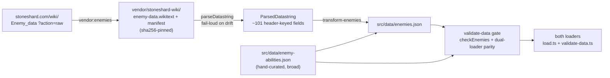
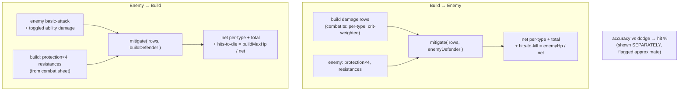

# feat: Enemy-vs-build combat (M5 capstone)

## Summary

Add the roadmap's capstone milestone: pick any Stoneshard enemy, toggle the abilities it uses, and read the **two-way damage exchange** — the damage your build deals into that enemy and the damage the enemy deals back. This extends the M4 self-damage model (`combat.ts`, "deal + take" against no target) into a real matchup against an extracted enemy database, with a full mitigation chain (block → per-bodypart protection → capped resistances) modeled in both directions.

The work is a near-perfect mirror of the existing item pipeline and combat layer: a new `Enemy data` wiki extraction (same `;`-delimited datastring shape as items), a curated enemy-ability dataset, a pure `matchup.ts` compute module reusing the M4 constants, a `selectEnemy` ledger op that rides the existing share codec additively, and two new panel components mirroring `CharacterSelect`/`CombatPanel`. The mitigation chain (block → per-bodypart protection → capped resistances) modeled in both directions is **net-new in M5** — M4's `combat.ts` computes display metrics, not a mitigation chain (see KTD3).

---

## Problem Frame

M4 shipped the build's self-damage: outgoing per-type damage with crit, and survivability as resistance-scaled effective HP and per-bodypart protection — but **against no specific target**. The `CombatPanel` itself flags the gap: *"Expected = crit-weighted, on a landing hit. Hit chance vs. an enemy is later (M5)."* A player still can't answer the headline matchup question the project exists to answer: *against this enemy, how hard do I hit it, and how hard does it hit me?*

The reference tool (nstratos) is talent-only — it has no items, no damage, and no enemies — so the enemy-combat capstone is pure differentiation, not parity. Two things block it today: there is **no enemy data** (no `Enemy` schema, no `enemies.json`), and the combat layer computes damage assuming a hit lands but never applies a *target's* mitigation to it.

Research resolved the two unknowns the brainstorm deferred. **Enemy data is bulk-extractable** from `stoneshard.com/wiki/Enemy_data?action=raw` — a single `{{#switch}}` datastring (~200 enemies, ~101 fields) in the exact shape the item pipeline already parses. **The mitigation chain is officially documented** (order: block → protection → resistances) and high-confidence. The one genuinely soft area — the accuracy↔dodge hit-chance equation — is community-derived and possibly stale, so it is modeled as labeled context, never folded into the damage number (see Key Technical Decisions).

---

## Scope & Approach (carried from origin)

The origin requirements doc (`docs/brainstorms/2026-06-24-complete-build-calculator-requirements.md`) frames M5 as the enemy-combat capstone covering R10–R12, flow F3, and acceptance examples AE2/AE3, and notes it is "large enough to be its own brainstorm/milestone." This plan treats M5 as that milestone.

**Requirements traced into this plan:**

- **R10** — an enemy database covering the game's enemies, each selectable, with combat stats (HP, armor, resistances, evasion, etc.) and an ability set. → U1, U2, U3, U4, U8.
- **R11** — for a selected enemy, toggle which abilities it uses; a matchup view shows damage the build deals into the enemy and damage the enemy's selected abilities deal back. → U6, U7, U8. **Covers F3, AE2.**
- **R12** — enemy abilities are modeled with damage values (the brainstorm said "formulas mirroring the player-skill engine"; research found enemy abilities carry **no formula strings** — they are flat per-type damage in prose, so they are modeled as a curated flat-damage dataset; see KTD5). → U4, U6.
- **R9 / AE1** — damage and survivability degrade gracefully on missing input (no weapon, unmodeled stat): neutral marker, never a wrong or silently-zero number. → U6, U8.
- **R15** — new datasets flow through both loaders in lockstep and the validate-data gate. → U5.
- **R16 / AE3** — share codes carry the expanded build (now enemy selection) under the versioned, bounded, schema-validated codec; older/unknown codes still fail closed. → U7.

**Out of this milestone (origin Scope Boundaries + plan-local):** see [Scope Boundaries](#scope-boundaries).

---

## High-Level Technical Design

### Enemy data pipeline (mirrors the item pipeline)



The only deltas from items: **protection fans out to 4 body-part slots** (Head/Body/Hands/Legs, plus "Amount of bodypart" counts), and **special-ability damage is a separate curated file** because the source has no parseable ability formula.

### The matchup exchange (both directions reuse one `mitigate()`)



`mitigate(rows, defender)` applies the official chain **block → protection → resistances** per damage type:
- **Block** subtracts Block Power (physical 1 power/dmg, nature & magic 2 power/dmg) until exhausted.
- **Protection** is flat per targeted body part (physical 1:1; nature & magic 2:1 — i.e. halved protection).
- **Resistance** is `min(specific + umbrella, 75%)`, applied last.

Body-part targeting reuses the M4 `HIT_WEIGHTS` (head/chest/arms/legs ↔ enemy Head/Body/Hands/Legs), so both directions are symmetric. The matchup is a **derived post-pass** after `combat` in `recompute` — read-only for the UI, never persisted; only the enemy *selection* is persisted (in the ledger/codec).

---

## Output Structure

New files this milestone creates (existing files modified are listed per-unit):

```
src/
  data/
    enemies.json              # transformed bestiary (U3)
    enemy-abilities.json      # hand-curated ability damage (U4)
  lib/
    build/
      matchup.ts              # pure two-way exchange compute (U6)
      matchup.test.ts
      mitigate.ts             # shared mitigation chain, NEW pure module (U6)
      mitigate.test.ts
    bootstrap/
      enemies.ts              # pure datastring → Enemy transform (U3)
      enemies.test.ts
  components/
    EnemySelect.svelte        # searchable enemy picker (U8)
    MatchupPanel.svelte       # two-way exchange view (U8)
scripts/
  transform-enemies.ts        # orchestrator: verify → transform → validate → write (U3)
tools/
  wiki-extractor/
    fetch-enemies.ts          # vendor:enemies (U2) — or extend fetch.ts
    fetch-enemy-icons.ts      # vendor:enemy-icons (U9) — or extend fetch-icons.ts
vendor/stoneshard-wiki/
  enemy-data.wikitext         # checksum-pinned snapshot (U2)
public/img/enemies/           # ~200 portraits (U9)
```

---

## Key Technical Decisions

### KTD1 — Enemy extraction source: the wiki `Enemy data` datastring (resolves the deferred source question)

The brainstorm left "UMT vs wiki" open for enemies. Research confirms `stoneshard.com/wiki/Enemy_data?action=raw` is a single `{{#switch}}` `;`-delimited datastring — **the same shape `parseDatastring` already handles for items** — so the entire item ingestion posture (vendor → checksum-pin snapshot + manifest → fail-loud header-keyed parse) is reused verbatim. Per-enemy pages are stubs that transclude this table, so they are **not** scraped for stats. This matches the M2 outcome (wiki-primary beat UMT) and keeps a single extraction discipline.

### KTD2 — Enemy stats modeled as a typed-identity + snake_case-stats bag, mirroring `Item`

The `Enemy` schema follows `Item`'s split: typed identity fields (key, name, tier, type, faction, size, hp, energy) + a `stats` record (snake_case, e.g. `slashing_damage`, `fire_resistance`, `accuracy`, `dodge_chance`, `block_chance`, `block_power`, `crit_chance`, `crit_efficiency`, `armor_penetration`) + a typed `protection` 4-slot object that **reuses the existing M4 `BodypartProtection` shape `{head, chest, arms, legs}`** (not the wiki's `{head, body, hands, legs}`) so the matchup machinery (`HIT_WEIGHTS`, `mitigate`) consumes one canonical slot vocabulary — the U3 transform maps the wiki's Body→`chest` and Hands→`arms` columns at the boundary — + an `abilities` key list + a loose `properties` bag for everything else. This keeps the gate's `unknown-stat-key`-style checks possible and lets future-patch columns widen data without breaking validation — exactly the `Item.properties` posture.

### KTD3 — Mitigation is a NEW pure `mitigate()` module, sharing only the resistance primitive with `combat.ts`

The chain (block → protection → resistances) lives in a standalone pure `mitigate(rows, defender)` so **both** matchup directions use identical, tested math. **This is net-new logic, not an extraction** (deepening correction): `combat.ts`'s `computeDefense` computes *display* metrics — hit-weighted average protection and per-type resistance-scaled effective HP — and never subtracts protection from, or applies block to, a damage row. There is no mitigation chain in M4 to extract. The only genuinely shared sub-expression is the per-type resistance lookup `min(umbrella + perType, RESIST_CAP)/100` plus the `GROUP_OF` umbrella map; factor that one primitive (`resistanceFor`) so both `computeDefense`'s display rows and `mitigate`'s final step call it. Dependency direction: `mitigate.ts` (and `matchup.ts`) import the resistance primitive + constants from `combat.ts`; **`combat.ts` imports from neither** — no cycle, M4 code stays untouched.

`DefenderProfile` is **plain data**, not a closure: `{ protection: BodypartProtection, resistances: Record<string,number>, block?: { power: number } }`. `mitigate` resolves + clamps resistance internally via the shared `resistanceFor`, so the umbrella/cap logic lives in exactly one place and both defenders are built trivially from their raw stat bag (build-side from `gearStats`, enemy-side from `enemy.stats`) — fully symmetric, single clamp site, value-testable. Block is **deterministic in `mitigate` (Block Power absorption only)** — `block_chance`/`block_recovery` are probabilistic/per-turn and would mismatch the otherwise expected-value pipeline, so they are surfaced as labeled context in the panel (like the approximate hit-chance), never folded into `mitigate`.

Two contract details `mitigate` must pin (else the math is ambiguous):
- **Protection collapse.** `mitigate` operates on per-type damage rows that carry no body-part, while protection is 4-slot. Each row's protection is the **`HIT_WEIGHTS`-weighted average** across the four pools (the same weighting `computeDefense.avgProtection` already uses), so the 4 slots collapse to one number per row.
- **Block-drain order.** Block Power is one shared pool drained at 1:1 (physical) vs 2:1 (nature/magic), so the per-type net depends on drain order. Pin the rule: **physical types drain first, then nature/magic** (the order the worked example encodes) — a stated rule, not an emergent property of one fixture.

Official worked examples are the test oracle: Necromancer 10 Crushing + 12 Unholy into 30/30 Block Power → 2 Unholy through; 17 Crushing − 8 Protection → 9; 10 Fire − (8 Protection / 2) → 6; resistance capped at 75%. Protection is physical 1:1 (high confidence) and nature 2:1 (high confidence); **magic 2:1 is assumed (medium confidence — official examples only demonstrate nature; see Open Questions)**, and block-as-first-hit-absorption is a **single-exchange modeling estimate**, not the game's per-turn pool simulation.

### KTD4 — To-hit is labeled context, not folded into damage (per user decision: "mitigation headline, hit-chance flagged")

Damage numbers use only the **high-confidence** mitigation chain, crit-weighted assuming the hit lands (identical posture to M4). The accuracy↔dodge hit-chance — community-derived, never published as an equation, possibly shifted by post-RtR patches — is computed and displayed as a **separate figure explicitly marked approximate**, never multiplied into the headline damage. This protects the trustworthy number from the untrustworthy one.

**Credibility limit, stated honestly:** the headline `hits-to-kill`/`hits-to-die` figures therefore assume **every hit lands** — they are a no-miss upper bound, the same gap M4's `CombatPanel` already flags ("Hit chance vs. an enemy is later"). The matchup is honest about this (hit-chance shown beside the figures, labeled approximate) rather than implying a fully-resolved exchange. Two preconditions gate the figures' correctness and are promoted from "nice to verify" to **must-confirm before labeling** (see Open Questions): the `Enemy data` `*Damage` columns are per-hit (not DPS), and the per-bodypart targeting model. The hit-chance model and its validation remain an Open Question, not a blocker.

### KTD5 — Enemy abilities are a hand-curated flat-damage dataset, not a formula engine

R12 did not merely ask for "formulas" as an implementation style — it asserted a **property**: enemy output is "computed from the matchup, **not stored as a static number**." Research found that property is **unachievable from the source**: enemy abilities (Lion Leap, Primal Aether, …) are documented as prose with flat numbers ("12 Arcane, 12 Sacred, 12 Unholy"), with no machine-readable formula string anywhere. **This plan therefore knowingly inverts that origin requirement** — it stores curated static per-type damage rather than computing it — and also resolves the origin's open question ("game-accurate formulas vs an approximate comparison metric") toward the curated-dataset side. The trade is recorded here rather than hidden: a curated `EnemyAbility` dataset — `{ key, name, damage: { <type>: number }, properties }` — referenced by `Enemy.abilities`. Basic-attack damage (always-on incoming) comes free from the datastring's 13 `*Damage` columns; toggled abilities add their curated flat per-type damage. Per the user's "curate broadly" choice, U4 authors a broad cross-faction first pass; the structure supports incremental additions as data-only changes the gate validates.

### KTD6 — Enemy selection rides the existing codec additively (no format bump)

A new `selectEnemy` ledger op (last-wins, carrying the enemy id + the set of enabled ability keys) joins the discriminated `LedgerEntry` union. Like `equip` and `selectCharacter` before it, this needs **no `FORMAT_VERSION` bump** — Zod validates the new variant automatically, pre-feature codes still decode (no `selectEnemy` entry → no matchup), and an unknown-version guard still fails closed (AE3, R16). The computed matchup is a derived post-pass, never serialized.

Two consequences of `selectEnemy` being the **first op with a variable-length array payload** (deepening hardening):
- **Bound the array at the schema layer.** `MAX_LEDGER_ENTRIES` bounds entry *count*, not per-entry size; one `selectEnemy` entry with a huge `abilities` array is one entry. The Zod variant must be `abilities: z.array(z.string().min(1)).max(N)` (N = the largest plausible per-enemy ability count, e.g. 16) so a corrupt/hostile code fails closed at the `schema` layer, not silently at the byte ceiling.
- **Canonical form for round-trip determinism.** `abilities` is kept **sorted + de-duplicated** on every mutation, so two builds reaching the same enemy+ability *set* via different toggle orders encode to the same code. `selectEnemy` collapses **all** prior `selectEnemy` entries (mirroring `#removeSelectCharacter`, which collapses many — not just the last).

Fail-soft mirrors the existing patch-drift posture in both directions: an unknown enemy id → `unknown-enemy-ref` note; a stale/foreign ability key inside a *valid* enemy's `selectEnemy` → `unknown-enemy-ability-ref` note, dropping just that ability and keeping the rest (like `resolveSkill`/`equip` skip-and-note).

### KTD7 — Reuse M4 constants and crit model wholesale

`DAMAGE_TYPE_GROUPS`, `DAMAGE_TYPES`, `RESIST_CAP` (75), `CRIT_EFFICIENCY_CAP` (150), and `HIT_WEIGHTS` are reused directly. Crit stays the M4 bonus form `1 + min(Crit_Efficiency, 150)/100`. Enemy `Crit_Avoidance` (a multiplier reducing attacker crit *chance*) is applied when computing the build's expected crit into the enemy; it is medium-confidence, so its contribution is small and isolated (an Open Question flags verifying it).

---

## Implementation Units

Grouped into three phases. U-IDs are stable; dependencies cite U-IDs.

### Phase A — Enemy data foundation

#### U1. Enemy + EnemyAbility schemas and dataset wiring

**Goal:** Add the `Enemy` and `EnemyAbility` Zod schemas and thread them through `Dataset` and `Constants`, so the rest of the pipeline has typed shapes to target.
**Requirements:** R10, R12.
**Dependencies:** none.
**Files:**
- `src/lib/types.ts` — add `Enemy`, `EnemyAbility` schemas; add `enemies: z.array(Enemy).default([])` and `enemyAbilities: z.array(EnemyAbility).default([])` to `Dataset`; optionally add `enemyStatKeys` to `Constants` (mirrors `itemStatKeys`).
- `src/lib/types.test.ts` (or the existing schema test location) — schema tests.

**Approach:** Mirror `Item` exactly (KTD2). `Enemy`: `{ key, name: Localized, tier?, type?, faction?, size?, hp, energy?, protection: BodypartProtection /* {head,chest,arms,legs} — reuse the M4 type */, stats: Record<string,number>, abilities: string[], properties: PropertyBag, icon? }`. `EnemyAbility`: `{ key, name: Localized, damage: Record<string,number>, properties: PropertyBag }`. Both `enemies`/`enemyAbilities` default to `[]` so the bootstrap transform and old datasets still validate — the same forward-compat posture `items`/`presets` use.

**Patterns to follow:** `Item` schema (`src/lib/types.ts:278`), `Preset` schema (`:328`), `Dataset` (`:364`).

**Test scenarios:**
- A minimal valid `Enemy` (key, name, hp, protection, empty stats/abilities) parses; missing `hp` or a negative `hp` fails.
- An `EnemyAbility` with a `damage` map of known types parses; a non-numeric damage value fails.
- `Dataset.parse` accepts a dataset with `enemies`/`enemyAbilities` present, and one with both omitted (defaults to `[]`) — backward-compat.
- `Enemy.protection` requires all four body-part keys (a preset-style "can't silently omit one" guard).

#### U2. Enemy data ingestion (vendor + parse)

**Goal:** Fetch and checksum-pin the `Enemy data` wiki snapshot and parse it into header-keyed rows, reusing `parseDatastring`.
**Requirements:** R10, R15 (versioned, gate-clean dataset through both loaders).
**Dependencies:** U1.
**Files:**
- `src/lib/data/wiki-pages.ts` — add an `Enemy data` `WikiPage` entry with the `leadingColumns`/header legend the page needs.
- `tools/wiki-extractor/fetch-enemies.ts` (new) **or** extend `tools/wiki-extractor/fetch.ts` — `vendor:enemies` script.
- `vendor/stoneshard-wiki/enemy-data.wikitext` + `manifest.json` update (sha256, wiki revid, patch label) — produced by the script, committed.
- `package.json` — add `"vendor:enemies"` script.
- `src/lib/data/wiki-datastring.test.ts` — extend with an enemy-datastring fixture.

**Approach:** Reuse `parseDatastring` unchanged — the enemy page is the same `{{#switch}}` shape. The ~101-field header legend (verbatim from the raw source) defines column order; the research-captured first entry (`Restless = 1;o_zombie;…`) is the offset-mapping fixture. Handle the two item-pipeline deltas: the **4 Protection columns** (Head/Body/Hands/Legs) and the **4 "Amount of <bodypart>" count columns**. Fail loud on column drift, exactly as items do (`DatastringError`).

**Critical: `parseDatastring` only fails on cell-COUNT drift, not on an offset that preserves count** (deepening F1). A header legend transcribed with two columns swapped, or `leadingColumns` miscounted, mis-maps every value with zero parse error. The named mitigations (fail-loud parser, single fixture) do NOT close this. So: (a) record the **exact** protection/count column labels from the raw legend — if the wiki labels the four protection columns identically, the parser de-dupes them to `protection`, `protection (2)`, … and U3's slot assignment becomes position-dependent *inside the dedup family* (F2); document which case applies; (b) confirm the row's final column is free-text Description (the `splitCells` overflow-absorption target) — if the enemy row ends in a numeric column, a stray `;` corrupts it silently (F6).

**Patterns to follow:** `fetch.ts` (`?action=raw` + checksum + manifest), `WIKI_PAGES` (`src/lib/data/wiki-pages.ts`), `parseDatastring` (`src/lib/data/wiki-datastring.ts`). Network scripts are dev-only, never CI (like `vendor:wiki`).

**Test scenarios:**
- `Value-anchored offset fixture (F1):` a fixture enemy with values **distinct across columns** parses so that specific known values land on specific named fields — e.g. "Restless HP = X, slashing_resistance = Y, head protection = Z" — not merely "parses to the expected header-keyed fields." A fixture enemy with many equal/zero stats cannot catch a swap; pick one with distinct values.
- The four protection columns resolve to four distinct, correctly-ordered slots (Head/Body/Hands/Legs), by their exact (possibly dedup-suffixed) labels.
- A row with the wrong cell count raises `DatastringError` (column-drift fail-loud).
- A row with empty `;;` fields yields absent/zero stats, not a parse error.
- Semicolons inside the free-text Description are absorbed, not treated as cell delimiters; assert the enemy row's final column is genuinely Description before relying on this.

#### U3. Enemy transform → `enemies.json`

**Goal:** Transform parsed enemy rows into validated `Enemy` records and emit a deterministic `enemies.json`.
**Requirements:** R10, R15.
**Dependencies:** U1, U2.
**Files:**
- `src/lib/bootstrap/enemies.ts` (new, pure) — `transformEnemies(input)` mirroring `transformItems`.
- `src/lib/bootstrap/enemies.test.ts` (new).
- `scripts/transform-enemies.ts` (new) — orchestrator.
- `src/data/enemies.json` (generated, committed).
- `src/data/bootstrap-report.json` — fold enemy counts/warnings in.
- `package.json` — add `"transform-enemies"` script.

**Approach:** Pure transform like `items.ts`: typed identity fields off named columns; `protection` from the four columns; `stats` = snake_case numeric columns (the 13 `*Damage` = basic attack, 3 umbrella + 13 specific resistances, accuracy/dodge/block/crit/fumble/armor-pen/magic-power); `abilities` left empty here (linked in U4); the rest → `properties`. `key = slug(name)` (names are the stable identifier, as items proved source IDs are not unique). The orchestrator checksum-verifies the snapshot, runs the enemy **shape/stat** checks of `checkEnemies` (U5) pre-write, and writes a deterministic key-sorted file, folding warnings/notes/count into `bootstrap-report.json`. The **ability cross-ref** checks of `checkEnemies` run only at the U5 gate, since U4's linkage may not exist at U3 time (F14) — split the check accordingly.

**Patterns to follow:** `src/lib/bootstrap/items.ts`, `scripts/transform-items.ts`, `scripts/checksum.ts`.

**Test scenarios:**
- A small fixture of enemy rows transforms to N `Enemy` records with snake_case stats and a populated 4-slot `protection`.
- `Transform-level slot binding (F2):` the four protection columns fill `protection.head/body/hands/legs` from the right source columns (not just "all four keys present" — assert the *values* track their source columns).
- `Family-count cross-check (F5):` the transform produces exactly the expected count of `*_damage` keys and `*_resistance` keys; a count mismatch (e.g. 12 damage / 14 resistance) is an offset signature and fails.
- A `*Damage` column populates the basic-attack stat; a `*Resistance` column populates the resistance stat.
- An enemy with all-empty optional columns still produces a valid record (hp present) — no crash, defaults applied.
- A row missing required `Health` is skipped with a recorded warning, not a hard transform failure (graceful, like the Shackles skip in items).
- Output is deterministic and key-sorted across two runs (byte-identical).

#### U4. Curated enemy-ability dataset + linkage

**Goal:** Author a broad, validated curated `enemy-abilities.json` of flat per-type ability damage, and link abilities to enemies via `Enemy.abilities`.
**Requirements:** R12, R11 (the "toggle an ability" half of the matchup), AE2.
**Dependencies (split — the unit has two halves):** *ability authoring* depends on U1 (schema) only and is parallel with U2/U3; *enemy→ability linkage* depends on **U3's generated `enemies.json` slugs** (it can't be finalized until U3 emits keys).
**v1 completion floor (so "broad" is verifiable):** at least one curated ability for **every faction** the bestiary index lists (Wildlife, Brigands, Undead, Proselytes, The Hive, Sorcerous Creations) **plus all named bosses** — roughly 15–25 abilities. This is the milestone bar; entire-bestiary ability coverage is explicitly Deferred to follow-up. Note the per-ability cost: read the ability page prose, transcribe per-type numbers, record a provenance URL.
**Files:**
- `src/data/enemy-abilities.json` (new, hand-curated).
- `src/lib/bootstrap/enemies.ts` — read a curated linkage map (enemy key → ability keys) and set `Enemy.abilities` during transform, **or** maintain linkage directly in a curated file the transform merges.
- `src/data/enemies.json` — regenerated with `abilities` populated.

**Approach (KTD5):** Each `EnemyAbility` is `{ key, name, damage: { <damageType>: number }, properties }`, with per-type damage transcribed from the wiki ability page prose (e.g. Manticore's Primal Aether → `{ arcane: 12, sacred: 12, unholy: 12 }`). Per the "curate broadly" decision, cover a wide cross-faction swath (Wildlife, Brigands, Undead, Proselytes, The Hive, Bosses…), prioritizing enemies a player is likely to matchup-test. **Provenance is a required, structured field** (`properties.source` URL, non-empty) so the gate enforces that *every* curated number is auditable, not just a sampled subset (deepening F7) — `missing-provenance` is a gate error. `Enemy.abilities` lists the keys; linkage is authored against U3's **generated** `enemies.json` slugs (the ability-authoring half is independent of U3; the linkage half depends on it — F10). The U5 gate cross-checks every reference resolves.

**Execution note:** Data authoring, not code. Validated by the U5 gate rather than unit logic. Land an initial broad pass; further coverage is additive data-only edits.

**Test scenarios:**
- `Covers AE2.` Every `Enemy.abilities` key resolves to an `EnemyAbility` (cross-ref integrity; a dangling key fails the gate).
- Every `EnemyAbility.damage` type is a known `constants.damageTypes` value (unknown type fails).
- `EnemyAbility` keys are unique (`duplicate-ability-key`).
- `Plausibility (F8):` every `damage` value is a positive integer below a sane ceiling (`implausible-ability-damage` warning catches a `1200`-for-`12` fat-finger); no `damage` map is empty (`empty-ability-damage`).
- `Provenance (F7):` every `EnemyAbility` carries a non-empty `properties.source`; a missing one fails the gate.
- `Orphan check (F9):` an `EnemyAbility` referenced by no enemy is flagged `orphan-ability` (mirrors the existing `orphan-skill` check) — an orphan often signals a typo'd link that left the intended ability unreferenced.

#### U5. Validate gate + dual-loader lockstep

**Goal:** Add `checkEnemies` integrity validation and wire `enemies`/`enemyAbilities` through **both** loaders and the gate in lockstep.
**Requirements:** R15.
**Dependencies:** U1, U3, U4.
**Files:**
- `src/lib/validate.ts` — add `checkEnemies` (and ability cross-checks) alongside `checkItems`/`checkPresets`.
- `src/lib/data/load.ts` — import + compose `enemies.json` and `enemy-abilities.json`.
- `scripts/validate-data.ts` — **explicitly read** both new files (don't rely on `.default([])`, the documented dual-loader gotcha from presets) and pass to the gate.
- `src/lib/data/gate.ts` — return `enemyCount` / `enemyAbilityCount` in `GateResult`.
- The `composedLikeGate` parity test — extend to assert both loaders see identical enemy data.

**Approach:** `checkEnemies` referential/integrity kinds: `duplicate-enemy-key`, `unknown-damage-type` (basic-attack & resistance stat keys), `unknown-ability-ref` (enemy → ability), `orphan-ability` (F9), `enemy-missing-hp`, `unknown-enemy-stat-key` against an `enemyStatKeys` vocabulary, plus the offset-catching checks below. Mirror exactly how `checkItems` was added and how `checkPresets` cross-checks references across dataset sections.

Three hardening requirements the item precedent does not give for free:
- **Don't inherit the empty-vocabulary tolerance (F11).** `checkItems` skips `unknown-stat-key` when the vocab list is empty (deliberate partial-dataset support). For the full enemy dataset an empty `enemyStatKeys` is always a bug — require a non-empty vocabulary when `enemies.length > 0` (`missing-enemy-stat-vocabulary` error), or the offset class (F1/F3) escapes through validation too.
- **All-zero-column check (F3) — the highest-value new check.** A stat column that is empty/zero across **all** ~200 enemies is far more likely a mapping/offset bug than a real game fact; flag it (`all-zero-stat-column`). This catches the offset class the cell-count parser cannot see. Add `implausible-stat-value` (F4) for HP/resistance/protection outside sane bounds.
- **Two new files double the parity surface (F12/F13).** Both `enemies.json` and `enemy-abilities.json` default to `[]`, so a forgotten explicit read in `validate-data.ts` validates an empty array and skips all cross-checks while `load.ts` loads the real data — silent divergence. Require **two** explicit reads in `validate-data.ts` and **two** imports (not `[]` stubs) in `load.ts`. `gateDataset` returns AND prints `enemyCount`/`enemyAbilityCount` so an empty file can't look healthy. The run reports `228 skills / 731 items / N enemies / M abilities`, integrity clean, zero blocking warnings.

**Patterns to follow:** `checkItems`/`checkPresets` in `src/lib/validate.ts` (note the `Pick<Dataset,…>` narrow input so the transform script can run checks pre-write); the dual-loader explicit-read fix documented for presets; the `orphan-skill` check; `gateDataset` in `src/lib/data/gate.ts`.

**Test scenarios:**
- The gate passes clean on the real composed dataset (enemies + abilities present, integrity clean).
- A duplicate enemy key → `duplicate-enemy-key`.
- An enemy referencing a missing ability key → `unknown-ability-ref`.
- An enemy basic-attack/resistance stat with an unknown damage type → `unknown-damage-type`.
- `Empty vocab (F11):` `enemies` present but `enemyStatKeys` empty → `missing-enemy-stat-vocabulary` (NOT a silent pass).
- `All-zero column (F3):` a stat column empty across every enemy → `all-zero-stat-column`.
- `Per-array parity (F12):` the parity test asserts the app loader and validate-data loader produce deep-equal `enemies` AND `enemyAbilities` arrays, AND that both are non-empty (`length > 0`) — so a both-loaders-forgot-the-same-file mistake also fails.

---

### Phase B — Combat compute + state

#### U6. Matchup compute (`matchup.ts`) + new shared `mitigate()` module

**Goal:** Build a NEW shared pure `mitigate()` module and the two-way `matchup.ts` compute that consumes the build's combat output and an enemy.
**Requirements:** R11, R12, R9 / AE1 (extends the M4 self-damage model into a targeted matchup).
**Dependencies:** U1; imports the `resistanceFor` primitive + constants from M4 `combat.ts` (only `computeDefense`'s resistance step may be rerouted; no mitigation chain is extracted).
**Files:**
- `src/lib/build/mitigate.ts` (new, pure) — `mitigate(rows, defender)`; `DefenderProfile` type; the shared `resistanceFor` primitive may live here OR stay in `combat.ts` and be imported (see dependency direction).
- `src/lib/build/mitigate.test.ts` (new).
- `src/lib/build/matchup.ts` (new, pure) — `computeMatchup(combat, enemy, enabledAbilities)`; `MatchupSheet` type.
- `src/lib/build/matchup.test.ts` (new).
- `src/lib/build/combat.ts` — only if `computeDefense`'s resistance step is rerouted through the shared `resistanceFor` helper; the `CombatSheet` output stays stable so `CombatPanel` is untouched. **No mitigation chain is extracted — there isn't one (KTD3).**

**Approach:** `DefenderProfile` is **plain data**: `{ protection: BodypartProtection, resistances: Record<string,number>, block?: { power: number } }` (deepening — no closure field). `mitigate(rows, defender)` applies **block (Block Power absorption, deterministic) → protection (physical 1:1, nature/magic 2:1, body-part-weighted via `HIT_WEIGHTS`) → resistance (`resistanceFor`, cap 75%)** per type, returning net per-type rows; it resolves + clamps resistance internally (single clamp site). **Dependency direction:** `mitigate.ts`/`matchup.ts` import constants + `resistanceFor` from `combat.ts`; `combat.ts` imports from neither. `computeMatchup`:
- **Build → enemy:** feed the already-computed `combat.damage` (crit-weighted) through `mitigate` with the enemy as defender (`enemy.stats` → `resistances`, `enemy.protection`) → net per-type, total, `hitsToKill = ceil(enemyHp / netTotal)`.
- **Enemy → build:** assemble incoming rows from the enemy's basic-attack stats + each enabled ability's `damage`, feed through `mitigate` with the build as defender (`gearStats` → `resistances`, `combat.protection`) → net per-type, total, `hitsToDie = ceil(buildMaxHp / netTotal)`. Build-side and enemy-side defenders are constructed identically from a raw stat bag (symmetry).
- **`combat` passed in explicitly** (not re-derived) so there is one combat computation per recompute; `matchup.ts` depends only on the `CombatSheet` contract + `Enemy`, never on raw `Character` internals.
- **Hit-chance (KTD4):** compute an accuracy-vs-dodge figure per direction, returned in a clearly-named `approxHitChance` field, **never** multiplied into damage. `block_chance`/`block_recovery` are likewise context-only, not inputs to `mitigate`.
- **Graceful markers (R9/AE1):** no weapon → build→enemy damage is the neutral marker (empty rows, `hasWeapon:false`); a zero-HP or absent enemy → no matchup. Mirror `computeCombat`'s zero-state booleans.

**Execution note:** Test-first — this is the riskiest seam. Start from the wiki worked examples as failing tests before writing `mitigate`.

**Patterns to follow:** `computeCombat`/`computeDefense` in `src/lib/build/combat.ts` (note: `computeDefense` is display-only — effective-HP + avg-protection — not a mitigation chain); the pure, dataset-free, value-typed input posture; the `clamp` helper; the existing `BodypartProtection` type (slots already align Head/Body/Hands/Legs ↔ head/chest/arms/legs).

**Test scenarios:**
- `mitigate` matches the official examples: 17 Crushing − 8 Protection → 9; 10 Fire − (8/2) → 6; multi-type 8 Crushing + 10 Fire vs 8 Protection → 0 + 6; resistance 50% on 10 Fire → 5; resistance clamps at 75%.
- Block: 10 Crushing + 12 Unholy into 30 Block Power → 2 Unholy through (physical 1:1 drains 10, unholy 2:1 drains 20 → 10 absorbed of 12 → 2 left). Block Power floors at 0 (no negative). `mitigate` is deterministic — no `block_chance` input.
- `computeMatchup` build→enemy: known build damage vs known enemy mitigation → expected net + `hitsToKill`; enemy HP not divisible → ceil.
- Enemy→build with abilities off → basic-attack only on the incoming side; toggling one ability on adds exactly that ability's mitigated per-type damage. **Covers AE2.**
- No weapon equipped → build→enemy shows the neutral marker, not 0. **Covers AE1.**
- `approxHitChance` is present and is **not** a factor in any net-damage value (assert damage equals the no-hit-chance computation).
- `DefenderProfile` is plain data — a fixture builds one by value (no closures) and `mitigate` produces the expected net rows.
- Guard (not safety-net): if `computeDefense`'s resistance step is rerouted through `resistanceFor`, `CombatSheet` output stays byte-identical (characterization test pins the display numbers; there is no mitigation chain to regress).

#### U7. `selectEnemy` ledger op + recompute + codec

**Goal:** Persist enemy selection and ability toggles as a ledger op, derive the matchup in recompute, and carry it through the share codec without a format bump.
**Requirements:** R11, R16 / AE3.
**Dependencies:** U1, U6.
**Files:**
- `src/lib/build/character.ts` — add `selectEnemy` to `LedgerEntry`; resolve the last `selectEnemy` → `Character.enemy` + `Character.matchup` as a derived post-pass after `combat`; add an `unknown-enemy-ref` `RecomputeNote` kind.
- `src/lib/build/ledger.svelte.ts` — `selectEnemy(id)`, `clearEnemy()`, `toggleEnemyAbility(key)` methods returning the `LedgerResult` shape.
- `src/lib/share/codec.ts` — no version change; the `Build` schema picks up the new op via `LedgerEntry`. Confirm bounds still hold.
- Tests: `src/lib/build/character.test.ts`, `src/lib/build/ledger.test.ts`, `src/lib/share/codec.test.ts`.

**Approach (KTD6):** `selectEnemy { op:'selectEnemy', id, abilities: z.array(z.string().min(1)).max(N) }`. Last-wins that collapses **all** prior `selectEnemy` entries (mirror `#removeSelectCharacter`, not the singular "replace one" — a hand-crafted/older code may carry several); route `selectEnemy`/`clearEnemy`/`toggleEnemyAbility` through one `#removeSelectEnemy()` helper. `toggleEnemyAbility` keeps `abilities` **sorted + de-duped** so the same enemy+ability set encodes identically regardless of toggle order. `recompute` resolves the id against `dataset.enemies` (unknown id → `unknown-enemy-ref` note, mirrors `unknown-preset-ref`) and resolves each ability key against the enemy's own `abilities` + `dataset.enemyAbilities` (stale/foreign key → `unknown-enemy-ability-ref` note, drop just that ability — like `equip`/`resolveSkill` skip-and-note); known id → set `Character.enemy` and call `computeMatchup` with the surviving abilities. The matchup is derived, never serialized. The codec rides `FORMAT_VERSION = 1` — Zod auto-validates the new variant; the `.max(N)` bound closes the per-entry size hole the entry-count ceiling leaves open.

**Patterns to follow:** the `selectCharacter` op end-to-end (recompute resolution, collapse-all via `#removeSelectCharacter`, `unknown-preset-ref` note, ledger method, codec round-trip); `equip`'s stale-item skip-and-note; the codec's `.max(MAX_LEDGER_ENTRIES)` array bound.

**Test scenarios:**
- `selectEnemy` then `clearEnemy` leaves no enemy; a second `selectEnemy` collapses all prior ones (≤1 entry, last-wins).
- `toggleEnemyAbility` adds/removes an ability key from the active `selectEnemy` entry; toggling with no enemy selected is a no-op with a `not-found`-style result.
- Selecting an unknown enemy id → `unknown-enemy-ref` note, no crash, no matchup.
- `Stale ability key (F17):` a valid enemy + one stale ability key recomputes the matchup with the surviving abilities and one `unknown-enemy-ability-ref` note — not a crash, not a dropped selection.
- `Canonical form (F16):` two builds reaching the same enemy+ability set via different toggle orders encode to the **same** code (idempotency), and encode→decode→encode is byte-stable. **Covers AE3.**
- `Schema bound (F15):` a corrupt code carrying an oversized `abilities` array fails closed with reason `schema`.
- `Never-serialized (F18):` the encoded ledger for a build-with-matchup contains only the `selectEnemy` op (id + abilities) — no damage numbers — pinning the selection-persisted / computation-derived boundary.
- **Backward-compat:** a pre-M5 share code (no `selectEnemy`) still decodes and recomputes with no enemy. **Covers AE3.**
- An unknown `formatVersion` still fails closed (`unknown-version`) — unchanged guard.

---

### Phase C — UI + polish

#### U8. `EnemySelect` + `MatchupPanel` components + App wiring

**Goal:** Ship the enemy picker and the two-way matchup view, wired into the app shell.
**Requirements:** R10, R11, R9 / AE1, F3.
**Dependencies:** U6, U7.
**Files:**
- `src/components/EnemySelect.svelte` (new) — searchable, faction/tier-grouped picker over ~200 enemies.
- `src/components/MatchupPanel.svelte` (new) — build→enemy and enemy→build rows, hits-to-kill / hits-to-die, ability toggles, neutral markers, the flagged approximate hit-chance.
- `src/App.svelte` — instantiate the panels, route `onSelectEnemy`/`onClearEnemy`/`onToggleEnemyAbility` to the ledger, feed `character.matchup`.

**Approach:** `EnemySelect` mirrors `CharacterSelect` + the `ItemPicker` name-search (~200 enemies need filter + grouping; reuse the picker's search pattern). `MatchupPanel` mirrors `CombatPanel`'s two-section table layout: an outgoing block (per-type net into the enemy + hits-to-kill) and an incoming block (basic attack + per-ability toggles + hits-to-die), with the approximate hit-chance shown in a labeled, visually-secondary line (echoing CombatPanel's existing "Expected = …" caption). Use the global `.panel` class and M1 tokens (`--font-display`, `--frame-shadow`, `--shadow-float`) — do not redefine them (the M1 reskin is now in `app.css`). No component unit-test harness exists in this repo; verify via `svelte-check`, `build`, and CDP browser screenshots at 375 + 1280 (the established practice).

**Patterns to follow:** `CharacterSelect.svelte`, `ItemPicker.svelte` (search), `CombatPanel.svelte` (two-section table + caption), `EquipmentPanel.svelte` (toggle-inline pattern for ability toggles), App's gesture-routing block.

**Test scenarios:**
- `Test expectation: none — Svelte components have no unit harness in this repo (documented in M3).` Verify via: `svelte-check` clean; production build clean; CDP at 375 and 1280 shows **overflowX 0**, a searchable enemy list, a selected enemy's two-way matchup with hits-to-kill/die, an ability toggle that changes the incoming total, the neutral marker when no weapon is equipped (AE1), and the hit-chance line visually marked approximate.

#### U9. Enemy portrait icons

**Goal:** Vendor enemy portraits and surface them in the picker/matchup, mirroring the M3 item-icon flow.
**Requirements:** none directly — presentation polish (the origin requires combat stats + an ability set, not portrait art). Shippable last; could be deferred without affecting the matchup math.
**Dependencies:** U3 (enemy keys); independent of U6–U8 and shippable last.
**Files:**
- `tools/wiki-extractor/fetch-enemy-icons.ts` (new) **or** extend `fetch-icons.ts` — `vendor:enemy-icons` via wiki `Special:FilePath/<Name>.png`.
- `public/img/enemies/` (generated assets).
- `vendor/stoneshard-wiki/enemy-icons-manifest.json` (or fold into the existing icons manifest).
- `src/lib/bootstrap/enemies.ts` — set `Enemy.icon` from the available-icon set (like items).
- `src/components/Icon.svelte` — reuse with an enemies base path; relies on its existing fallback.
- `package.json` — add `"vendor:enemy-icons"`.

**Approach:** Reuse the M3 item-icon pattern exactly: fetch by name from `Special:FilePath`, write to `public/img/enemies/`, set `item.icon`-equivalent only when art exists, lean on `Icon.svelte`'s fallback for the gaps. Base-relative URLs (the Pages sub-path gotcha — never root-absolute).

**Patterns to follow:** `fetch-icons.ts`, the M3 item-icon vendoring (`vendor:item-icons`), `Icon.svelte` fallback.

**Test scenarios:**
- `Test expectation: none — asset vendoring + a reference field.` Verify: `validate-data` still clean with `icon` set; build clean; CDP shows portraits in the picker with the fallback rendering for any missing art.

---

## Scope Boundaries

### In scope
Enemy extraction (all ~200 from `Enemy data`), `Enemy`/`EnemyAbility` schemas, the gate + dual-loader lockstep, the `selectEnemy` ledger op + codec, the shared `mitigate()` + two-way `matchup.ts` (block → protection → resistances, crit-weighted expected, hits-to-kill/die), basic-attack + a broad curated ability set, the picker + matchup UI, and enemy portraits.

### Deferred to follow-up work (plan-local sequencing)
- Curated-ability coverage of the **entire** bestiary — U4 lands a broad first pass; remaining abilities are additive data-only edits behind the same gate.
- Folding hit-chance into the damage number — gated on validating the accuracy↔dodge model in-game (see Open Questions).
- Enemy-side counterattack/backfire and a per-turn block-pool simulation (block is modeled as a first-hit absorption estimate in v1).

### Deferred for later (origin Scope Boundaries, carried verbatim)
- Enchantments/legendaries (Ancient Echoes), item-quality/affix rolls.
- Two-build side-by-side comparison.
- Manual/homebrew gear entry (explicitly rejected in favor of the curated database).

### Outside this product's identity (origin)
- A turn-by-turn combat simulator with positioning, status-effects-over-time, and AI decision-making. The matchup is a **damage-exchange preview**, not a fight simulation — this bounds U6 (no DoT, no status stacking, no initiative/turn order, no enemy AI).

---

## Open Questions

Resolve at implementation or after a play-test; none block starting.

- **Magic-vs-Protection ratio.** Research confirms physical 1:1 and nature 2:1; magic-as-2:1 is medium-confidence (official examples only demonstrate nature). Default to 2:1 in `mitigate`, isolate it behind a single constant, and verify against an in-game magic hit.
- **Accuracy↔dodge equation.** Community-derived ("excess accuracy above 100 subtracts from defender dodge"), possibly stale post-RtR. v1 shows it flagged-approximate (KTD4); validate against in-game numbers before ever folding it into damage.
- **Basic-attack damage semantics.** Confirm the `Enemy data` `*Damage` columns are per-hit (turn-based) vs DPS before labeling the incoming numbers.
- **Block presentation.** Block Power is a depletable, per-turn-refilled pool; in a single-exchange preview, model it as a first-hit absorption estimate and label it, rather than simulating refill across turns.
- **Enemy `Crit_Avoidance`.** Apply as a multiplier on the build's crit chance into the enemy (KTD7) or defer entirely; it is a small, medium-confidence effect.
- **Flat damage pre- vs post-multiplier** — inherited M4 open question; keep the M4 convention for consistency.

---

## Risks & Mitigations

- **Enemy datastring offset error that preserves cell count (~101 fields).** The dominant data risk: `parseDatastring` fails loud only on cell-*count* drift, so a swapped/miscounted column mis-maps every enemy with **no** parse error. *Mitigation:* a **value-anchored** offset fixture (U2, F1) asserting known values land on named fields; an **all-zero-stat-column** gate check (U5, F3) — a column empty across all ~200 enemies is almost certainly a mapping bug; the damage/resistance **family-count** cross-check (U3, F5); and `implausible-stat-value` bounds (F4). The fail-loud parser alone does **not** cover this class.
- **Dual-loader silent divergence, doubled by two new files (F12).** Both `enemies.json` and `enemy-abilities.json` default to `[]`, so a forgotten explicit read in `validate-data.ts` validates empty and skips cross-checks while the app loads real data. *Mitigation:* two explicit reads + two imports, per-array deep-equal parity asserting both are non-empty, and printed `enemyCount`/`enemyAbilityCount` (U5).
- **Curated ability numbers are unverifiable against a formula source (KTD5).** Hand-transcribed flat damage can drift from the game. *Mitigation:* **required structured provenance** on every ability (F7 — `missing-provenance` is a gate error, so every number is auditable, not just a sampled subset), plus `implausible-ability-damage`/`empty-ability-damage`/`orphan-ability` checks (F8/F9). Scope honesty: these are curated, not derived.
- **`selectEnemy` is the first variable-length op payload.** Its `abilities` array is unbounded under the entry-count ceiling and non-canonical under toggling. *Mitigation:* schema `.max(N)` bound (F15) and sorted+deduped canonical form (F16); fail-soft `unknown-enemy-ability-ref` for stale keys (F17).
- **Low-confidence hit-chance formula presented as fact.** *Mitigation:* KTD4 keeps it out of the damage number and labels it approximate; the Open Question requires in-game validation before any promotion.
- **~200-enemy picker performance/UX.** *Mitigation:* reuse the `ItemPicker` search/filter pattern and group by faction/tier; the dataset is static and small enough that a simple filter suffices.
- **No M4 mitigation chain to "extract" (deepening correction).** `combat.ts`'s `computeDefense` is display-only (effective-HP + avg-protection); `mitigate()` is net-new logic. *Mitigation:* KTD3 reframes the work as a new module sharing only the `resistanceFor` primitive; the characterization test guards that the shared resistance helper didn't move `CombatSheet` display numbers — it is a guard, not the safety net for a refactor that isn't happening.

---

## Dependencies & Sequencing

```
U1 ─┬─ U2 ── U3 ─┬─ U5 ── (Phase A complete)
    │            │
    └─ U4 ───────┘
U1, combat.ts ── U6 ── U7 ── U8
U3 ─────────────────────────── U9 (independent; ship last)
```

- **Phase A (U1–U5)** is the data foundation; nothing downstream produces real enemy numbers until U5's gate is green. U4 (ability curation) runs in parallel with U2/U3.
- **Phase B (U6–U7)** is the combat math + persisted state; U6 adds the new `mitigate` module and may reroute `computeDefense`'s resistance step through the shared `resistanceFor` helper, so guard that one touch with the characterization test.
- **Phase C (U8–U9)** is presentation; U8 is the headline deliverable, U9 (icons) is independent polish.

---

## Sources & Research

- **Origin requirements:** `docs/brainstorms/2026-06-24-complete-build-calculator-requirements.md` (M5: R10–R12, F3, AE2/AE3).
- **Enemy data (extraction source):** `https://stoneshard.com/wiki/Enemy_data` (`?action=raw`) — single `{{#switch}}` datastring, ~200 enemies, ~101 fields; per-body-part protection + "Amount of bodypart" counts. Per-enemy pages are stubs (do not scrape for stats). High confidence.
- **Mitigation order + worked examples:** `https://stoneshard.com/wiki/Combat_Formulas` (block → protection → resistances; physical 1:1, nature 2:1; block-power 1:1 vs 2:1). High confidence.
- **Caps:** `https://stoneshard.com/wiki/Attributes_%26_Stats` (Accuracy 150, Crit Efficiency 150, Fortitude 50, Resistances 75, Dodge 100). High confidence.
- **Damage types / umbrella groups:** `https://stoneshard.com/wiki/Damage_Types`. High confidence.
- **Hit/dodge (low confidence, flagged):** `https://stoneshard.com/wiki/Accuracy`, `https://stoneshard.com/wiki/Dodge_Chance`, plus Steam threads — never published as an equation; community-derived; possibly stale post-RtR.
- **Enemy abilities (no formula strings):** per-enemy `{{SkillTable}}` link lists + prose damage (e.g. `https://stoneshard.com/wiki/Manticore`). High confidence that no parseable formula exists.
- **Codebase patterns to mirror:** item pipeline (`tools/wiki-extractor/fetch.ts`, `src/lib/data/wiki-datastring.ts`, `src/lib/bootstrap/items.ts`, `scripts/transform-items.ts`), combat layer (`src/lib/build/combat.ts`), recompute/ledger/codec (`src/lib/build/character.ts`, `src/lib/build/ledger.svelte.ts`, `src/lib/share/codec.ts`), gate (`src/lib/validate.ts`, `src/lib/data/gate.ts`, `scripts/validate-data.ts`), UI (`src/components/CharacterSelect.svelte`, `ItemPicker.svelte`, `CombatPanel.svelte`).
